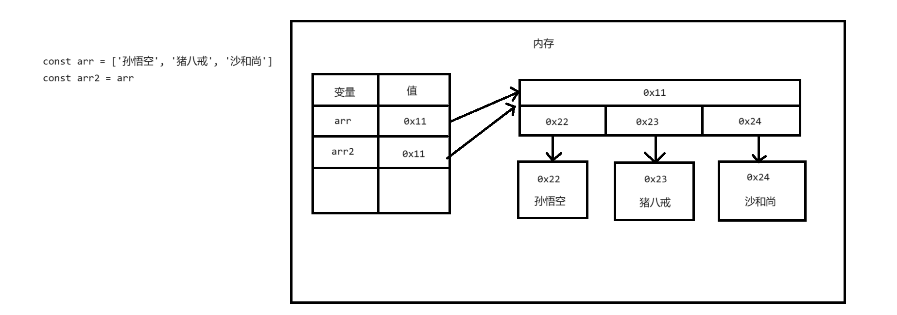
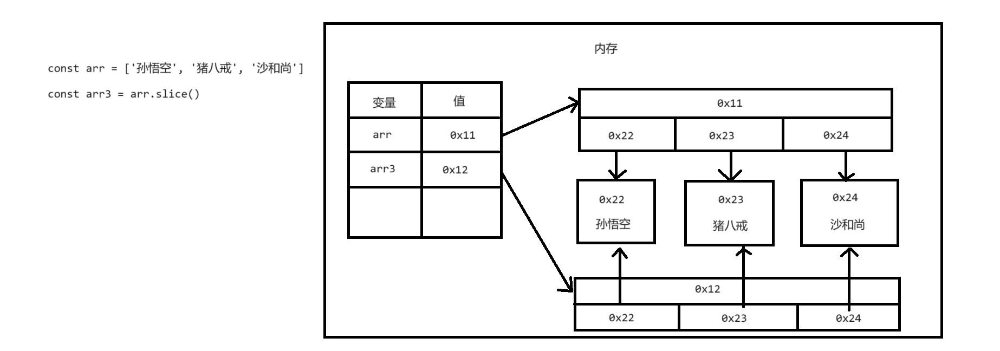
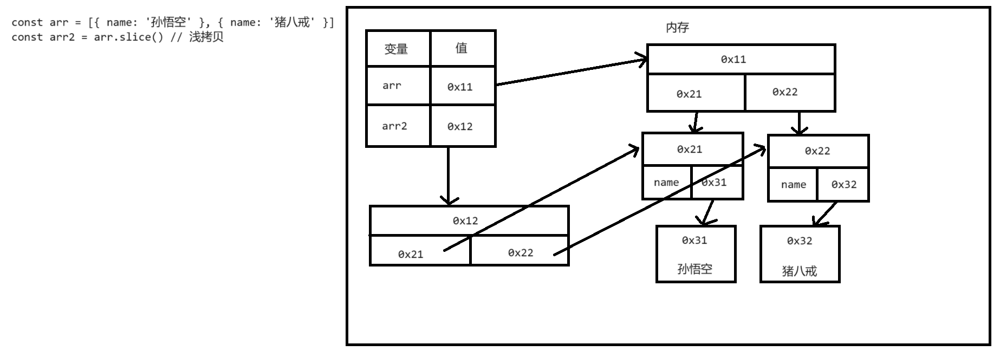
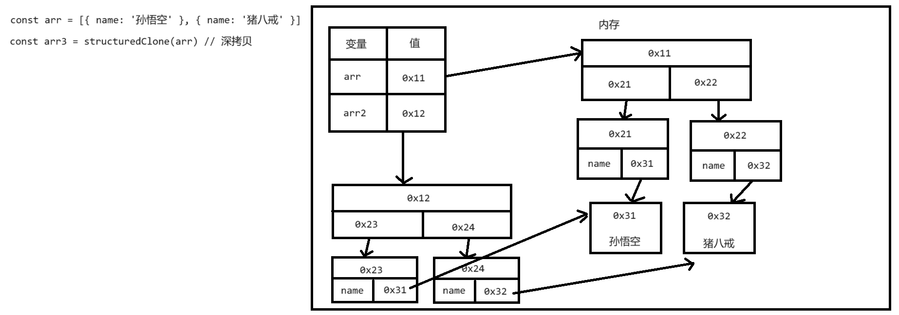

# 数组

## 简介

- 数组也是一种复合数据类型，在数组中可以存储多个不同类型的数据
- 数组中存储的是有序的数据，数组中的每个数据都有一个唯一的索引
- 可以通过索引来操作获取数据
- 数组中存储的数据叫做元素
- 索引(index)是一组大于等于 0 的整数
- 创建数组
  - 通过 Array() 来创建数组，也可以通过 [] 来创建数组
- 向数组中添加元素
  - 语法：
    - 数组\[索引] = 元素
- 读取数组中的元素
  - 语法：
    - 数组\[索引]
    - 如果读取了一个不存在的元素，不会报错而是返回 undefined
- length
  - 获取数组的长度
  - 获取的实际值就是数组的最大索引 + 1
  - 向数组最后添加元素：
    - 数组\[数组.length] = 元素
  - length 是可以修改的

```html
<!DOCTYPE html>
<html lang="zh">
  <head>
    <meta charset="UTF-8" />
    <meta name="viewport" content="width=device-width, initial-scale=1.0" />
    <title>Document</title>
    <script>
      const arr = new Array()

      arr[0] = 12
      arr[1] = 13
      arr[2] = 14
      arr[3] = 15

      // 使用数组时，应该避免非连续数组，因为它性能不好
      // arr[10] = 100

      // console.log(arr[1])
      // console.log(typeof arr) // 'object'
      // console.log(arr.length)

      arr[arr.length] = 22
      arr[arr.length] = 33

      // arr.length = 5

      console.log(arr)

      const arr2 = [10, 20, 30, 40]
    </script>
  </head>
  <body></body>
</html>
```

## 遍历数组

- 任何类型的值都可以成为数组中的元素
- 创建数组时尽量要确保数组中存储的数据的类型是相同的
- 遍历数组
  - 遍历数组简单理解，就是获取到数组中的每一个元素

```html
<!DOCTYPE html>
<html lang="zh">
  <head>
    <meta charset="UTF-8" />
    <meta name="viewport" content="width=device-width, initial-scale=1.0" />
    <title>Document</title>
    <script>
      // 任何类型的值都可以成为数组中的元素
      let arr = [1, 'hello', true, null, undefined, { name: '孙悟空' }, () => {}]

      // 创建数组时尽量要确保数组中存储的数据的类型是相同的
      arr = ['孙悟空', '猪八戒', '沙和尚']

      arr = ['孙悟空', '猪八戒', '沙和尚', '唐僧', '白骨精']

      // 从前往后遍历
      for (let i = 0; i < arr.length; i++) {
        // console.log(arr[i])
      }

      // 从后往前遍历
      for (let i = arr.length - 1; i >= 0; i--) {
        console.log(arr[i])
      }

      class Person {
        constructor(name, age) {
          this.name = name
          this.age = age
        }
      }

      const personArr = [
        new Person('孙悟空', 18),
        new Person('沙和尚', 38),
        new Person('红孩儿', 8),
      ]

      for (let i = 0; i < personArr.length; i++) {
        if (personArr[i].age < 18) {
          console.log(personArr[i])
        }
      }
    </script>
  </head>
  <body></body>
</html>
```

## for of 语句

- for-of 语句可以用来遍历可迭代对象
- 语法：

```js
for(let 变量 of 可迭代的对象){
  语句...
}
```

- 执行流程：
  - for-of 的循环体会执行多次，数组中有几个元素就会执行几次
  - 每次执行时都会将一个元素赋值给变量

```html
<!DOCTYPE html>
<html lang="zh">
  <head>
    <meta charset="UTF-8" />
    <meta name="viewport" content="width=device-width, initial-scale=1.0" />
    <title>Document</title>
    <script>
      const arr = ['孙悟空', '猪八戒', '沙和尚', '唐僧', '白骨精']

      for (let item of arr) {
        console.log(item)
      }

      for (let item of 'world') {
        console.log(item)
      }
    </script>
  </head>
  <body></body>
</html>
```

## 数组的方法

- https://developer.mozilla.org/en-US/docs/Web/JavaScript/Reference/Global_Objects/Array

### Array.isArray()

- 用来检查一个对象是否是数组

### at()

- 可以根据索引获取数组中的指定元素
- at 可以接收负索引作为参数

### concat()

- 用来拼接两个或多个数组
- 非破坏性方法，不会影响原数组，而是返回一个新的数组

```html
<!DOCTYPE html>
<html lang="zh">
  <head>
    <meta charset="UTF-8" />
    <meta name="viewport" content="width=device-width, initial-scale=1.0" />
    <title>Document</title>
    <script>
      // console.log(Array.isArray({ name: '孙悟空' })) // false
      // console.log(Array.isArray([1, 2, 3])) // true

      const arr = ['孙悟空', '猪八戒', '沙和尚', '唐僧', '白骨精']

      // console.log(arr.at(0)) // 孙悟空

      // console.log(arr.at(-1)) // 白骨精
      // console.log(arr[arr.length - 1]) // 白骨精

      // console.log(arr.at(-2)) // 唐僧
      // console.log(arr[arr.length - 2]) // 唐僧

      const arr2 = ['孙悟空', '猪八戒']
      const arr3 = ['沙和尚', '唐僧']
      const arr4 = arr2.concat(arr3, ['白骨精', '蜘蛛精'])
      console.log(arr4) // ['孙悟空', '猪八戒', '沙和尚', '唐僧', '白骨精', '蜘蛛精']
    </script>
  </head>
  <body></body>
</html>
```

### indexOf()

- 获取元素在数组中第一次出现的索引, 从前往后查询
- 参数：
  - 要查询的元素
  - 查询的起始索引, 可以省略, 默认从 0 开始

### lastIndexOf()

- 获取元素在数组中最后一次出现的位置, 从后往前查询
- 返回值：
  - 找到了则返回元素的索引，没有找到返回-1

### join()

- 将一个数组中的元素连接为一个字符串
- 参数：
  - 指定一个字符串作为连接符

### slice()

- 用来截取数组(非破坏性方法)
- 参数：
  - 截取的起始索引 (包括该索引)
  - 截取的结束索引 (不包括该索引)
  - 第二个参数可以省略不写，如果省略则会一直截取到最后
  - 索引可以是负值
  - 如果将两个参数全都省略，则可以对数组进行浅拷贝(浅复制)

```html
<!DOCTYPE html>
<html lang="zh">
  <head>
    <meta charset="UTF-8" />
    <meta name="viewport" content="width=device-width, initial-scale=1.0" />
    <title>Document</title>
    <script>
      let arr = ['孙悟空', '猪八戒', '沙和尚', '猪八戒', '唐僧']

      let result = arr.indexOf('猪八戒') // 1
      result = arr.indexOf('白骨精') // -1
      result = arr.indexOf('猪八戒', 2) // 3
      result = arr.indexOf('猪八戒', -3) // 3

      result = arr.lastIndexOf('猪八戒') // 3
      result = arr.lastIndexOf('猪八戒', 2) // 1
      result = arr.lastIndexOf('猪八戒', -3) // 1

      result = arr.join() // '孙悟空,猪八戒,沙和尚,猪八戒,唐僧'
      result = arr.join('@') // '孙悟空@猪八戒@沙和尚@猪八戒@唐僧'
      result = arr.join('') // '孙悟空猪八戒沙和尚猪八戒唐僧'

      result = arr.slice(1, 3) // ['猪八戒', '沙和尚']
      result = arr.slice(1, -1) // ['猪八戒', '沙和尚', '猪八戒']
      result = arr.slice() // ['孙悟空', '猪八戒', '沙和尚', '猪八戒', '唐僧']

      console.log(result)
    </script>
  </head>
  <body></body>
</html>
```

### push()

- 向数组的末尾添加一个或多个元素，并返回数组的新长度

### pop()

- 删除并返回数组的最后一个元素

### unshift()

- 向数组的开头添加一个或多个元素，并返回数组的新长度

### shift()

- 删除并返回数组的第一个元素

### splice()

- 可以删除、插入、替换数组中的元素
- 参数：
  - 删除的起始索引
  - 删除的数量
  - 要插入的元素
- 返回值：
  - 返回被删除的元素

### reverse()

- 反转数组

```html
<!DOCTYPE html>
<html lang="zh">
  <head>
    <meta charset="UTF-8" />
    <meta name="viewport" content="width=device-width, initial-scale=1.0" />
    <title>Document</title>
    <script>
      let arr = ['孙悟空', '猪八戒', '沙和尚']

      let result = arr.push('唐僧', '白骨精') // result = 5
      result = arr.pop() // result = 白骨精
      result = arr.unshift('唐僧') // result = 5
      result = arr.shift() // 唐僧

      arr = ['孙悟空', '猪八戒', '沙和尚', '唐僧']

      // result = arr.splice(1, 2) // ['猪八戒', '沙和尚']
      // result = arr.splice(1, 2, '牛魔王', '白骨精', '蜘蛛精') // ['猪八戒', '沙和尚']
      result = arr.splice(1, 0, '牛魔王', '白骨精', '蜘蛛精') // []

      arr = ['a', 'b', 'c', 'd', 'e']
      arr.reverse() // arr = ['e', 'd', 'c', 'b', 'a']

      console.log(result)
      console.log(arr)
    </script>
  </head>
  <body></body>
</html>
```

### sort()

- sort 用来对数组进行排序 (会改变原数组)
- sort 默认会将数组升序排序
- 注意：
  - sort 默认会按照 Unicode 编码进行排序，所以如果直接通过 sort 对数字进行排序，可能会得到一个不正确的结果
- 参数：
  - 可以传递一个回调函数作为参数，通过回调函数来指定排序规则
  - (a, b) => a - b 升序排序
  - (a, b) => b - a 降序排序

### forEach()

- 用来遍历数组
- 它需要一个回调函数作为参数，这个回调函数会被调用多次
- 数组中有几个元素，回调函数就会调用几次
- 每次调用，都会将数组中的数据作为参数传递
- 回调函数中有三个参数：
  - item 当前的元素
  - index 当前元素的索引
  - array 被遍历的数组

### filter()

- 将数组中符合条件的元素保存到一个新数组中返回
- 需要一个回调函数作为参数，会为每一个元素去调用回调函数，并根据返回值来决定是否将元素添加到新数组中
- 非破坏性方法，不会影响原数组

### map()

- 根据当前数组生成一个新数组
- 需要一个回调函数作为参数，回调函数的返回值会成为新数组中的元素
- 非破坏性方法不会影响原数组

### reduce()

- 可以用来将一个数组中的所有元素整合为一个值
- 参数：
  - 回调函数，通过回调函数来指定合并的规则
  - 可选参数，初始值

```html
<!DOCTYPE html>
<html lang="zh">
  <head>
    <meta charset="UTF-8" />
    <meta name="viewport" content="width=device-width, initial-scale=1.0" />
    <title>Document</title>
    <script>
      let arr = ['a', 'c', 'e', 'f', 'd', 'b']
      arr = [1, 3, 6, 35, 54, 76, 33, 78]

      // arr.sort() // 无法对数字进行排序, 适用于对字符串进行排序
      arr.sort((a, b) => a - b) // 对数字进行升序排序
      arr.sort((a, b) => b - a) // 对数字进行降序排序

      // console.log(arr)

      arr = ['孙悟空', '猪八戒', '沙和尚', '唐僧']

      arr.forEach((item, index, array) => {
        // console.log(item)
      })

      arr = [1, 2, 3, 4, 5, 6, 7, 8]

      let result = arr.filter((item) => item % 2 === 0)

      result = arr.map((item) => item * 2)

      // 不传第二个参数 0 的情况过程
      // 1, 2
      // 3, 3
      // 6, 4
      // 10, 5
      result = arr.reduce((value, current) => value + current, 0)
      console.log(result)
    </script>
  </head>
  <body></body>
</html>
```

## 对象的复制

- 复制必须要产生新的对象
- 当调用 slice 时，会产生一个新的数组对象，从而完成对数组的复制




```html
<!DOCTYPE html>
<html lang="zh">
  <head>
    <meta charset="UTF-8" />
    <meta name="viewport" content="width=device-width, initial-scale=1.0" />
    <title>Document</title>
    <script>
      const arr = ['孙悟空', '猪八戒', '沙和尚']

      // const arr2 = arr  // 不是复制
      // arr2[0] = "唐僧"

      // 如何去复制一个对象 复制必须要产生新的对象
      // 当调用slice时，会产生一个新的数组对象，从而完成对数组的复制
      const arr3 = arr.slice()

      // console.log(arr === arr2)
      // console.log(arr2)

      arr3[0] = '唐僧'

      console.log(arr)
      console.log(arr3)
    </script>
  </head>
  <body></body>
</html>
```

## 浅拷贝和深拷贝

- 浅拷贝 (shallow copy)
  - 通常对对象的拷贝都是浅拷贝
  - 浅拷贝顾名思义，只对对象的浅层进行复制 (只复制一层)
  - 如果对象中存储的数据是原始值，那么拷贝的深浅是不重要的
  - 浅拷贝只会对对象本身进行复制，不会复制对象中的属性 (或元素)
- 深拷贝 (deep copy)
  - 深拷贝指不仅复制对象本身，还复制对象中的属性和元素
  - 因为性能问题，通常情况不太使用深拷贝




```html
<!DOCTYPE html>
<html lang="zh">
  <head>
    <meta charset="UTF-8" />
    <meta name="viewport" content="width=device-width, initial-scale=1.0" />
    <title>Document</title>
    <script>
      const arr = [{ name: '孙悟空' }, { name: '猪八戒' }]
      const arr2 = arr.slice() // 浅拷贝
      const arr3 = structuredClone(arr) // 深拷贝
    </script>
  </head>
  <body></body>
</html>
```

## 对象的复制

- ... (展开运算符)
  - 可以将一个数组中的元素展开到另一个数组中或者作为函数的参数传递
  - 通过它也可以对数组进行浅复制
- 对象的复制
  - Object.assign(目标对象, 被复制的对象)
  - 将被复制对象中的属性复制到目标对象里，并将目标对象返回
  - 也可以使用展开运算符对对象进行复制

```html
<!DOCTYPE html>
<html lang="zh">
  <head>
    <meta charset="UTF-8" />
    <meta name="viewport" content="width=device-width, initial-scale=1.0" />
    <title>Document</title>
    <script>
      const arr = ['孙悟空', '猪八戒', '沙和尚']

      arr2 = arr.slice()

      // const arr3 = [arr[0], arr[1], arr[2]]
      arr3 = [...arr]

      function sum(a, b, c) {
        return a + b + c
      }

      const arr4 = [10, 20, 30]

      let result = sum(arr4[0], arr4[1], arr4[2])
      result = sum(...arr4)
      // console.log(result)

      const obj = { name: '孙悟空', age: 18 }

      const obj2 = Object.assign({}, obj)

      const obj3 = { address: '花果山', age: 28 }

      const obj4 = Object.assign(obj3, obj)

      // 将obj中的属性在新对象中展开
      const obj5 = { address: '高老庄', ...obj, age: 48 }

      console.log(obj5)
    </script>
  </head>
  <body></body>
</html>
```

## 数组去重

```html
<!DOCTYPE html>
<html lang="zh">
  <head>
    <meta charset="UTF-8" />
    <meta name="viewport" content="width=device-width, initial-scale=1.0" />
    <title>Document</title>
    <script>
      // 编写代码去除数组中重复的元素
      const arr = [1, 2, 1, 3, 2, 2, 2, 4, 5, 5, 6, 7]

      for (let i = 0; i < arr.length - 1; i++) {
        for (let j = i + 1; j < arr.length; j++) {
          if (arr[i] === arr[j]) {
            arr.splice(j, 1)
            /* 
              当 arr[i] 和 arr[j] 相同时，它会自动的删除 j 位置的元素
              然后 j+1 位置的元素，会变成 j 位置的元素
              而 j 位置已经比较过了，不会重复比较，所以会出现漏比较的情况
              解决办法，当删除一个元素后，需要将该位置的元素再比较一遍
            */
            j--
          }
        }
      }

      console.log(arr)
    </script>
  </head>
  <body></body>
</html>
```

```html
<!DOCTYPE html>
<html lang="zh">
  <head>
    <meta charset="UTF-8" />
    <meta name="viewport" content="width=device-width, initial-scale=1.0" />
    <title>Document</title>
    <script>
      const arr = [1, 2, 1, 3, 2, 2, 2, 4, 5, 5, 6, 7]

      // for (let i = 0; i < arr.length; i++) {
      //   const index = arr.indexOf(arr[i], i + 1)
      //   if (index !== -1) {
      //     arr.splice(index, 1)
      //     i--
      //   }
      // }

      // console.log(arr)

      const newArr = []
      for (let item of arr) {
        if (newArr.indexOf(item) === -1) {
          newArr.push(item)
        }
      }

      console.log(newArr)
    </script>
  </head>
  <body></body>
</html>
```

## 排序

```html
<!DOCTYPE html>
<html lang="zh">
  <head>
    <meta charset="UTF-8" />
    <meta name="viewport" content="width=device-width, initial-scale=1.0" />
    <title>Document</title>
    <script>
      // 有一个数组: [9, 1, 3, 2, 8, 0, 5, 7, 6, 4]
      // 编写代码对数组进行排序 -- > 0, 1, 2, 3, 4, 5, 6, 7, 8, 9

      // 比较相邻的两个元素，然后根据大小来决定是否交换它们的位置
      // 这种排序方式，被称为冒泡排序，冒泡排序是最慢的排序方式
      // 数字少还可以凑合用，不适用于数据量较大的排序

      const arr = [9, 1, 3, 2, 8, 0, 5, 7, 6, 4]
      for (let i = 0; i < arr.length - 1; i++) {
        for (let j = 0; j < arr.length - 1; j++) {
          if (arr[j] > arr[j + 1]) {
            const temp = arr[j]
            arr[j] = arr[j + 1]
            arr[j + 1] = temp
          }
        }
      }

      console.log(arr)
    </script>
  </head>
  <body></body>
</html>
```

```html
<!DOCTYPE html>
<html lang="zh">
  <head>
    <meta charset="UTF-8" />
    <meta name="viewport" content="width=device-width, initial-scale=1.0" />
    <title>Document</title>
    <script>
      const arr = [9, 1, 3, 2, 8, 0, 5, 7, 6, 4]

      // 冒泡排序优化
      // for (let i = 0; i < arr.length - 1; i++) {
      //   for (let j = 0; j < arr.length - 1 - i; j++) {
      //     if (arr[j] > arr[j + 1]) {
      //       const temp = arr[j]
      //       arr[j] = arr[j + 1]
      //       arr[j + 1] = temp
      //     }
      //   }
      // }

      // 选择排序
      // 取出一个元素，然后将其他元素和该元素进行比较，如果其他元素比该元素小则交换两个元素的位置
      for (let i = 0; i < arr.length - 1; i++) {
        for (let j = i + 1; j < arr.length; j++) {
          if (arr[i] > arr[j]) {
            const temp = arr[i]
            arr[i] = arr[j]
            arr[j] = temp
          }
        }
      }

      console.log(arr)
    </script>
  </head>
  <body></body>
</html>
```

## 函数

```html
<!DOCTYPE html>
<html lang="zh">
  <head>
    <meta charset="UTF-8" />
    <meta name="viewport" content="width=device-width, initial-scale=1.0" />
    <title>Document</title>
    <script>
      const arr = [9, 1, 3, 2, 8, 0, 5, 7, 6, 4]

      function sort(array) {
        const arr = [...array]

        for (let i = 0; i < arr.length - 1; i++) {
          for (let j = i + 1; j < arr.length; j++) {
            if (arr[i] > arr[j]) {
              const temp = arr[i]
              arr[i] = arr[j]
              arr[j] = temp
            }
          }
        }

        return arr
      }

      const result = sort(arr)
      // console.log(result)

      class Person {
        constructor(name, age) {
          this.name = name
          this.age = age
        }
      }

      const personArr = [
        new Person('孙悟空', 18),
        new Person('沙和尚', 38),
        new Person('红孩儿', 8),
        new Person('白骨精', 16),
      ]

      function filter(arr) {
        const newArr = []

        for (let i = 0; i < arr.length; i++) {
          if (arr[i].age < 18) {
            newArr.push(arr[i])
          }
        }

        return newArr
      }

      const res = filter(personArr)
      console.log(res)
    </script>
  </head>
  <body></body>
</html>
```

## 问题

- 一个函数的参数也可以是函数
- 如果将函数作为参数传递，那么我们就称这个函数为回调函数 (callback)

```html
<!DOCTYPE html>
<html lang="zh">
  <head>
    <meta charset="UTF-8" />
    <meta name="viewport" content="width=device-width, initial-scale=1.0" />
    <title>Document</title>
    <script>
      class Person {
        constructor(name, age) {
          this.name = name
          this.age = age
        }
      }

      const personArr = [
        new Person('孙悟空', 18),
        new Person('沙和尚', 38),
        new Person('红孩儿', 8),
        new Person('白骨精', 16),
      ]

      // 一个函数的参数也可以是函数
      // 如果将函数作为参数传递，那么我们就称这个函数为回调函数(callback)

      function filter(arr, cb) {
        const newArr = []

        for (let i = 0; i < arr.length; i++) {
          if (cb(arr[i])) {
            newArr.push(arr[i])
          }
        }

        return newArr
      }

      function fn(item) {
        return item.age < 18
      }

      const res = filter(personArr, fn)
      console.log(res)
    </script>
  </head>
  <body></body>
</html>
```

## 高阶函数

- 如果一个函数的参数或返回值是函数，则这个函数就称为高阶函数
- 为什么要将函数作为参数传递？(回调函数有什么作用？)
  - 将函数作为参数，意味着可以对另一个函数动态的传递代码
- 通常回调函数都是匿名函数

```html
<!DOCTYPE html>
<html lang="zh">
  <head>
    <meta charset="UTF-8" />
    <meta name="viewport" content="width=device-width, initial-scale=1.0" />
    <title>Document</title>
    <script>
      class Person {
        constructor(name, age) {
          this.name = name
          this.age = age
        }
      }

      const personArr = [
        new Person('孙悟空', 18),
        new Person('沙和尚', 38),
        new Person('红孩儿', 8),
        new Person('白骨精', 16),
      ]

      function filter(arr, cb) {
        const newArr = []

        for (let i = 0; i < arr.length; i++) {
          if (cb(arr[i])) {
            newArr.push(arr[i])
          }
        }

        return newArr
      }

      // 我们这种定义回调函数的形式比较少见，通常回调函数都是匿名函数
      // function fn(item) {
      //   return item.age < 18
      // }

      let res = filter(personArr, (item) => item.age < 18)
      res = filter(personArr, (item) => item.name === '孙悟空')

      const arr = [1, 2, 3, 4, 5, 6, 7, 8, 9, 10]
      res = filter(arr, (item) => item % 2 === 0)

      console.log(res)
    </script>
  </head>
  <body></body>
</html>
```

```html
<!DOCTYPE html>
<html lang="zh">
  <head>
    <meta charset="UTF-8" />
    <meta name="viewport" content="width=device-width, initial-scale=1.0" />
    <title>Document</title>
    <script>
      function fn() {
        return 'Hello'
      }

      function outer(cb) {
        return () => {
          console.log('记录日志~')
          const result = cb()
          return result
        }
      }

      const newFn = outer(fn)

      function test() {
        console.log('test~')
        return 'test'
      }

      const newTest = outer(test)
    </script>
  </head>
  <body></body>
</html>
```

## 函数

- 闭包：
  - 闭包就是能访问到外部函数作用域中变量的函数
- 什么时候使用：
  - 当我们需要隐藏一些不希望被别人访问的内容时就可以使用闭包
- 构成闭包的要件：
  - 函数的嵌套
  - 内部函数要引用外部函数中的变量
  - 内部函数要作为返回值返回

```html
<!DOCTYPE html>
<html lang="zh">
  <head>
    <meta charset="UTF-8" />
    <meta name="viewport" content="width=device-width, initial-scale=1.0" />
    <title>Document</title>
    <script>
      // 创建一个函数，第一次调用时打印1，第二次调用打印2，以此类推
      // 可以利用函数，来隐藏不希望被外部访问到的变量

      function outer() {
        let num = 0

        return () => {
          num++
          console.log(num)
        }
      }

      const newFn = outer()
    </script>
  </head>
  <body></body>
</html>
```

## 闭包

- 函数的外层作用域，在函数创建时就已经确定的 (词法作用域)，和调用的位置无关
- 闭包利用的就是词法作用域

```html
<!DOCTYPE html>
<html lang="zh">
  <head>
    <meta charset="UTF-8" />
    <meta name="viewport" content="width=device-width, initial-scale=1.0" />
    <title>Document</title>
    <script>
      let a = '全局变量a'

      function fn() {
        console.log(a)
      }

      // fn()

      function fn2() {
        let a = 'fn2中的a'

        fn() // 全局变量a
      }

      // fn2()

      function fn3() {
        let a = 'fn3中的a'

        function fn4() {
          console.log(a)
        }

        // fn4()
        return fn4
      }

      const result = fn3()
      result() // fn3中的a
    </script>
  </head>
  <body></body>
</html>
```

## 闭包的注意事项

- 闭包的生命周期：
  - 闭包在外部函数调用时产生，外部函数每次调用都会产生一个全新的闭包
  - 在内部函数丢失时销毁(内部函数被垃圾回收了，闭包才会消失)
- 注意事项：
  - 闭包主要用来隐藏一些不希望被外部访问的内容，这就意味着闭包需要占用一定的内存空间
  - 相较于类来说，闭包比较浪费内存空间 (类可以使用原型而闭包不能)
  - 需要执行次数较少时，使用闭包
  - 需要大量创建实例时，使用类

```html
<!DOCTYPE html>
<html lang="zh">
  <head>
    <meta charset="UTF-8" />
    <meta name="viewport" content="width=device-width, initial-scale=1.0" />
    <title>Document</title>
    <script>
      function outer() {
        let num = 0

        return () => {
          num++
          console.log(num)
        }
      }

      let fn = outer() // 独立闭包
      let fn2 = outer() // 独立闭包

      fn()
      fn2()

      // 闭包在内部函数丢失时销毁
      fn = null
      fn2 = null
    </script>
  </head>
  <body></body>
</html>
```

## 递归

- 调用自身的函数称为递归函数
- 递归的作用和循环是基本一致的
- 递归的核心思想就是将一个大的问题拆分为一个一个小的问题，小的问题解决了，大的问题也就解决了
- 编写递归函数，一定要包含两个要件：
  - 基线条件 —— 递归的终止条件
  - 递归条件 —— 如何对问题进行拆分
- 递归的作用和循环是一致的，不同点在于，递归的思路比较清晰简洁，循环的执行性能比较好
- 在开发中，一般的问题都可以通过循环解决，也尽量去使用循环，少用递归
- 只在一些使用循环解决比较麻烦的场景下，才使用递归

```html
<!DOCTYPE html>
<html lang="zh">
  <head>
    <meta charset="UTF-8" />
    <meta name="viewport" content="width=device-width, initial-scale=1.0" />
    <title>Document</title>
    <script>
      function jieCheng(num) {
        let result = 1
        for (let i = 2; i <= num; i++) {
          result *= i
        }

        return result
      }

      const result = jieCheng(5)
      // console.log(result)

      function jieCheng2(num) {
        if (num === 1) {
          return 1
        }

        return jieCheng2(num - 1) * num
      }

      const res = jieCheng2(10)
      console.log(res)
    </script>
  </head>
  <body></body>
</html>
```

## 练习

```html
<!DOCTYPE html>
<html lang="zh">
  <head>
    <meta charset="UTF-8" />
    <meta name="viewport" content="width=device-width, initial-scale=1.0" />
    <title>Document</title>
    <script>
      // 求斐波那契数列中的第n个数
      function fib(n) {
        if (n < 3) {
          return 1
        }

        return fib(n - 1) + fib(n - 2)
      }

      const result = fib(10)
      console.log(result)
    </script>
  </head>
  <body></body>
</html>
```

## 可变参数

- arguments
  - arguments 是函数中又一个隐含参数
  - arguments 是一个类数组对象(伪数组)
  - 和数组相似，可以通过索引来读取元素，也可以通过 for 循环变量，但是它不是一个数组对象，不能调用数组的方法
  - arguments 用来存储函数的实参，无论用户是否定义形参，实参都会存储到 arguments 对象中
  - 可以通过该对象直接访问实参
- 可变参数，在定义函数时可以将参数指定为可变参数
- 可变参数可以接收任意数量实参，并将他们统一存储到一个数组中返回
- 可变参数的作用和 arguments 基本是一致，但是也具有一些不同点：
  - 可变参数的名字可以自己指定
  - 可变参数就是一个数组，可以直接使用数组的方法
  - 可变参数可以配合其他参数一起使用
- 当可变参数和普通参数一起使用时，需要将可变参数写到最后

```html
<!DOCTYPE html>
<html lang="zh">
  <head>
    <meta charset="UTF-8" />
    <meta name="viewport" content="width=device-width, initial-scale=1.0" />
    <title>Document</title>
    <script>
      function fn() {
        // console.log(arguments.length) // 3
        // console.log(arguments[0]) // 1
        // console.log(Array.isArray(arguments)) // false
        // for (let i = 0; i < arguments.length; i++) {
        //   console.log(arguments[i])
        // }
        // for (let item of arguments) {
        //   console.log(item)
        // }
        // arguments.forEach(item => console.log(item)) // 它不是一个数组对象，不能调用数组的方法
      }

      fn(1, 2, 3)

      // 定义一个函数，可以求任意个数值的和
      function sum() {
        let result = 0

        // 通过arguments，可以不受参数数量的限制更加灵活的创建函数
        for (let item of arguments) {
          result += item
        }

        return result
      }

      let result = sum(1, 2, 3, 4, 5)
      // console.log(result)

      function fn2(...args) {
        // console.log(Array.isArray(args)) // true
      }

      fn2()

      function sum2(...args) {
        return args.reduce((value, current) => value + current, 0)
      }

      result = sum2(1, 2, 3, 4)
      // console.log(result)

      function fn3(a, b) {
        for (let item of arguments) {
          console.log(item)
        }
      }

      // fn3(10, 20)

      // 当可变参数和普通参数一起使用时，需要将可变参数写到最后
      function fn4(a, b, ...args) {
        console.log(args)
      }

      fn4(10, 20, 30, 40)
    </script>
  </head>
  <body></body>
</html>
```

## 函数

- 根据函数调用方式的不同，this 的值也不同：
  - 以函数形式调用，this 是 window
  - 以方法形式调用，this 是调用方法的对象
  - 构造函数中，this 是新建的对象
  - 箭头函数没有自己的 this，由外层作用域决定
  - 通过 call 和 apply 调用的函数，它们的第一个参数就是函数的 this
- 调用函数除了通过 函数() 这种形式外，还可以通过其他的方式来调用函数
  - 比如，我们可以通过调用函数的 call()和 apply()两个方法来调用函数
    - 函数.call()
    - 函数.apply()
  - call 和 apply 除了可以调用函数，还可以用来指定函数中的 this
  - call 和 apply 的第一个参数，将会成为函数的 this
  - 通过 call 方法调用函数，函数的实参直接在第一个参数后一个一个的列出来
  - 通过 apply 方法调用函数，函数的实参需要在第一个参数后通过一个数组传递

```html
<!DOCTYPE html>
<html lang="zh">
  <head>
    <meta charset="UTF-8" />
    <meta name="viewport" content="width=device-width, initial-scale=1.0" />
    <title>Document</title>
    <script>
      function fn() {
        console.log('函数执行了~', this)
      }

      // fn() // window

      const obj = { name: '孙悟空', fn }
      const obj2 = { name: '猪八戒', fn }
      // obj.fn() // obj

      // fn.call() // window
      // fn.apply() // window

      // fn.call(obj) // obj
      // fn.apply(obj2) // obj2

      function fn2(a, b) {
        console.log('a =', a, 'b =', b, this)
      }

      fn2.call(obj, 1, 2)
      fn2.apply(obj2, [3, 4])
    </script>
  </head>
  <body></body>
</html>
```

## bind

- 根据函数调用方式的不同，this 的值也不同：
  - 以函数形式调用，this 是 window
  - 以方法形式调用，this 是调用方法的对象
  - 构造函数中，this 是新建的对象
  - 箭头函数没有自己的 this，由外层作用域决定
  - 通过 call 和 apply 调用的函数，它们的第一个参数就是函数的 this
  - 通过 bind 返回的函数，this 由 bind 第一个参数决定(无法修改)
- bind() 是函数的方法，可以用来创建一个新的函数
  - bind 可以为新函数绑定 this
  - bind 可以为新函数绑定参数
- 箭头函数没有自身的 this，它的 this 由外层作用域决定
- 也无法通过 call apply 和 bind 修改它的 this
- 箭头函数中没有 arguments

```html
<!DOCTYPE html>
<html lang="zh">
  <head>
    <meta charset="UTF-8" />
    <meta name="viewport" content="width=device-width, initial-scale=1.0" />
    <title>Document</title>
    <script>
      function fn(a, b, c) {
        console.log('函数执行了~', this)
        console.log(a, b, c)
      }

      const obj = { name: '孙悟空' }

      const newFn = fn.bind(obj, 1, 2, 3)
      // newFn()

      const arrowFn = () => {
        console.log(this) // window
        // 箭头函数中没有 arguments
        // console.log(arguments)
      }

      // 箭头函数没有自身的this，它的this由外层作用域决定
      // 也无法通过call apply 和 bind 修改它的 this
      // 箭头函数中没有 arguments

      // arrowFn()

      // 全部无效
      // arrowFn.call(obj)
      // arrowFn.apply(obj)
      // const newArrowFn = arrowFn.bind(obj)
      // newArrowFn()

      class MyClass {
        fn = () => {
          console.log(this)
        }
      }

      const mc = new MyClass()
      // mc.fn()
      mc.fn.call(obj)
    </script>
  </head>
  <body></body>
</html>
```
