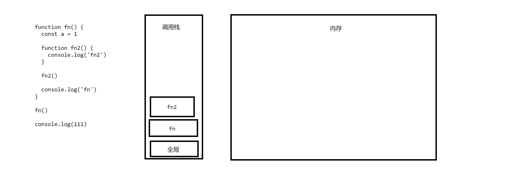
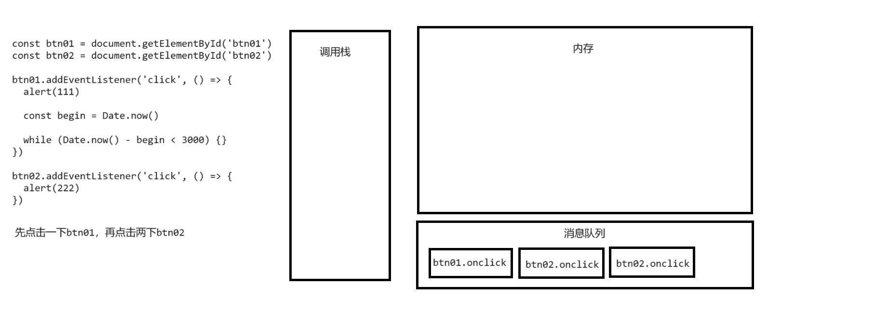

# DOM

## Hello World

- 要使用 DOM 来操作网页，我们需要浏览器至少得先给我一个对象，才能去完成各种操作
- 所以浏览器已经为我们提供了一个 document 对象，它是一个全局变量可以直接使用
- document 代表的是整个的网页

```html
<!DOCTYPE html>
<html lang="zh">
  <head>
    <meta charset="UTF-8" />
    <meta name="viewport" content="width=device-width, initial-scale=1.0" />
    <title>Document</title>
  </head>
  <body>
    <button id="btn">点我一下</button>

    <script>
      console.log(document)
      const btn = document.getElementById('btn')
      btn.innerText = 'Click Me'
    </script>
  </body>
</html>
```

## document 对象

- document 对象表示的是整个网页
- document 对象的原型链
  - HTMLDocument -> Document -> Node -> EventTarget -> Object 原型 -> null
- 凡是在原型链上存在的对象的属性和方法都可以通过 Document 去调用
- 部分属性：
  - document.documentElement --> html 根元素
  - document.head --> head 元素
  - document.body --> body 元素
  - document.title --> title 元素
  - document.links --> 获取页面中所有的超链接

```html
<!DOCTYPE html>
<html lang="zh">
  <head>
    <meta charset="UTF-8" />
    <meta name="viewport" content="width=device-width, initial-scale=1.0" />
    <title>Document</title>
  </head>
  <body>
    <a href="javascript:;">111</a>
    <a href="javascript:;">222</a>

    <script>
      console.log(document.links[0])
    </script>
  </body>
</html>
```

## 元素节点

- 元素节点对象(element)
  - 在网页中，每一个标签都是一个元素节点
  - 如何获取元素节点对象？
    - 通过 document 对象来获取元素节点
    - 通过 document 对象来创建元素节点
  - 通过 document 来获取已有的元素节点：
    - document.getElementById()
      - 根据 id 获取一个元素节点对象
    - document.getElementsByClassName()
      - 根据元素的 class 属性值获取一组元素节点对象
      - 返回的是一个类数组对象
      - 该方法返回的结果是一个实时更新的集合
      - 当网页中新添加元素时，集合也会实时的刷新
    - document.getElementsByTagName()
      - 根据标签名获取一组元素节点对象
      - 返回的结果是可以实时更新的集合
      - document.getElementsByTagName("\*") 获取页面中所有的元素
    - document.getElementsByName()
      - 根据 name 属性获取一组元素节点对象
      - 返回一个实时更新的集合
      - 主要用于表单项
    - document.querySelectorAll()
      - 根据选择器去页面中查询元素
      - 会返回一个类数组(不会实时更新)
    - document.querySelector()
      - 根据选择器去页面中查询第一个符合条件的元素
  - 创建一个元素节点
    - document.createElement()
      - 根据标签名创建一个元素节点对象

```html
<!DOCTYPE html>
<html lang="zh">
  <head>
    <meta charset="UTF-8" />
    <meta name="viewport" content="width=device-width, initial-scale=1.0" />
    <title>Document</title>
  </head>
  <body>
    <button id="btn">点我一下</button>

    <span class="s1">span1</span>
    <span class="s1">span2</span>
    <span class="s1">span3</span>
    <span class="s1">span4</span>
    <span class="s1">span5</span>

    <div>div1</div>
    <div>div2</div>
    <div>div3</div>
    <div>div4</div>
    <div>div5</div>

    <form>
      <input type="text" name="username" />
      <input type="radio" name="gender" />男 <input type="radio" name="gender" />女
    </form>

    <script>
      const btn = document.getElementById('btn')

      const spans = document.getElementsByClassName('s1')

      const divs = document.getElementsByTagName('div')

      const gender = document.getElementsByName('gender')

      const divs2 = document.querySelectorAll('div')

      const div = document.querySelector('div')

      // console.log(document.getElementsByTagName('*'))

      const h2 = document.createElement('h2')

      for (let item of spans) {
        item.innerText = '新span'
      }
    </script>
  </body>
</html>
```

- div 元素的原型链
  - HTMLDivElement -> HTMLElement -> Element -> Node -> EventTarget -> Object.prototype -> null
- 通过元素节点对象获取其他节点的方法
  - element.childNodes 获取当前元素的子节点 (会包含空白的子节点)
  - element.children 获取当前元素的子元素
  - element.firstElementChild 获取当前元素的第一个子元素
  - element.lastElementChild 获取当前元素的最后一个子元素
  - element.nextElementSibling 获取当前元素的下一个兄弟元素
  - element.previousElementSibling 获取当前元素的前一个兄弟元素
  - element.parentNode 获取当前元素的父节点
  - element.tagName 获取当前元素的标签名

```html
<!DOCTYPE html>
<html lang="zh">
  <head>
    <meta charset="UTF-8" />
    <meta name="viewport" content="width=device-width, initial-scale=1.0" />
    <title>Document</title>
  </head>
  <body>
    <p>哈哈哈</p>

    <div id="box01">
      我是box01
      <span class="s1">span01</span>
      <span class="s1">span02</span>
    </div>

    <span class="s1">span03</span>

    <script>
      const box01 = document.getElementById('box01')
      const spans = box01.getElementsByClassName('s1')

      // const cns = box01.childNodes
      let result = box01.children
      result = box01.firstElementChild
      result = box01.lastElementChild
      result = box01.nextElementSibling
      result = box01.previousElementSibling
      result = box01.parentNode
      result = box01.tagName // 'DIV'
      console.log(result)
    </script>
  </body>
</html>
```

## 文本节点

- 在 DOM 中，网页中所有的文本内容都是文本节点对象
- 可以通过元素来获取其中的文本节点对象，但是我们通常不会这么做
- 我们可以直接通过元素去修改其中的文本
- 修改文本的三个属性
  - element.textContent
    - 获取或修改元素中的文本内容
    - 获取的是标签中的内容，不会考虑 css 样式
  - element.innerText
    - 获取或修改元素中的文本内容
    - innerText 获取内容时，会考虑 css 样式
    - 通过 innerText 去读取 CSS 样式，会触发网页的重排(计算 CSS 样式)
    - 当字符串中有标签时，会自动对标签进行转义
    - `<li>` --> &lt;li&gt;
  - element.innerHTML
    - 获取或修改元素中的 html 代码
    - 可以直接向元素中添加 html 代码
    - innerHTML 插入内容时，有被 xss 注入的风险

```html
<!DOCTYPE html>
<html lang="zh">
  <head>
    <meta charset="UTF-8" />
    <meta name="viewport" content="width=device-width, initial-scale=1.0" />
    <title>Document</title>
  </head>
  <body>
    <!-- <div id="box01">我是box01</div> -->

    <div id="box01">
      <span style="text-transform: uppercase">我是box01</span>
    </div>

    <script>
      const box01 = document.getElementById('box01')

      // const text = box01.firstChild
      // console.log(text)

      // console.log(box01.innerText)
      // console.log(box01.textContent)
      // console.log(box01.innerHTML)

      // box01.innerText = '哈哈哈'
      // box01.textContent = '嘻嘻嘻'

      // box01.innerHTML = "<script src='https://sss/sss.js'><\/script>"
    </script>
  </body>
</html>
```

## 属性节点 (Attr)

- 在 DOM 中也是一个对象，通常不需要获取对象而是直接通过元素即可完成对其的各种操作
- 如何操作属性节点：
  - 方式一：
    - 读取：
      - 元素.属性名
      - 注意，class 属性需要使用 className 来读取
      - 读取一个布尔值时，会返回 true 或 false
    - 修改：
      - 元素.属性名 = 属性值
  - 方式二：
    - 读取：
      - 元素.getAttribute(属性名)
    - 修改：
      - 元素.setAttribute(属性名, 属性值)
    - 删除：
      - 元素.removeAttribute(属性名)

```html
<!DOCTYPE html>
<html lang="zh">
  <head>
    <meta charset="UTF-8" />
    <meta name="viewport" content="width=device-width, initial-scale=1.0" />
    <title>Document</title>
  </head>
  <body>
    <!-- <input class="test" disabled type="text" name="username" value="admin" /> -->
    <input class="test" type="text" name="username" value="admin" />

    <script>
      const input = document.getElementsByName('username')[0]

      // console.log(input.type)
      // console.log(input.name)
      // console.log(input.value)
      // console.log(input.className)
      // console.log(input.disabled) // 返回 true 或 false

      // input.disabled = false
      // input.disabled = true
      // input.value = '哈哈哈'

      // console.log(input.getAttribute('type'))
      // console.log(input.getAttribute('class'))

      // input.setAttribute('value', '孙悟空')
      // input.setAttribute('disabled', false) // 无法通过设置 false 解除禁用状态
      input.setAttribute('disabled', 'disabled')
      input.removeAttribute('disabled')
    </script>
  </body>
</html>
```

## 事件 (event)

- 事件就是用户和页面之间发生的交互行为
- 比如：点击按钮、鼠标移动、双击按钮、敲击键盘、松开按键 ......
- 可以通过为事件绑定响应函数(回调函数)，来完成和用户之间的交互
- 绑定响应函数的方式：
  - 可以直接在元素的属性中设置
  - 可以通过为元素的指定属性设置回调函数的形式来绑定事件 (一个事件只能绑定一个响应函数)，后面的会覆盖前面的
  - 可以通过元素 addEventListener()方法来绑定事件，不会进行覆盖

```html
<!DOCTYPE html>
<html lang="zh">
  <head>
    <meta charset="UTF-8" />
    <meta name="viewport" content="width=device-width, initial-scale=1.0" />
    <title>Document</title>
  </head>
  <body>
    <!-- <button onclick="alert('你点我干嘛')">点我一下</button> -->
    <button id="btn">点我一下</button>

    <script>
      const btn = document.getElementById('btn')

      // btn.onclick = function () {
      //   alert('Hello')
      //   console.log(this) // btn
      // }

      // btn.onclick = () => {
      //   alert('哈哈哈')
      //   console.log(this) // window
      // }

      btn.addEventListener('click', function () {
        alert('111')
        // console.log(this) // btn
      })

      btn.addEventListener('click', () => {
        alert('222')
        // console.log(this) // window
      })

      btn.addEventListener('click', () => {
        alert('333')
      })
    </script>
  </body>
</html>
```

## 文档的加载

- 网页是自上向下加载的，如果将 js 代码编写到网页的上边，js 代码在执行时，网页还没有加载完毕，这时会出现无法获取到 DOM 对象的情况
- window.onload 事件会在窗口中的内容加载完毕之后才触发
- document 的 DOMContentLoaded 事件会在当前文档加载完毕之后触发
- 如何解决这个问题：
  - 将 script 标签编写到 body 的最后
  - 将代码编写到 window.onload 的回调函数中
  - 将代码编写到 document 对象的 DOMContentLoaded 的回调函数中(执行时机更早)
  - 将代码编写到外部的 js 文件中，然后以 defer 的形式进行引入(执行时机更早，早于 DOMContentLoaded)

```html
<!DOCTYPE html>
<html lang="zh">
  <head>
    <meta charset="UTF-8" />
    <meta name="viewport" content="width=device-width, initial-scale=1.0" />
    <title>Document</title>
    <script>
      // window.onload = function () {
      //   const btn = document.getElementById('btn')
      //   console.log(btn)
      // }

      // window.addEventListener('load', function () {
      //   const btn = document.getElementById('btn')
      //   // console.log(btn)
      //   alert(btn)
      // })

      // document.addEventListener('DOMContentLoaded', function () {
      //   const btn = document.getElementById('btn')
      //   // console.log(btn)
      //   alert(btn)
      // })
    </script>

    <script defer src="./script/script.js"></script>
  </head>
  <body>
    <button id="btn">点我一下</button>

    <iframe src="https://www.lilichao.com" frameborder="0"></iframe>

    <script>
      // const btn = document.getElementById('btn')
      // console.log(btn)
      // alert(btn)
    </script>
  </body>
</html>
```

## 练习 1

```html
<!DOCTYPE html>
<html lang="zh">
  <head>
    <meta charset="UTF-8" />
    <meta name="viewport" content="width=device-width, initial-scale=1.0" />
    <title>Document</title>
    <style>
      .outer {
        width: 500px;
        margin: 50px auto;
        text-align: center;
      }

      .outer img {
        width: 100%;
      }
    </style>
  </head>
  <body>
    <div class="outer">
      
      <div>
        <button id="prev">上一张</button>
        <button id="next">下一张</button>
      </div>
      <p>1/5</p>
    </div>

    <script>
      const imgArr = [
        './images/001.jpg',
        './images/002.jpg',
        './images/003.jpg',
        './images/004.jpg',
        './images/005.jpg',
      ]

      let index = 0

      const img = document.getElementsByTagName('img')[0]
      const prev = document.getElementById('prev')
      const next = document.getElementById('next')
      const p = document.getElementsByTagName('p')[0]

      prev.addEventListener('click', () => {
        index--

        if (index < 0) {
          index = imgArr.length - 1
        }

        img.src = imgArr[index]

        p.textContent = `${index + 1}/${imgArr.length}`
      })

      next.addEventListener('click', () => {
        index++

        if (index > imgArr.length - 1) {
          index = 0
        }
        img.src = imgArr[index]

        p.textContent = `${index + 1}/${imgArr.length}`
      })
    </script>
  </body>
</html>
```

## 练习 2

- 在事件的响应函数中，响应函数绑定给谁 this 就是谁(箭头函数除外)

```html
<!DOCTYPE html>
<html lang="zh">
  <head>
    <meta charset="UTF-8" />
    <meta name="viewport" content="width=device-width, initial-scale=1.0" />
    <title>Document</title>
  </head>
  <body>
    <form>
      <div>
        请选择你的爱好：
        <input type="checkbox" id="check-all" /> 全选
      </div>
      <div>
        <input type="checkbox" name="hobby" value="乒乓球" /> 乒乓球
        <input type="checkbox" name="hobby" value="篮球" /> 篮球
        <input type="checkbox" name="hobby" value="羽毛球" /> 羽毛球
        <input type="checkbox" name="hobby" value="足球" /> 足球
      </div>
      <div>
        <button type="button" id="all">全选</button>
        <button type="button" id="no">取消</button>
        <button type="button" id="reverse">反选</button>
        <button type="button" id="send">提交</button>
      </div>
    </form>

    <script>
      let count = 0
      const hobbies = document.getElementsByName('hobby')

      const checkCount = (item) => {
        if (item.checked) {
          count++
        } else {
          count--
        }

        if (count === hobbies.length) {
          checkAll.checked = true
        } else {
          checkAll.checked = false
        }
      }

      const allBtn = document.getElementById('all')
      allBtn.addEventListener('click', () => {
        for (let i = 0; i < hobbies.length; i++) {
          hobbies[i].checked = true
        }

        checkAll.checked = true
      })

      const noBtn = document.getElementById('no')
      noBtn.addEventListener('click', () => {
        for (let i = 0; i < hobbies.length; i++) {
          hobbies[i].checked = false
        }

        checkAll.checked = false
      })

      const reverseBtn = document.getElementById('reverse')
      reverseBtn.addEventListener('click', () => {
        for (let i = 0; i < hobbies.length; i++) {
          hobbies[i].checked = !hobbies[i].checked
          checkCount(hobbies[i])
        }
      })

      const sendBtn = document.getElementById('send')
      sendBtn.addEventListener('click', () => {
        for (let i = 0; i < hobbies.length; i++) {
          if (hobbies[i].checked) {
            alert(hobbies[i].value)
          }
        }
      })

      const checkAll = document.getElementById('check-all')
      checkAll.addEventListener('click', () => {
        for (let i = 0; i < hobbies.length; i++) {
          // 在事件的响应函数中，响应函数绑定给谁 this就是谁(箭头函数除外)
          // hobbies[i].checked = this.checked
          hobbies[i].checked = checkAll.checked
        }
      })

      for (let i = 0; i < hobbies.length; i++) {
        hobbies[i].addEventListener('click', () => {
          checkCount(hobbies[i])
        })
      }
    </script>
  </body>
</html>
```

## 元素的修改

- appendChild() 用于给一个节点添加子节点，添加到末尾
- insertAdjacentElement()可以向元素的任意位置添加元素
- 两个参数：
  - 要添加的位置
    - beforeend 添加到标签的末尾
    - afterbegin 添加到标签的开始
    - beforebegin 在元素的前边插入元素(兄弟元素)
    - afterend 在元素的后边插入元素(兄弟元素)
  - 要添加的元素
- replaceWith() 使用一个元素替换当前元素
- remove()方法用来删除当前元素

```html
<!DOCTYPE html>
<html lang="zh">
  <head>
    <meta charset="UTF-8" />
    <meta name="viewport" content="width=device-width, initial-scale=2.0" />
    <title>Document</title>
  </head>
  <body>
    <button id="btn01">按钮1</button>
    <button id="btn02">按钮2</button>

    <hr />

    <ul id="list">
      <li id="swk">孙悟空</li>
      <li id="zbj">猪八戒</li>
      <li id="shs">沙和尚</li>
    </ul>

    <script>
      const list = document.getElementById('list')
      const btn01 = document.getElementById('btn01')
      const btn02 = document.getElementById('btn02')

      btn01.addEventListener('click', () => {
        const li = document.createElement('li')
        li.textContent = '唐僧'
        li.id = 'ts'

        // list.appendChild(li)

        // list.insertAdjacentElement('beforeend', li)
        // list.insertAdjacentElement('afterbegin', li)
        // list.insertAdjacentElement('afterend', li)
        // list.insertAdjacentElement('beforebegin', li)
        list.insertAdjacentHTML('beforeend', '<li id="bgj">白骨精</li>')
      })

      btn02.addEventListener('click', () => {
        const li = document.createElement('li')
        li.textContent = '蜘蛛精'
        li.id = 'zzj'

        const swk = document.getElementById('swk')
        // swk.replaceWith(li)
        swk.remove()
      })
    </script>
  </body>
</html>
```

## 练习 3

- 使用 return false 来取消默认行为，只在 xxx.xxx = function(){}这种形式绑定的事件中才适用

```html
<!DOCTYPE html>
<html lang="zh">
  <head>
    <meta charset="UTF-8" />
    <meta name="viewport" content="width=device-width, initial-scale=1.0" />
    <title>Document</title>
    <style>
      .outer {
        width: 400px;
        margin: 100px auto;
        text-align: center;
      }

      table {
        width: 400px;
        border-collapse: collapse;
        margin-bottom: 20px;
      }

      td,
      th {
        border: 1px black solid;
        padding: 10px 0;
      }

      form div {
        margin: 10px 0;
      }
    </style>
  </head>
  <body>
    <div class="outer">
      <table>
        <tbody>
          <tr>
            <th>姓名</th>
            <th>邮件</th>
            <th>薪资</th>
            <th>操作</th>
          </tr>
          <tr>
            <td>孙悟空</td>
            <td>swk@hgs.com</td>
            <td>10000</td>
            <td><a href="javascript:;">删除</a></td>
          </tr>
          <tr>
            <td>猪八戒</td>
            <td>zbj@glz.com</td>
            <td>8000</td>
            <td><a href="javascript:;">删除</a></td>
          </tr>
          <tr>
            <td>沙和尚</td>
            <td>shs@lsh.com</td>
            <td>6000</td>
            <td><a href="javascript:;">删除</a></td>
          </tr>
        </tbody>
      </table>

      <form action="#">
        <div>
          <label for="name">姓名</label>
          <input type="text" id="name" />
        </div>
        <div>
          <label for="email">邮件</label>
          <input type="email" id="email" />
        </div>
        <div>
          <label for="salary">薪资</label>
          <input type="number" id="salary" />
        </div>
        <button type="button">添加</button>
      </form>
    </div>

    <script>
      const links = document.links

      function deleteHandler() {
        // 本练习中的超链接，我们是不希望发生跳转，但是跳转行为是超链接的默认行为
        // 只要点击超链接就会触发页面的跳转，事件中可以通过取消默认行为来阻止超链接的跳转
        // 使用return false来取消默认行为，只在 xxx.xxx = function(){}这种形式绑定的事件中才适用
        // return false
        const tr = this.parentNode.parentNode
        const name = tr.firstElementChild.textContent

        if (confirm(`你确认要删除 [${name}] 吗`)) {
          tr.remove()
        }
      }

      for (let i = 0; i < links.length; i++) {
        // links[i].onclick = function () {
        //   const tr = links[i].parentNode.parentNode
        //   console.log(tr)

        //   return false
        // }

        // links[i].addEventListener("click", function(){
        //     alert(123)
        //     return false // 无法取消默认行为
        // })

        links[i].addEventListener('click', deleteHandler)
      }

      const btn = document.getElementsByTagName('button')[0]
      btn.addEventListener('click', () => {
        const name = document.getElementById('name').value
        const email = document.getElementById('email').value
        const salary = document.getElementById('salary').value

        const tbody = document.getElementsByTagName('tbody')[0]

        // 这种写法，容易被xss的攻击
        // tbody.insertAdjacentHTML(
        //   'beforeend',
        //   `
        //     <tr>
        //       <td>${name}</td>
        //       <td>${email}</td>
        //       <td>${salary}</td>
        //       <td><a href="javascript:;">删除</a></td>
        //     </tr>
        //   `
        // )

        const tr = document.createElement('tr')
        const nameTd = document.createElement('td')
        const emailTd = document.createElement('td')
        const salaryTd = document.createElement('td')

        nameTd.textContent = name
        emailTd.textContent = email
        salaryTd.textContent = salary

        tbody.appendChild(tr)

        tr.appendChild(nameTd)
        tr.appendChild(emailTd)
        tr.appendChild(salaryTd)
        tr.insertAdjacentHTML('beforeend', '<td><a href="javascript:;">删除</a></td>')

        // 由于上边的超链接是新添加的，所以它的上边并没有绑定单击响应函数，所以新添加的员工无法删除
        // 解决方式：为新添加的超链接单独绑定响应函数
        links[links.length - 1].addEventListener('click', deleteHandler)
      })
    </script>
  </body>
</html>
```

## 节点的复制

- 使用 cloneNode() 方法对节点进行复制时，它会复制节点的所有特点包括各种属性
- 这个方法默认只会复制当前节点，而不会复制节点的子节点
- 可以传递一个 true 作为参数，这样该方法也会将元素的子节点一起复制

```html
<!DOCTYPE html>
<html lang="zh">
  <head>
    <meta charset="UTF-8" />
    <meta name="viewport" content="width=device-width, initial-scale=1.0" />
    <title>Document</title>
  </head>
  <body>
    <button id="btn01">点我一下</button>

    <ul id="list1">
      <li id="l1">孙悟空</li>
      <li id="l2">猪八戒</li>
      <li id="l3">沙和尚</li>
    </ul>

    <ul id="list2">
      <li>蜘蛛精</li>
    </ul>

    <script>
      const btn01 = document.getElementById('btn01')
      const list2 = document.getElementById('list2')
      const l1 = document.getElementById('l1')

      btn01.addEventListener('click', () => {
        // list2.appendChild(l1)

        const newL1 = l1.cloneNode(true)
        newL1.id = 'newL1'
        list2.appendChild(newL1)
      })
    </script>
  </body>
</html>
```

## 修改 CSS 样式

- 修改样式的方式：
  - 元素.style.样式名 = 样式值
- 如果样式名中含有-，则需要将样式名修改为驼峰命名法
- background-color --> backgroundColor

```html
<!DOCTYPE html>
<html lang="zh">
  <head>
    <meta charset="UTF-8" />
    <meta name="viewport" content="width=device-width, initial-scale=1.0" />
    <title>Document</title>
    <style>
      .box01 {
        width: 200px;
        height: 200px;
        background-color: #bfa;
      }
    </style>
  </head>
  <body>
    <button id="btn">点我一下</button>
    <hr />
    <div class="box01"></div>

    <script>
      const btn = document.getElementById('btn')
      const box01 = document.getElementsByClassName('box01')[0]

      btn.addEventListener('click', () => {
        box01.style.width = '400px'
        box01.style.height = '400px'
        box01.style.backgroundColor = 'skyblue'
      })
    </script>
  </body>
</html>
```

## 读取 CSS 样式

- getComputedStyle()
  - 它会返回一个对象，这个对象中包含了当前元素所有生效的样式
  - 参数：
    - 要获取样式的对象
    - 要获取的伪元素
  - 返回值：
    - 返回的是一个对象，对象中存储了当前元素的样式
  - 注意：
    - 样式对象中返回的样式值，不一定能拿来直接计算
    - 所以使用时，一定要确保值是可以计算的才去计算

```html
<!DOCTYPE html>
<html lang="zh">
  <head>
    <meta charset="UTF-8" />
    <meta name="viewport" content="width=device-width, initial-scale=1.0" />
    <title>Document</title>
    <style>
      .box {
        /* width: 200px; */
        height: 200px;
        background-color: #bfa;
      }

      .box::before {
        content: 'Hello';
        color: red;
      }
    </style>
  </head>
  <body>
    <button id="btn">点我一下</button>
    <hr />
    <div class="box"></div>

    <script>
      const btn = document.getElementById('btn')
      const box = document.getElementsByClassName('box')[0]

      btn.addEventListener('click', () => {
        const boxStyle = getComputedStyle(box)
        // console.log(boxStyle.width)
        // console.log(parseInt(boxStyle.width) + 200)
        // box.style.width = parseInt(boxStyle.width) + 200 + 'px'

        console.log(boxStyle.width) // 1520px
        console.log(boxStyle.left) // auto

        const boxBefore = getComputedStyle(box, '::before')
        // console.log(boxBefore.color) // rgb(255, 0, 0)
      })
    </script>
  </body>
</html>
```

## 其他读取样式的方式

- 元素.clientHeight
- 元素.clientWidth
  - 获取元素内部的宽度和高度 (包括内容区和内边距)
- 元素.offsetHeight
- 元素.offsetWidth
  - 获取元素的可见框的大小 (包括内容区、内边距和边框)
- 元素.scrollHeight
- 元素.scrollWidth
  - 获取元素滚动区域的大小
- 元素.offsetParent
  - 获取元素的定位父元素
  - 定位父元素：
    - 离当前元素最近的开启了定位的祖先元素，如果所有的元素都没有开启定位则返回 body
- 元素.offsetTop
- 元素.offsetLeft
  - 获取元素相对于其定位父元素的偏移量
- 元素.scrollTop
- 元素.scrollLeft
  - 获取或设置元素滚动条的偏移量

```html
<!DOCTYPE html>
<html lang="zh">
  <head>
    <meta charset="UTF-8" />
    <meta name="viewport" content="width=device-width, initial-scale=1.0" />
    <title>Document</title>
    <style>
      #box {
        width: 200px;
        height: 200px;
        padding: 50px;
        margin: 50px;
        border: 10px solid red;
        background-color: #bfa;
        overflow: auto;
      }

      .box02 {
        height: 500px;
        background-color: orange;
      }
    </style>
  </head>
  <body>
    <button id="btn">点我一下</button>
    <hr />
    <div id="box">
      <div class="box02"></div>
    </div>

    <script>
      const btn = document.getElementById('btn')
      const box = document.getElementById('box')

      btn.addEventListener('click', () => {
        // console.log(box.clientHeight) // 300
        // console.log(box.clientWidth) // 300
        // console.log(box.offsetHeight) // 320
        // console.log(box.offsetWidth) // 320
        // console.log(box.scrollHeight) // 600

        // console.log(box.offsetParent) // body
        // console.log(box.offsetTop) // 91
        // console.log(box.offsetLeft) // 58
        console.log(box.scrollTop)
        box.scrollTop = 100
      })
    </script>
  </body>
</html>
```

## 修改 CSS 样式

- 除了直接修改样式外，也可以通过修改 class 属性来间接的修改样式
- 通过 class 修改样式的好处：
  - 可以一次性修改多个样式
  - 对 JS 和 CSS 进行解耦
- 元素.classList 是一个对象，对象中提供了对当前元素的类的各种操作方法
  - 元素.classList.add()
    - 向元素中添加一个或多个 class
  - 元素.classList.remove()
    - 移除元素中的一个或多个 class
  - 元素.classList.toggle()
    - 切换元素中的一个 class, 元素中有这个 class, 就移除, 没有就添加
  - 元素.classList.replace()
    - 替换 class
  - 元素.classList.contains()
    - 检查元素是否包含 class, 包含返回 true, 不包含返回 false

```html
<!DOCTYPE html>
<html lang="zh">
  <head>
    <meta charset="UTF-8" />
    <meta name="viewport" content="width=device-width, initial-scale=1.0" />
    <title>Document</title>
    <style>
      .box01 {
        width: 200px;
        height: 200px;
        background-color: #bfa;
      }

      .box02 {
        width: 400px;
        height: 300px;
        background-color: orange;
        border: 5px solid red;
      }
    </style>
  </head>
  <body>
    <button id="btn">点我一下</button>
    <hr />

    <div class="box01"></div>

    <script>
      const btn = document.getElementById('btn')
      const box01 = document.getElementsByClassName('box01')[0]

      btn.addEventListener('click', () => {
        // box01.className = 'box02'
        // box01.className += ' box02'
        // box01.classList.add('box02', 'box03')
        // box01.classList.remove('box03')
        // box01.classList.toggle('box02')
        box01.classList.replace('box01', 'box02')

        let result = box01.classList.contains('box02') // true
        console.log(result)
      })
    </script>
  </body>
</html>
```

## 事件对象

- event 事件
- 事件对象
  - 事件对象是由浏览器在事件触发时所创建的对象，这个对象中封装了事件相关的各种信息
  - 通过事件对象可以获取到事件的详细信息，比如：鼠标的坐标、键盘的按键 ......
  - 浏览器在创建事件对象后，会将事件对象作为响应函数的参数传递，所以我们可以在事件的回调函数中定义一个形参来接收事件对象

```html
<!DOCTYPE html>
<html lang="zh">
  <head>
    <meta charset="UTF-8" />
    <meta name="viewport" content="width=device-width, initial-scale=1.0" />
    <title>Document</title>
    <style>
      .box01 {
        width: 200px;
        height: 200px;
        border: 10px solid #bfa;
      }
    </style>
  </head>
  <body>
    <div class="box01"></div>

    <script>
      const box01 = document.getElementsByClassName('box01')[0]

      box01.addEventListener('mousemove', (e) => {
        box01.textContent = `(${e.x},${e.y})`
        console.log(e.clientX, e.clientY)
      })
    </script>
  </body>
</html>
```

- 在 DOM 中存在着多种不同类型的事件对象
- 多种事件对象有一个共同的祖先 Event
  - event.target 触发事件的对象
  - event.currentTarget 绑定事件的对象(同 this)
  - event.stopPropagation() 停止事件的传导
  - event.preventDefault() 取消默认行为
- 事件的冒泡(bubble)
  - 事件的冒泡就是指事件的向上传导
  - 当元素上的某个事件被触发后，其祖先元素上的相同事件也会同时被触发
  - 冒泡的存在大大的简化了代码的编写，但是在一些场景下我们并不希望冒泡存在
  - 不希望事件冒泡时，可以通过事件对象来取消冒泡

```html
<!DOCTYPE html>
<html lang="zh">
  <head>
    <meta charset="UTF-8" />
    <meta name="viewport" content="width=device-width, initial-scale=1.0" />
    <title>Document</title>
    <style>
      #box01 {
        width: 300px;
        height: 300px;
        background-color: #bfa;
      }

      #box02 {
        width: 200px;
        height: 200px;
        background-color: skyblue;
      }

      #box03 {
        width: 100px;
        height: 100px;
        background-color: orange;
      }
    </style>
  </head>
  <body>
    <div id="box01">
      <div id="box02">
        <div id="box03"></div>
      </div>
    </div>

    <a href="https://lilichao.com">超</a>

    <script>
      const box01 = document.getElementById('box01')
      const box02 = document.getElementById('box02')
      const box03 = document.getElementById('box03')
      const a = document.getElementsByTagName('a')[0]

      box01.addEventListener('click', function (e) {
        alert('box01')
        // 在事件的响应函数中：
        //   event.target 表示的是触发事件的对象
        //   this 绑定事件的对象

        // console.log(this)
        // console.log(e.target)
        console.log(e.currentTarget)
      })

      box02.addEventListener('click', function (e) {
        alert('box02')
      })

      box03.addEventListener('click', function (e) {
        // 取消事件的传导
        e.stopPropagation()
        alert('box03')
      })

      a.addEventListener('click', (e) => {
        // 取消默认行为
        e.preventDefault()
      })
    </script>
  </body>
</html>
```

## 冒泡

- 事件的冒泡和元素的样式无关，只和结构相关

```html
<!DOCTYPE html>
<html lang="zh">
  <head>
    <meta charset="UTF-8" />
    <meta name="viewport" content="width=device-width, initial-scale=1.0" />
    <title>Document</title>
    <style>
      #box01 {
        width: 100px;
        height: 100px;
        border-radius: 50%;
        background-color: #bfa;
        position: absolute;
      }

      #box02 {
        width: 300px;
        height: 300px;
        background-color: orange;
      }

      #box03 {
        width: 200px;
        height: 200px;
        background-color: skyblue;
      }

      #box04 {
        width: 100px;
        height: 100px;
        background-color: yellow;
        position: absolute;
        bottom: 0;
      }
    </style>
  </head>
  <body>
    <div id="box01"></div>
    <div id="box02"></div>

    <div id="box03">
      <div id="box04"></div>
    </div>

    <script>
      const box01 = document.getElementById('box01')
      const box02 = document.getElementById('box02')
      const box03 = document.getElementById('box03')
      const box04 = document.getElementById('box04')

      document.addEventListener('mousemove', (e) => {
        box01.style.left = e.x + 'px'
        box01.style.top = e.y + 'px'
      })

      box02.addEventListener('mousemove', (e) => {
        // e.stopPropagation()
      })

      box03.addEventListener('click', (e) => {
        alert(3)
      })

      box04.addEventListener('click', (e) => {
        alert(4)
      })
    </script>
  </body>
</html>
```

## 事件的委派

- 委派就是将本该绑定给多个元素的事件，统一绑定给 document，这样可以降低代码复杂度方便维护

```html
<!DOCTYPE html>
<html lang="zh">
  <head>
    <meta charset="UTF-8" />
    <meta name="viewport" content="width=device-width, initial-scale=1.0" />
    <title>Document</title>
  </head>
  <body>
    <button id="btn">点我一下</button>
    <hr />

    <ul id="list">
      <li><a href="javascript:;">链接1</a></li>
      <li><a href="javascript:;">链接2</a></li>
      <li><a href="javascript:;">链接3</a></li>
      <li><a href="javascript:;">链接4</a></li>
    </ul>

    <script>
      const btn = document.getElementById('btn')
      const list = document.getElementById('list')
      const links = document.links

      // for (let i = 0; i < links.length; i++) {
      //   links[i].addEventListener('click', e => {
      //     alert(e.target.textContent)
      //   })
      // }

      document.addEventListener('click', (e) => {
        if ([...links].includes(e.target)) {
          alert(e.target.textContent)
        }
      })

      btn.addEventListener('click', () => {
        list.insertAdjacentHTML('beforeend', '<li><a href="javascript:;">新超链接</a></li>')
      })
    </script>
  </body>
</html>
```

## 修改练习 3

```html
<!DOCTYPE html>
<html lang="zh">
  <head>
    <meta charset="UTF-8" />
    <meta name="viewport" content="width=device-width, initial-scale=1.0" />
    <title>Document</title>
    <style>
      .outer {
        width: 400px;
        margin: 100px auto;
        text-align: center;
      }

      table {
        width: 400px;
        border-collapse: collapse;
        margin-bottom: 20px;
      }

      td,
      th {
        border: 1px black solid;
        padding: 10px 0;
      }

      form div {
        margin: 10px 0;
      }
    </style>
  </head>
  <body>
    <div class="outer">
      <table>
        <tbody>
          <tr>
            <th>姓名</th>
            <th>邮件</th>
            <th>薪资</th>
            <th>操作</th>
          </tr>
          <tr>
            <td>孙悟空</td>
            <td>swk@hgs.com</td>
            <td>10000</td>
            <td><a href="javascript:;">删除</a></td>
          </tr>
          <tr>
            <td>猪八戒</td>
            <td>zbj@glz.com</td>
            <td>8000</td>
            <td><a href="javascript:;">删除</a></td>
          </tr>
          <tr>
            <td>沙和尚</td>
            <td>shs@lsh.com</td>
            <td>6000</td>
            <td><a href="javascript:;">删除</a></td>
          </tr>
        </tbody>
      </table>

      <form action="#">
        <div>
          <label for="name">姓名</label>
          <input type="text" id="name" />
        </div>
        <div>
          <label for="email">邮件</label>
          <input type="email" id="email" />
        </div>
        <div>
          <label for="salary">薪资</label>
          <input type="number" id="salary" />
        </div>
        <button type="button">添加</button>
      </form>
    </div>

    <script>
      const links = document.links

      document.addEventListener('click', (e) => {
        if ([...links].includes(e.target)) {
          const tr = e.target.parentNode.parentNode
          const name = tr.firstElementChild.textContent

          if (confirm(`你确认要删除 [${name}] 吗`)) {
            tr.remove()
          }
        }
      })

      const btn = document.getElementsByTagName('button')[0]
      btn.addEventListener('click', () => {
        const name = document.getElementById('name').value
        const email = document.getElementById('email').value
        const salary = document.getElementById('salary').value

        const tbody = document.getElementsByTagName('tbody')[0]

        const tr = document.createElement('tr')
        const nameTd = document.createElement('td')
        const emailTd = document.createElement('td')
        const salaryTd = document.createElement('td')

        nameTd.textContent = name
        emailTd.textContent = email
        salaryTd.textContent = salary

        tbody.appendChild(tr)

        tr.appendChild(nameTd)
        tr.appendChild(emailTd)
        tr.appendChild(salaryTd)
        tr.insertAdjacentHTML('beforeend', '<td><a href="javascript:;">删除</a></td>')
      })
    </script>
  </body>
</html>
```

## 事件的捕获

- 事件的传播机制：
  - 在 DOM 中，事件的传播可以分为三个阶段：
    - 捕获阶段 (由祖先元素向目标元素进行事件的捕获)从 document 到 触发事件的对象(默认情况下，事件不会在捕获阶段触发)
    - 目标阶段 (触发事件的对象)
    - 冒泡阶段 (由目标元素向祖先元素进行事件的冒泡)从触发事件的对象到 document
  - 事件的捕获，指事件从外向内的传导，当前元素触发事件以后，会先从当前元素最大的祖先元素开始向当前元素进行事件的捕获
  - 如果希望在捕获阶段触发事件，可以将 addEventListener 的第三个参数设置为 true
  - 一般情况下我们不希望事件在捕获阶段触发，所有通常都不需要设置第三个参数
  - eventPhase 表示事件触发的阶段
    - 0 没有触发事件
    - 1 捕获阶段
    - 2 目标阶段
    - 3 冒泡阶段

```html
<!DOCTYPE html>
<html lang="zh">
  <head>
    <meta charset="UTF-8" />
    <meta name="viewport" content="width=device-width, initial-scale=1.0" />
    <title>Document</title>
    <style>
      #box01 {
        width: 200px;
        height: 200px;
        background-color: #bfa;
      }

      #box02 {
        width: 150px;
        height: 150px;
        background-color: skyblue;
      }

      #box03 {
        width: 100px;
        height: 100px;
        background-color: orange;
      }
    </style>
  </head>
  <body>
    <div id="box01">
      <div id="box02">
        <div id="box03"></div>
      </div>
    </div>

    <script>
      const box01 = document.getElementById('box01')
      const box02 = document.getElementById('box02')
      const box03 = document.getElementById('box03')

      box01.addEventListener(
        'click',
        (e) => {
          alert('1-->' + e.eventPhase)
          // e.stopPropagation()
        },
        true
      )

      box02.addEventListener(
        'click',
        (e) => {
          alert('2-->' + e.eventPhase)
        },
        true
      )

      box03.addEventListener(
        'click',
        (e) => {
          alert('3-->' + e.eventPhase)
        },
        true
      )

      // box01.addEventListener('click', e => {
      //   alert('1-->' + e.eventPhase)
      //   // e.stopPropagation()
      // })

      // box02.addEventListener('click', e => {
      //   alert('2-->' + e.eventPhase)
      // })

      // box03.addEventListener('click', e => {
      //   alert('3-->' + e.eventPhase)
      // })
    </script>
  </body>
</html>
```

## BOM 对象

- 浏览器对象模型
- BOM 为我们提供了一组对象，通过这组对象可以完成对浏览器的各种操作
- BOM 对象：
  - Window —— 代表浏览器窗口(全局对象)
  - Navigator —— 浏览器的对象(可以用来识别浏览器)
  - Location —— 浏览器的地址栏信息
  - History —— 浏览器的历史记录(控制浏览器前进后退)
  - Screen —— 屏幕的信息
- BOM 对象都是作为 window 对象的属性保存的，所以可以直接在 JS 中访问这些对象

```html
<!DOCTYPE html>
<html lang="zh">
  <head>
    <meta charset="UTF-8" />
    <meta name="viewport" content="width=device-width, initial-scale=1.0" />
    <title>Document</title>
  </head>
  <body>
    <script>
      console.log(history)
      console.log(location)
      console.log(screen)
    </script>
  </body>
</html>
```

## navigator

- Navigator —— 浏览器的对象(可以用来识别浏览器)
- userAgent 返回一个用来描述浏览器信息的字符串

```html
<!DOCTYPE html>
<html lang="zh">
  <head>
    <meta charset="UTF-8" />
    <meta name="viewport" content="width=device-width, initial-scale=1.0" />
    <title>Document</title>
  </head>
  <body>
    <script>
      // console.log(navigator.userAgent)

      function getBrowserName(userAgent) {
        // The order matters here, and this may report false positives for unlisted browsers.

        if (userAgent.includes('Firefox')) {
          // "Mozilla/5.0 (X11; Linux i686; rv:104.0) Gecko/20100101 Firefox/104.0"
          return 'Mozilla Firefox'
        } else if (userAgent.includes('SamsungBrowser')) {
          // "Mozilla/5.0 (Linux; Android 9; SAMSUNG SM-G955F Build/PPR1.180610.011) AppleWebKit/537.36 (KHTML, like Gecko) SamsungBrowser/9.4 Chrome/67.0.3396.87 Mobile Safari/537.36"
          return 'Samsung Internet'
        } else if (userAgent.includes('Opera') || userAgent.includes('OPR')) {
          // "Mozilla/5.0 (Macintosh; Intel Mac OS X 12_5_1) AppleWebKit/537.36 (KHTML, like Gecko) Chrome/104.0.0.0 Safari/537.36 OPR/90.0.4480.54"
          return 'Opera'
        } else if (userAgent.includes('Edge')) {
          // "Mozilla/5.0 (Windows NT 10.0; Win64; x64) AppleWebKit/537.36 (KHTML, like Gecko) Chrome/58.0.3029.110 Safari/537.36 Edge/16.16299"
          return 'Microsoft Edge (Legacy)'
        } else if (userAgent.includes('Edg')) {
          // "Mozilla/5.0 (Windows NT 10.0; Win64; x64) AppleWebKit/537.36 (KHTML, like Gecko) Chrome/104.0.0.0 Safari/537.36 Edg/104.0.1293.70"
          return 'Microsoft Edge (Chromium)'
        } else if (userAgent.includes('Chrome')) {
          // "Mozilla/5.0 (X11; Linux x86_64) AppleWebKit/537.36 (KHTML, like Gecko) Chrome/104.0.0.0 Safari/537.36"
          return 'Google Chrome or Chromium'
        } else if (userAgent.includes('Safari')) {
          // "Mozilla/5.0 (iPhone; CPU iPhone OS 15_6_1 like Mac OS X) AppleWebKit/605.1.15 (KHTML, like Gecko) Version/15.6 Mobile/15E148 Safari/604.1"
          return 'Apple Safari'
        } else {
          return 'unknown'
        }
      }

      const browserName = getBrowserName(navigator.userAgent)
      console.log(`You are using: ${browserName}`)
    </script>
  </body>
</html>
```

## location

- location 表示的是浏览器地址栏的信息
  - 可以直接将 location 的值修改为一个新的地址，这样会使得网页发生跳转
  - location.assign() 跳转到一个新的地址
  - location.replace() 跳转到一个新的地址(无法通过回退按钮回退)
  - location.reload() 刷新页面，可以传递一个 true 来强制清缓存刷新
  - location.href 获取当前地址

```html
<!DOCTYPE html>
<html lang="zh">
  <head>
    <meta charset="UTF-8" />
    <meta name="viewport" content="width=device-width, initial-scale=1.0" />
    <title>Document</title>
  </head>
  <body>
    <button id="btn">点我一下</button>

    <input type="text" />

    <script>
      const btn = document.getElementById('btn')

      btn.addEventListener('click', () => {
        console.log(location.href)
        // location = 'https://www.lilichao.com'
        // location.assign('https://www.lilichao.com')
        // location.replace('https://www.lilichao.com')
        location.reload(true)
      })
    </script>
  </body>
</html>
```

## history

- history.back()
  - 回退按钮
- history.forward()
  - 前进按钮
- history.go()
  - 可以向前跳转也可以向后跳转

```html
<!DOCTYPE html>
<html lang="zh">
  <head>
    <meta charset="UTF-8" />
    <meta name="viewport" content="width=device-width, initial-scale=1.0" />
    <title>Document</title>
  </head>
  <body>
    <button id="btn">点我一下</button>

    <script>
      const btn = document.getElementById('btn')

      btn.addEventListener('click', () => {
        // console.log(history.length)
        // history.forward()
        // history.back()
        history.go(2)
      })
    </script>
  </body>
</html>
```

## 定时器

- 通过定时器，可以使代码在指定时间后执行
- 设置定时器的方式有两种：
  - setTimeout()
    - 参数：
      - 回调函数(要执行的代码)
      - 间隔的时间(毫秒)
    - 关闭定时器
      - clearTimeout()
  - setInterval() (每间隔一段时间代码就会执行一次)
    - 参数：
      - 回调函数(要执行的代码)
      - 间隔的时间(毫秒)
    - 关闭定时器
      - clearInterval()

```html
<!DOCTYPE html>
<html lang="zh">
  <head>
    <meta charset="UTF-8" />
    <meta name="viewport" content="width=device-width, initial-scale=1.0" />
    <title>Document</title>
  </head>
  <body>
    <h1>1</h1>

    <script>
      const timer = setTimeout(() => {
        alert('Hello~')
      }, 3000)

      clearTimeout(timer)

      const h1 = document.getElementsByTagName('h1')[0]
      let num = 1

      const timer2 = setInterval(() => {
        num++
        h1.textContent = num

        if (num === 10) {
          clearInterval(timer2)
        }
      }, 1000)
    </script>
  </body>
</html>
```

## 事件循环 (event loop)

- 函数在每次执行时，都会产生一个执行环境
- 执行环境负责存储函数执行时产生的一切数据
- 问题：函数的执行环境要存储到哪里呢？
  - 函数的执行环境存储到了一个叫做调用栈的地方
  - 栈，是一种数据结构，特点 后进先出
- 调用栈(call stack)
  - 调用栈负责存储函数的执行环境
  - 当一个函数被调用时，它的执行环境会作为一个栈帧
  - 插入到调用栈的栈顶，函数执行完毕其栈帧会自动从栈中弹出
- 消息队列
  - 消息队列负责存储将要执行的函数
  - 当我们触发一个事件时，其响应函数并不是直接就添加到调用栈中的
  - 因为调用栈中有可能会存在一些还没有执行完的代码
  - 事件触发后，JS 引擎是将事件响应函数插入到消息队列中排队



```html
<!DOCTYPE html>
<html lang="zh">
  <head>
    <meta charset="UTF-8" />
    <meta name="viewport" content="width=device-width, initial-scale=1.0" />
    <title>Document</title>
    <script>
      function fn() {
        const a = 1

        function fn2() {
          console.log('fn2')
        }

        fn2()

        console.log('fn')
      }

      fn()

      console.log(111)
    </script>
  </head>
  <body></body>
</html>
```



```html
<!DOCTYPE html>
<html lang="zh">
  <head>
    <meta charset="UTF-8" />
    <meta name="viewport" content="width=device-width, initial-scale=1.0" />
    <title>Document</title>
  </head>
  <body>
    <button id="btn01">按钮1</button>
    <button id="btn02">按钮2</button>
    <script>
      function fn() {
        const a = 1

        function fn2() {
          console.log('fn2')
        }

        fn2()

        console.log('fn')
      }

      fn()

      console.log(111)

      const btn01 = document.getElementById('btn01')
      const btn02 = document.getElementById('btn02')

      btn01.addEventListener('click', () => {
        alert(111)

        const begin = Date.now()

        while (Date.now() - begin < 3000) {}
      })

      btn02.addEventListener('click', () => {
        alert(222)
      })
    </script>
  </body>
</html>
```

## 定时器

- 定时器的本质，就是在指定时间后将函数添加到消息队列中
- setInterval() 每间隔一段时间就将函数添加到消息队列中
- 但是如果函数执行的速度比较慢，它是无法确保每次执行的间隔都是一样的

```html
<!DOCTYPE html>
<html lang="zh">
  <head>
    <meta charset="UTF-8" />
    <meta name="viewport" content="width=device-width, initial-scale=1.0" />
    <title>Document</title>
    <script>
      // console.time('间隔')
      // setTimeout(() => {
      //   console.timeEnd('间隔')
      //   console.log('定时器执行了')
      // }, 3000)

      // const begin = Date.now()
      // while (Date.now() - begin < 6000) {}

      // console.time('间隔')
      // setInterval(() => {
      //   console.timeEnd('间隔')
      //   // console.log('定时器执行了')
      //   alert('定时器执行了')
      //   console.time('间隔')
      // }, 3000)

      // console.time('间隔')
      // setTimeout(function fn() {
      //   console.timeEnd('间隔')
      //   // console.log('定时器执行了')
      //   alert('定时器执行了')

      //   console.time('间隔')
      //   setTimeout(fn, 3000)
      // }, 3000)

      setTimeout(() => {
        console.log(111)
      }, 0)

      console.log(222)
    </script>
  </head>
  <body></body>
</html>
```

## 练习 4

```html
<!DOCTYPE html>
<html lang="zh">
  <head>
    <meta charset="UTF-8" />
    <meta name="viewport" content="width=device-width, initial-scale=1.0" />
    <title>Document</title>
    <style>
      .outer {
        width: 500px;
        margin: 50px auto;
        text-align: center;
      }

      .outer img {
        width: 100%;
      }
    </style>
  </head>
  <body>
    <div class="outer">
      
      <div>
        <button id="prev">上一张</button>
        <button id="auto">自动</button>
        <button id="next">下一张</button>
      </div>
      <p>1/5</p>
    </div>

    <script>
      const imgArr = [
        './images/001.jpg',
        './images/002.jpg',
        './images/003.jpg',
        './images/004.jpg',
        './images/005.jpg',
      ]

      let index = 0

      const img = document.getElementsByTagName('img')[0]
      const prev = document.getElementById('prev')
      const auto = document.getElementById('auto')
      const next = document.getElementById('next')
      const p = document.getElementsByTagName('p')[0]

      // 上一张
      prev.addEventListener('click', () => {
        clearTimeout(timer)

        index--

        if (index < 0) {
          index = imgArr.length - 1
        }

        img.src = imgArr[index]

        p.textContent = `${index + 1}/${imgArr.length}`
        auto.click()
      })

      // 下一张
      next.addEventListener('click', () => {
        clearTimeout(timer)

        index++

        if (index > imgArr.length - 1) {
          index = 0
        }
        img.src = imgArr[index]

        p.textContent = `${index + 1}/${imgArr.length}`
        auto.click()
      })

      let timer

      // 点击自动播放
      auto.addEventListener('click', () => {
        clearTimeout(timer)

        timer = setTimeout(function autoPlay() {
          // index++

          // if (index > imgArr.length - 1) {
          //   index = 0
          // }
          // img.src = imgArr[index]

          // p.textContent = `${index + 1}/${imgArr.length}`

          next.click()

          clearTimeout(timer)
          timer = setTimeout(autoPlay, 3000)
        }, 3000)
      })
    </script>
  </body>
</html>
```

## 练习 5

```html
<!DOCTYPE html>
<html lang="zh">
  <head>
    <meta charset="UTF-8" />
    <meta name="viewport" content="width=device-width, initial-scale=1.0" />
    <title>Document</title>
    <style>
      * {
        margin: 0;
        padding: 0;
        box-sizing: border-box;
      }

      img {
        vertical-align: middle;
      }

      ul {
        list-style: none;
      }

      .outer {
        width: 500px;
        margin: 50px auto;
        position: relative;
        height: 282px;
      }

      .outer .img-list {
        position: relative;
      }

      .outer .img-list .current {
        z-index: 1;
        opacity: 1;
      }

      .outer .img-list li {
        position: absolute;
        opacity: 0;
        transition: all 1s;
      }

      .outer .img-list li a {
        display: inline-block;
      }

      .outer .img-list img {
        width: 100%;
      }

      #prev,
      #next {
        position: absolute;
        top: 0;
        bottom: 0;
        margin: auto;
        width: 50px;
        height: 50px;
        line-height: 50px;
        text-align: center;
        z-index: 2;
        color: #fff;
        font-size: 40px;
        opacity: 0.5;
      }

      #prev {
        left: 0;
      }

      #next {
        right: 0;
      }

      #prev:hover {
        cursor: pointer;
        opacity: 1;
      }

      #next:hover {
        opacity: 1;
        cursor: pointer;
      }

      div {
        -webkit-user-select: none;
      }

      .dots {
        display: flex;
        justify-content: center;
        align-items: center;
        position: absolute;
        width: 100%;
        bottom: 10px;
        z-index: 1;
      }

      .dot {
        width: 14px;
        height: 14px;
        background-color: #fff;
        border-radius: 50%;
        margin: 0 2px;
        opacity: 0.5;
      }

      .dot:hover,
      .active {
        opacity: 1;
        cursor: pointer;
      }
    </style>
  </head>
  <body>
    <div class="outer">
      <ul class="img-list">
        <li class="current">
          <a href="javascript:;">
            
          </a>
        </li>
        <li>
          <a href="javascript:;">
            
          </a>
        </li>
        <li>
          <a href="javascript:;">
            
          </a>
        </li>
        <li>
          <a href="javascript:;">
            
          </a>
        </li>
        <li>
          <a href="javascript:;">
            
          </a>
        </li>
      </ul>

      <div id="prev"><</div>
      <div id="next">></div>

      <div class="dots">
        <div class="dot active"></div>
        <div class="dot"></div>
        <div class="dot"></div>
        <div class="dot"></div>
        <div class="dot"></div>
      </div>
    </div>

    <script>
      const allDot = document.getElementsByClassName('dot')

      document.addEventListener('click', (e) => {
        const index = [...allDot].indexOf(e.target)

        if (index >= 0) {
          changeImg(index)
        }
      })

      // 切换图片
      const changeImg = (type) => {
        // 获取当前显示的图片
        const current = document.getElementsByClassName('current')[0]
        const lis = document.getElementsByTagName('li')

        let next
        if (type === 'next') {
          // 获取下一要显示的图片
          next = current.nextElementSibling || lis[0]
        } else if (type === 'prev') {
          next = current.previousElementSibling || lis[lis.length - 1]
        } else if (typeof type === 'number') {
          next = lis[type]
        }

        const index = [...lis].indexOf(next)
        const active = document.getElementsByClassName('active')[0]

        active.classList.remove('active')
        allDot[index].classList.add('active')

        current.classList.remove('current')
        next.classList.add('current')
      }

      // 自动切换
      const toggleChange = (function () {
        let timer = null

        return () => {
          if (timer === null) {
            timer = setTimeout(function auto() {
              changeImg('next')
              timer = setTimeout(auto, 3000)
            }, 3000)
          } else {
            clearTimeout(timer)
            timer = null
          }
        }
      })()

      toggleChange()

      const prevIcon = document.getElementById('prev')
      const nextIcon = document.getElementById('next')
      const outer = document.getElementsByClassName('outer')[0]

      outer.addEventListener('mouseenter', () => {
        toggleChange()
      })

      outer.addEventListener('mouseleave', () => {
        toggleChange()
      })

      nextIcon.addEventListener('click', () => {
        changeImg('next')
      })

      prevIcon.addEventListener('click', () => {
        changeImg('prev')
      })
    </script>
  </body>
</html>
```

## 练习 6

- 绑定按键事件 keydown keyup
- 键盘事件只能绑定给可以获取焦点的元素或者是 document

```html
<!DOCTYPE html>
<html lang="zh">
  <head>
    <meta charset="UTF-8" />
    <meta name="viewport" content="width=device-width, initial-scale=1.0" />
    <title>Document</title>
    <style>
      * {
        margin: 0;
        padding: 0;
        box-sizing: border-box;
      }

      .main {
        width: 360px;
        height: 420px;
        background-color: #b7d4a8;
        border: 10px solid #000;
        margin: 50px auto;
        border-radius: 20px;
      }

      .stage {
        position: relative;
        width: 304px;
        height: 304px;
        border: 2px solid #000;
        margin: 20px auto;
      }

      .snake {
        width: 10px;
        height: 10px;
      }

      .snake-body {
        position: absolute;
        left: 150px;
        top: 150px;
        width: 10px;
        height: 10px;
        border: 1px solid #b7d4a8;
        background-color: #000;
      }

      .food {
        display: flex;
        flex-wrap: wrap;
        position: absolute;
        left: 100px;
        top: 200px;
        width: 10px;
        height: 10px;
      }

      .food-item {
        width: 5px;
        height: 5px;
        background-color: #000;
        transform: rotate(45deg);
      }

      .score-level {
        display: flex;
        justify-content: space-between;
        align-items: center;
        padding: 20px;
        font-size: 20px;
        font-weight: bold;
        font-family: Courier;
      }
    </style>
  </head>
  <body>
    <div class="main">
      <div class="stage">
        <div class="snake">
          <div class="snake-body"></div>
        </div>
        <div class="food">
          <div class="food-item"></div>
          <div class="food-item"></div>
          <div class="food-item"></div>
          <div class="food-item"></div>
        </div>
      </div>
      <div class="score-level">
        <div class="score">SCORE:0</div>
        <div class="level">LEVEL:1</div>
      </div>
    </div>

    <script>
      // 蛇的容器
      const snake = document.getElementsByClassName('snake')[0]
      // 蛇的身体
      const snakeBodies = snake.getElementsByClassName('snake-body')
      // 食物
      const food = document.getElementsByClassName('food')[0]

      const changeFoodPosition = () => {
        // 食物的坐标 0-290
        const x = Math.floor(Math.random() * 30) * 10
        const y = Math.floor(Math.random() * 30) * 10

        food.style.left = x + 'px'
        food.style.top = y + 'px'
      }

      // 蛇的移动方向
      let dir = null

      const keyArr = ['ArrowUp', 'ArrowDown', 'ArrowLeft', 'ArrowRight']
      const obj = {
        ArrowUp: 'ArrowDown',
        ArrowDown: 'ArrowUp',
        ArrowLeft: 'ArrowRight',
        ArrowRight: 'ArrowLeft',
      }

      // 记录按键的状态
      let keyActive = true

      let score = 0
      let level = 0

      const scoreDiv = document.getElementsByClassName('score')[0]
      const levelDiv = document.getElementsByClassName('level')[0]

      document.addEventListener('keydown', (e) => {
        // console.log(e.keyCode)
        // console.log(e.key)

        // 更改蛇的移动方向
        if (keyActive && keyArr.includes(e.key)) {
          if (snakeBodies.length < 2 || obj[dir] !== e.key) {
            dir = e.key
            keyActive = false
          }
        }
      })

      setTimeout(function move() {
        // 蛇头
        const snakeHead = snakeBodies[0]
        // 获取蛇头的坐标
        let x = snakeHead.offsetLeft
        let y = snakeHead.offsetTop

        switch (dir) {
          case 'ArrowUp':
            y -= 10
            break
          case 'ArrowDown':
            y += 10
            break
          case 'ArrowLeft':
            x -= 10
            break
          case 'ArrowRight':
            x += 10
            break
        }

        // 判断游戏是否结束

        if (x < 0 || x > 290 || y < 0 || y > 290) {
          alert(`游戏结束, 您的分数为${score}, 等级为${level}`)
          return
        }

        for (let i = 0; i < snakeBodies.length - 1; i++) {
          if (snakeBodies[i].offsetLeft === x && snakeBodies[i].offsetTop === y) {
            alert(`游戏结束, 您的分数为${score}`)
            return
          }
        }

        // 判断蛇是否吃到食物
        if (food.offsetLeft === snakeHead.offsetLeft && food.offsetTop === snakeHead.offsetTop) {
          // 吃到食物改变食物的位置
          changeFoodPosition()

          // 吃到食物增加蛇的身体
          snake.insertAdjacentHTML('beforeend', '<div class="snake-body"></div>')

          // 增加分数
          score++
          scoreDiv.textContent = `SCORE:${score}`

          if (score % 5 === 0 && level < 14) {
            level++
            levelDiv.textContent = `LEVEL:${level + 1}`
          }
        }

        // 蛇尾
        const snakeTail = snakeBodies[snakeBodies.length - 1]

        // 设置蛇尾的坐标
        snakeTail.style.left = x + 'px'
        snakeTail.style.top = y + 'px'

        // 将蛇尾变为蛇头
        snake.insertAdjacentElement('afterbegin', snakeTail)

        keyActive = true
        setTimeout(move, 320 - level * 20)
      }, 320 - level * 20)
    </script>
  </body>
</html>
```
