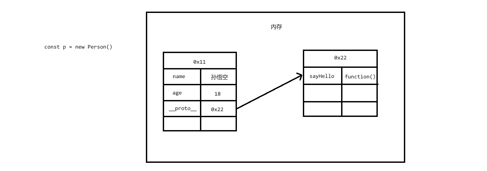

# 面向对象

## 面向对象

- 面向对象编程(OOP)
  - 程序是干嘛的？
    - 程序就是对现实世界的抽象
  - 对象是干嘛的？
    - 一个事物抽象到程序中后就变成了对象
    - 在程序的世界中，一切皆对象
  - 面向对象的编程
    - 面向对象的编程指，程序中的所有操作都是通过对象来完成
    - 做任何事情之前都需要先找到它的对象，然后通过对象来完成各种操作
- 一个事物通常由两部分组成：数据和功能
- 一个对象由两部分组成：属性和方法
- 事物的数据到了对象中，体现为属性
- 事物的功能到了对象中，体现为方法

```html
<!DOCTYPE html>
<html lang="zh">
  <head>
    <meta charset="UTF-8" />
    <meta name="viewport" content="width=device-width, initial-scale=1.0" />
    <title>Document</title>
    <script>
      const five = {
        // 添加属性
        name: '王老五',
        age: 48,
        height: 180,
        weight: 100,

        // 添加方法
        sleep() {
          console.log(this.name + '睡觉了~')
        },

        eat() {
          console.log(this.name + '吃饭了~')
        },
      }
    </script>
  </head>
  <body></body>
</html>
```

## 类

- 使用 Object 创建对象的问题：
  - 无法区分出不同类型的对象
  - 不方便批量创建对象
- 在 JS 中可以通过类(class)来解决这个问题：
  - 类是对象模板，可以将对象中的属性和方法直接定义在类中，定义后就可以直接通过类来创建对象
  - 通过同一个类创建的对象，我们称为同类对象
  - 可以使用 instanceof 来检查一个对象是否是由某个类创建
  - 如果某个对象是由某个类所创建，则我们称该对象是这个类的实例
- 语法：
  - class 类名 {} // 类名要使用大驼峰命名
  - const 类名 = class {}
- 通过类创建对象：
  - new 类()

```html
<!DOCTYPE html>
<html lang="zh">
  <head>
    <meta charset="UTF-8" />
    <meta name="viewport" content="width=device-width, initial-scale=1.0" />
    <title>Document</title>
    <script>
      class Person {}

      class Dog {}

      // 调用构造函数创建对象
      const p1 = new Person()
      const p2 = new Person()

      const d1 = new Dog()
      const d2 = new Dog()

      console.log(p1 instanceof Person) // true
      console.log(d1 instanceof Person) // false
    </script>
  </head>
  <body></body>
</html>
```

## 属性

- 类是创建对象的模板，要创建对象第一件事就是定义类
- 类的代码块，默认就是严格模式，类的代码块是用来设置对象的属性的，不是什么代码都能写
- 实例属性只能通过实例访问
- 使用 static 声明的属性，是静态属性(类属性)
- 静态属性只能通过类去访问

```html
<!DOCTYPE html>
<html lang="zh">
  <head>
    <meta charset="UTF-8" />
    <meta name="viewport" content="width=device-width, initial-scale=1.0" />
    <title>Document</title>
    <script>
      class Person {
        // Person的实例属性name  p1.name
        name = '孙悟空'

        // 实例属性只能通过实例访问  p1.age
        age = 18

        // 使用static声明的属性，是静态属性(类属性)
        // 静态属性只能通过类去访问  Person.test
        static test = 'test静态属性'
      }

      const p1 = new Person()
      const p2 = new Person()

      console.log(p1)
      console.log(p2)
    </script>
  </head>
  <body></body>
</html>
```

## 方法

- 实例方法中 this 就是当前实例
- 静态方法(类方法) 通过类来调用 静态方法中 this 指向的是当前类

```html
<!DOCTYPE html>
<html lang="zh">
  <head>
    <meta charset="UTF-8" />
    <meta name="viewport" content="width=device-width, initial-scale=1.0" />
    <title>Document</title>
    <script>
      class Person {
        name = '孙悟空'

        // 添加方法的一种方式
        // sayHello = function () {}

        // 添加方法(实例方法)  实例方法中this就是当前实例
        sayHello() {
          console.log(this.name)
        }

        // 静态方法(类方法)  通过类来调用  静态方法中this指向的是当前类
        static test() {
          console.log('静态方法', this)
        }
      }

      const p1 = new Person()
      p1.sayHello()
      Person.test()
    </script>
  </head>
  <body></body>
</html>
```

## 构造函数

- 在类中可以添加一个特殊的方法 constructor
- 该方法我们称为构造函数(构造方法)
- 构造函数会在我们调用类创建对象时执行
- 可以在构造函数中，为实例属性进行赋值
- 在构造函数中，this 表示当前所创建的对象

```html
<!DOCTYPE html>
<html lang="zh">
  <head>
    <meta charset="UTF-8" />
    <meta name="viewport" content="width=device-width, initial-scale=1.0" />
    <title>Document</title>
    <script>
      class Person {
        constructor(name, age, gender) {
          // console.log('构造函数执行了')
          this.name = name
          this.age = age
          this.gender = gender
        }
      }

      const p1 = new Person('孙悟空', 18, '男')
      const p2 = new Person('猪八戒', 28, '男')
      const p3 = new Person('沙和尚', 38, '男')

      console.log(p1)
      console.log(p2)
      console.log(p3)
    </script>
  </head>
  <body></body>
</html>
```

## 封装

- 面向对象的特点：
  - 封装、继承和多态
- 封装
  - 对象就是一个用来存储不同属性的容器
  - 对象不仅存储属性，还要负责数据的安全
  - 直接添加到对象中的属性，并不安全，因为它们可以被任意的修改
  - 如何确保数据的安全：
    - 私有化数据
      - 将需要保护的数据设置为私有，只能在类内部使用
    - 提供 setter 和 getter 方法来开放对数据的操作
      - 属性设置为私有，通过 getter setter 方法操作属性带来的好处
      - 可以控制属性的读写权限
      - 可以在方法中对属性的值进行验证
- 封装主要用来保证数据的安全
- 实现封装的方式：

  - 属性私有化 加#
  - 通过 getter 和 setter 方法来操作属性

    ```js
    get 属性名(){
      return this.#属性
    }

    set 属性名(参数){
      一些限制逻辑
      this.#属性 = 参数
    }
    ```

- 实例使用#开头就变成了私有属性，私有属性只能在类内部访问
- 私有属性需要先声明
- getter 方法，用来读取属性
- setter 方法，用来设置属性

```html
<!DOCTYPE html>
<html lang="zh">
  <head>
    <meta charset="UTF-8" />
    <meta name="viewport" content="width=device-width, initial-scale=1.0" />
    <title>Document</title>
    <script>
      class Person {
        // 实例使用 # 开头就变成了私有属性，私有属性只能在类内部访问
        // 私有属性需要先声明

        #name
        #age
        #gender

        constructor(name, age, gender) {
          this.#name = name
          this.#age = age
          this.#gender = gender
        }

        getName() {
          return this.#name
        }

        setName(name) {
          this.#name = name
        }

        // 推荐方法
        get age() {
          return this.#age
        }

        set age(age) {
          if (Number.isNaN(age) || typeof age !== 'number') return

          if (age >= 0 && age <= 150) {
            this.#age = age
          }
        }
      }

      const p1 = new Person('孙悟空', 18, '男')

      const name = p1.getName()
      p1.setName('猪八戒')
      // console.log(name)

      const age = p1.age
      p1.age = 100
      // console.log(age)
    </script>
  </head>
  <body></body>
</html>
```

## 多态

- 在 JS 中不会检查参数的类型，所以这就意味着任何数据都可以作为参数传递
- 要调用某个函数，无需指定的类型，只要对象满足某些条件即可
- 如果一个东西走路像鸭子，叫起来像鸭子，那么它就是鸭子
- 多态为我们提供了灵活性

```html
<!DOCTYPE html>
<html lang="zh">
  <head>
    <meta charset="UTF-8" />
    <meta name="viewport" content="width=device-width, initial-scale=1.0" />
    <title>Document</title>
    <script>
      class Person {
        constructor(name) {
          this.name = name
        }
      }

      class Dog {
        constructor(name) {
          this.name = name
        }
      }

      const person = new Person('孙悟空')
      const dog = new Dog('旺财')

      function sayHello(obj) {
        // if (obj instanceof Person) {
        console.log('Hello,', obj.name)
        // }
      }

      sayHello(person)
      sayHello(dog)
    </script>
  </head>
  <body></body>
</html>
```

## 继承

- 可以通过 extends 关键字来完成继承
- 当一个类继承另一个类时，就相当于将另一个类中的代码复制到了当前类中(简单理解)
- 继承发生时，被继承的类称为父类(超类)，继承的类称为子类
- 通过继承可以减少重复的代码，并且可以在不修改一个类的前提对其进行扩展
- 封装 —— 安全性
- 继承 —— 扩展性
- 多态 —— 灵活性

```html
<!DOCTYPE html>
<html lang="zh">
  <head>
    <meta charset="UTF-8" />
    <meta name="viewport" content="width=device-width, initial-scale=1.0" />
    <title>Document</title>
    <script>
      class Animal {
        constructor(name) {
          this.name = name
        }

        sayHello() {
          console.log('动物在叫~')
        }
      }

      class Dog extends Animal {}

      class Cat extends Animal {}

      const dog = new Dog('旺财')
      const cat = new Cat('Tom')

      console.log(dog)
      console.log(cat)

      dog.sayHello()
      cat.sayHello()
    </script>
  </head>
  <body></body>
</html>
```

- 通过继承可以在不修改一个类的情况下对其进行扩展
- OCP 开闭原则
  - 程序应该对修改关闭，对扩展开放
- 在子类中，可以通过创建同名方法来重写父类的方法
- 重写构造函数时，构造函数的第一行代码必须为 super()
- 在方法中可以使用 super 来引用父类的方法

```html
<!DOCTYPE html>
<html lang="zh">
  <head>
    <meta charset="UTF-8" />
    <meta name="viewport" content="width=device-width, initial-scale=1.0" />
    <title>Document</title>
    <script>
      class Animal {
        constructor(name) {
          this.name = name
        }

        sayHello() {
          console.log('动物在叫~')
        }
      }

      class Dog extends Animal {
        // 在子类中，可以通过创建同名方法来重写父类的方法
        sayHello() {
          console.log('汪汪汪')
        }
      }

      class Cat extends Animal {
        // 重写构造函数
        constructor(name, age) {
          // 重写构造函数时，构造函数的第一行代码必须为super()
          super(name) // 调用父类的构造函数
          this.age = age
        }

        sayHello() {
          // 调用一下父类的sayHello
          // 在方法中可以使用super来引用父类的方法
          super.sayHello()
          console.log('喵喵喵')
        }
      }

      const dog = new Dog('旺财')
      const cat = new Cat('Tom', 5)

      console.log(dog)
      console.log(cat)

      dog.sayHello()
      cat.sayHello()
    </script>
  </head>
  <body></body>
</html>
```

## 对象的结构

- 对象中存储属性的区域实际有两个：
  - 对象自身
    - 直接通过对象所添加的属性，位于对象自身中
    - 在类中通过 x = y 的形式添加的属性，也位于对象自身中
  - 原型对象(prototype)
    - 对象中还有一些内容，会存储到其他的对象里(原型对象)
    - 在对象中会有一个属性用来存储原型对象，这个属性叫做`__proto__`
    - 原型对象也负责为对象存储属性
      - 当我们访问对象中的属性时，会优先访问对象自身的属性
      - 对象自身不包含该属性时，才会去原型对象中寻找
    - 会添加到原型对象中的情况：
      - 在类中通过 xxx(){}方式添加的方法，位于原型中
      - 主动向原型中添加的属性或方法



```html
<!DOCTYPE html>
<html lang="zh">
  <head>
    <meta charset="UTF-8" />
    <meta name="viewport" content="width=device-width, initial-scale=1.0" />
    <title>Document</title>
    <script>
      class Person {
        name = '孙悟空'
        age = 18

        // 构造函数中添加的属性会存储到对象自身中
        // constructor() {
        //   this.gender = '男'
        // }

        // 存储到对象自身中
        // sayHi = function () {
        //   console.log('Hi')
        // }

        // 存储到对象自身中
        // sayHi = () => {
        //   console.log('Hi')
        // }

        // 存储到原型对象中
        sayHello() {
          console.log('Hello')
        }
      }

      const person = new Person()

      // 存储到对象自身中
      person.address = '花果山'
      // person.sayHello = 'Hello'

      console.log(person)
      // console.log(person.sayHello)
    </script>
  </head>
  <body></body>
</html>
```

## 原型对象

- 访问一个对象的原型对象
  - `对象.__proto__`
  - Object.getPrototypeOf(对象)
- 原型对象中的数据：
  - 对象中的数据(属性、方法等)
  - constructor(对象的构造函数)
- 注意：
  - 原型对象也有原型，这样就构成了一条原型链，根据对象的复杂程度不同，原型链的长度也不同
  - person 对象的原型链：p 对象 --> 原型 --> 原型 --> null
  - obj 对象的原型链：obj 对象 --> 原型 --> null
- 原型链：
  - 读取对象属性时，会优先读取对象自身属性
  - 如果对象中有，则使用，没有则去对象的原型中寻找
  - 如果原型中有，则使用，没有则去原型的原型中寻找
  - 直到找到 Object 对象的原型(Object 的原型没有原型(为 null))
  - 如果依然没有找到，则返回 undefined
  - 作用域链，是找变量的链，找不到会报错
  - 原型链，是找属性的链，找不到会返回 undefined

```html
<!DOCTYPE html>
<html lang="zh">
  <head>
    <meta charset="UTF-8" />
    <meta name="viewport" content="width=device-width, initial-scale=1.0" />
    <title>Document</title>
    <script>
      class Person {
        name = '孙悟空'
        age = 18

        sayHello() {
          console.log('Hello')
        }
      }

      const person = new Person()
      console.log(person)
      console.log(person.__proto__.__proto__.__proto__)
      // console.log(Object.getPrototypeOf(person))

      const obj = {}
    </script>
  </head>
  <body></body>
</html>
```

- 所有的同类型对象它们的原型对象都是同一个，也就意味着，同类型对象的原型链是一样的
- 原型的作用：
  - 原型就相当于是一个公共的区域，可以被所有该类实例访问
  - 可以将该类实例中，所有的公共属性(方法)统一存储到原型中
  - 这样我们只需要创建一个属性，即可被所有实例访问
  - JS 中继承就是通过原型来实现的，当继承时，子类的原型就是一个父类的实例
  - 在对象中有些值是对象独有的，像属性(name，age，gender)每个对象都应该有自己的值
  - 但是有些值对于每个对象来说都是一样的，像各种方法，对于一样的值没必要重复的创建

```html
<!DOCTYPE html>
<html lang="zh">
  <head>
    <meta charset="UTF-8" />
    <meta name="viewport" content="width=device-width, initial-scale=1.0" />
    <title>Document</title>
    <script>
      class Person {
        name = '孙悟空'
        age = 18

        sayHello() {
          console.log('Hello, 我是', this.name)
        }
      }

      const p = new Person()
      const p2 = new Person()

      // console.log(p.__proto__ === p2.__proto__) // true

      class Animal {}

      class Cat extends Animal {}

      const cat = new Cat()

      // cat --> Animal实例 --> object --> Object原型 --> null
      // console.log(cat.__proto__.__proto__.__proto__.__proto__)

      const obj = {}
      // obj --> Object原型 --> null
      // console.log(obj.__proto__.__proto__)

      function fn() {}
      // fn --> ? --> Object原型 --> null
      console.log(fn.__proto__.__proto__.__proto__)
    </script>
  </head>
  <body></body>
</html>
```

## 修改原型

- 大部分情况下，我们是不需要修改原型对象
- 注意：
  - 千万不要通过类的实例去修改原型
    - 通过一个对象影响所有同类对象，这么做不合适
    - 修改原型先得创建实例，麻烦
    - 危险
- 除了通过`__proto__`能访问对象的原型外
- 还可以通过类的 prototype 属性，来访问实例的原型
- 修改原型时，最好通过类去修改
- 好处：
  - 一修改就是修改所有实例的原型
  - 无需创建实例即可完成对类的修改
- 原则：
  - 原型尽量不要手动改
  - 要改也不要通过实例对象去改
  - 通过 类.prototype 属性去修改
  - 最好不要直接给 prototype 去赋值

```html
<!DOCTYPE html>
<html lang="zh">
  <head>
    <meta charset="UTF-8" />
    <meta name="viewport" content="width=device-width, initial-scale=1.0" />
    <title>Document</title>
    <script>
      class Person {
        name = '孙悟空'
        age = 18

        sayHello() {
          console.log('Hello, 我是', this.name)
        }
      }

      const p = new Person()
      const p2 = new Person()

      class Dog {}

      // 通过对象修改原型，向原型中添加方法，修改后所有同类实例都能访问该方法 不要这么做
      // p.__proto__.run = () => {
      //   console.log('我在跑')
      // }

      // p.run()
      // p2.run()

      // 直接为对象赋值了一个新的原型 不要这么做
      // p.__proto__ = new Dog()

      // 访问Person实例的原型对象
      // console.log(Person.prototype)

      Person.prototype.fly = () => {
        console.log('我会飞')
      }
    </script>
  </head>
  <body></body>
</html>
```

## instanceof 和 hasOwn

- instanceof 用来检查一个对象是否是一个类的实例
- instanceof 检查的是对象的原型链上是否有该类实例
- 只要原型链上有该类实例，就会返回 true
- dog -> Animal 的实例 -> Object 实例 -> Object 原型
- Object 是所有对象的原型，所以任何和对象和 Object 进行 instanceof 运算都会返回 true
- in
  - 使用 in 运算符检查属性时，无论属性在对象自身还是在原型中，都会返回 true
- 对象.hasOwnProperty(属性名) (不推荐使用)
  - 用来检查一个对象的自身是否含有某个属性
- Object.hasOwn(对象, 属性名)
  - 用来检查一个对象的自身是否含有某个属性

```html
<!DOCTYPE html>
<html lang="zh">
  <head>
    <meta charset="UTF-8" />
    <meta name="viewport" content="width=device-width, initial-scale=1.0" />
    <title>Document</title>
    <script>
      class Animal {}

      class Dog extends Animal {}

      const dog = new Dog()

      // console.log(dog instanceof Dog) // true
      // console.log(dog instanceof Animal) // true
      // console.log(dog instanceof Object) // true

      const obj = {}
      // console.log(obj.__proto__ === Object.prototype) // true

      class Person {
        name = '孙悟空'
        age = 18

        sayHello() {
          console.log('Hello, 我是', this.name)
        }
      }

      const p = new Person()

      // 使用in运算符检查属性时，无论属性在对象自身还是在原型中，都会返回true
      // console.log('sayHello' in p)

      // 对象.hasOwnProperty(属性名)  Object.hasOwn(对象, 属性名)
      // 用来检查一个对象的自身是否含有某个属性
      console.log(p.hasOwnProperty('sayHello')) // false
      console.log(Object.hasOwn(p, 'sayHello')) // false
    </script>
  </head>
  <body></body>
</html>
```

## 旧类

- 早期 JS 中，直接通过函数来定义类
- 一个函数如果直接调用 xxx() 那么这个函数就是一个普通函数
- 一个函数如果通过 new 调用 new xxx() 那么这个函数就是一个构造函数

```html
<!DOCTYPE html>
<html lang="zh">
  <head>
    <meta charset="UTF-8" />
    <meta name="viewport" content="width=device-width, initial-scale=1.0" />
    <title>Document</title>
    <script>
      var Person = (function () {
        function Person(name, age) {
          // 在构造函数中, this表示新建的对象
          this.name = name
          this.age = age
        }

        // 向原型中添加属性(方法)
        Person.prototype.sayHello = function () {
          console.log('sayHello')
        }

        // 添加静态属性
        Person.staticProperty = '静态属性'

        // 添加静态方法
        Person.staticMethod = function () {
          console.log('静态方法')
        }

        return Person
      })()

      const p = new Person('孙悟空', 18)
      // console.log(p)

      var Animal = (function () {
        function Animal() {}

        return Animal
      })()

      var Cat = (function () {
        function Cat() {}

        // 继承 Animal
        Cat.prototype = new Animal()

        return Cat
      })()

      const cat = new Cat()
      console.log(cat)
    </script>
  </head>
  <body></body>
</html>
```

## New 运算符

- new 运算符是创建对象时要使用的运算符
- 使用 new 时，到底发生了哪些事情：
  - https://developer.mozilla.org/en-US/docs/Web/JavaScript/Reference/Operators/new
  - 当使用 new 去调用一个函数时，这个函数将会作为构造函数调用
  - 使用 new 调用函数时，将会发生这些事：
    - 创建一个普通的 JS 对象(Object 对象 {}), 为了方便，称其为新对象
    - 将构造函数的 prototype 属性设置为新对象的原型
    - 使用实参来执行构造函数，并且将新对象设置为函数中的 this
    - 如果构造函数返回的是一个非原始值，则该值会作为 new 运算的返回值返回(千万不要这么做)
      - 如果构造函数的返回值是一个原始值或者没有指定返回值，则新的对象将会作为返回值返回
      - 通常不会为构造函数指定返回值

```html
<!DOCTYPE html>
<html lang="zh">
  <head>
    <meta charset="UTF-8" />
    <meta name="viewport" content="width=device-width, initial-scale=1.0" />
    <title>Document</title>
    <script>
      function MyClass() {
        // var newInstance = {}
        // newInstance.__proto__ = MyClass.prototype
      }

      var mc = new MyClass()

      // console.log(mc)

      class Person {
        constructor() {}
      }

      new Person()
    </script>
  </head>
  <body></body>
</html>
```

## 总结

- 面向对象本质就是，编写代码时所有的操作都是通过对象来进行的
- 面向对象的编程的步骤：
  - 找对象
  - 搞对象
- 学习对象：
  - 明确这个对象代表什么，有什么用
  - 如何获取到这个对象
  - 如何使用这个对象(对象中的属性和方法)
- 对象的分类：
  - 内建对象
    - 由 ES 标准所定义的对象
    - 比如 Object Function String Number ......
  - 宿主对象
    - 由浏览器提供的对象
    - BOM、DOM
  - 自定义对象
    - 由开发人员自己创建的对象
