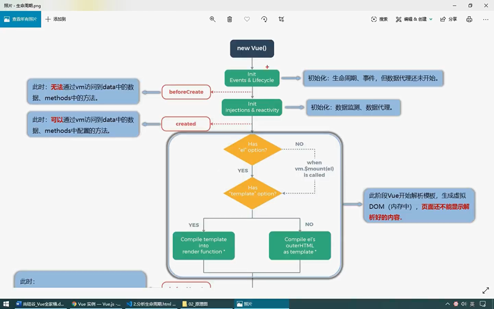
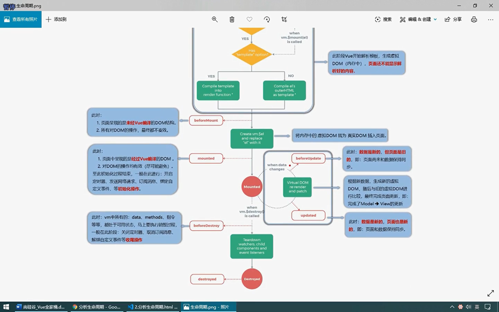
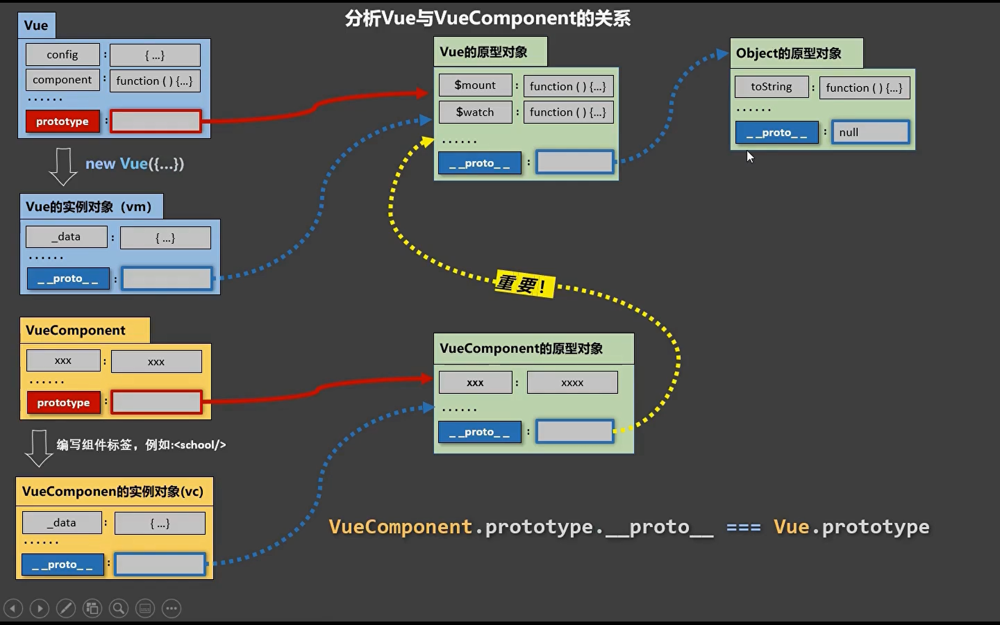

# Vue2

## 初识 Vue

```html
<!DOCTYPE html>
<html lang="zh">
  <head>
    <meta charset="UTF-8" />
    <meta name="viewport" content="width=device-width, initial-scale=1.0" />
    <title>Document</title>
    <!-- <script src="https://cdn.jsdelivr.net/npm/vue@2.7.14/dist/vue.js"></script> -->
    <script src="../js/vue.js"></script>
  </head>
  <body>
    <div id="app">{{message}}</div>

    <script>
      Vue.config.productionTip = false //阻止 vue 在启动时生成生产提示

      const vm = new Vue({
        el: '#app',
        data: {
          message: 'Hello World',
        },
      })
    </script>
  </body>
</html>
```

## el 和 data 的两种写法

```html
<!DOCTYPE html>
<html lang="zh">
  <head>
    <meta charset="UTF-8" />
    <meta name="viewport" content="width=device-width, initial-scale=1.0" />
    <title>Document</title>
    <!-- <script src="https://cdn.jsdelivr.net/npm/vue@2.7.14/dist/vue.js"></script> -->
    <script src="../js/vue.js"></script>
  </head>
  <body>
    <div id="app">{{message}}</div>

    <script>
      // Vue.config.productionTip = false //阻止 vue 在启动时生成生产提示

      // data中所有的属性，最后都出现在了vm身上
      // vm身上所有的属性及Vue原型上所有的属性，在Vue模版中都可以直接使用

      new Vue({
        data() {
          return {
            message: 'Hello World',
          }
        },
      }).$mount('#app')
    </script>
  </body>
</html>
```

## Object.defineProperty

```html
<!DOCTYPE html>
<html lang="zh">
  <head>
    <meta charset="UTF-8" />
    <meta name="viewport" content="width=device-width, initial-scale=1.0" />
    <title>Document</title>
  </head>
  <body>
    <script>
      let number = 18

      const obj = {
        name: '孙悟空',
        gender: '男',
        age: number,
      }

      Object.defineProperty(obj, 'age', {
        // value: 18,
        // enumerable: true, // 控制属性是否可以枚举，默认值是false
        // writable: true, // 控制属性是否可以被修改，默认值是false
        // configurable: true, // 控制属性是否可以被删除，默认值是false

        // 当读取obj的age属性时，getter就会被调用，返回值就是age的值
        get() {
          return number
        },
        // 当修改obj的age属性时，setter就会被调用，且会收到修改的具体值
        set(value) {
          number = value
        },
      })

      // for (const key in obj) {
      //   console.log(key)
      // }
    </script>
  </body>
</html>
```

## 数据代理

```html
<!DOCTYPE html>
<html lang="zh">
  <head>
    <meta charset="UTF-8" />
    <meta name="viewport" content="width=device-width, initial-scale=1.0" />
    <title>Document</title>
  </head>
  <body>
    <script>
      // 数据代理：通过一个对象代理对另一个对象中属性的操作(读/写)
      const obj = {
        x: 100,
      }

      const obj2 = {
        y: 200,
      }

      Object.defineProperty(obj2, 'x', {
        get() {
          return obj.x
        },
        set(value) {
          obj.x = value
        },
      })
    </script>
  </body>
</html>
```

## Vue 中的数据代理

```html
<!DOCTYPE html>
<html lang="zh">
  <head>
    <meta charset="UTF-8" />
    <meta name="viewport" content="width=device-width, initial-scale=1.0" />
    <title>Document</title>
    <script src="../js/vue.js"></script>
  </head>
  <body>
    <div id="app">
      <h2>姓名：{{name}}</h2>
      <h2>年龄：{{age}}</h2>
    </div>

    <script>
      /* 
        Vue中的数据代理：
          通过vm对象来代理data对象中属性的操作(读/写)
        Vue中数据代理的好处：
          更加方便的操作data中的数据
        基本原理：
          通过Object.defineProperty()把data对象中所有的属性添加到vm上
          为每一个添加到vm上的属性，都指定一个getter/setter
          在getter/setter内部去操作(读/写)data中对应的属性
      */
      const vm = new Vue({
        data() {
          return {
            name: '孙悟空',
            age: 18,
          }
        },
      }).$mount('#app')

      console.log(vm)
    </script>
  </body>
</html>
```

## 监视属性

```html
<!DOCTYPE html>
<html lang="zh">
  <head>
    <meta charset="UTF-8" />
    <meta name="viewport" content="width=device-width, initial-scale=1.0" />
    <title>Document</title>
    <script src="../js/vue.js"></script>
  </head>
  <body>
    <div id="app">
      <h2>今天天气很{{weather}}</h2>
      <button @click="changeWeather">切换天气</button>
    </div>

    <script>
      const vm = new Vue({
        data() {
          return {
            isHot: false,
          }
        },
        computed: {
          weather() {
            return this.isHot ? '炎热' : '凉爽'
          },
        },
        methods: {
          changeWeather() {
            this.isHot = !this.isHot
          },
        },
        watch: {
          // isHot: {
          //   handler(newValue, oldValue) {
          //     console.log('isHot发生改变', newValue, oldValue)
          //   },
          //   immediate: true,
          // },
        },
      }).$mount('#app')

      vm.$watch('isHot', {
        handler(newValue, oldValue) {
          console.log('isHot发生改变', newValue, oldValue)
        },
        immediate: true,
      })
    </script>
  </body>
</html>
```

## 深度监视

```html
<!DOCTYPE html>
<html lang="zh">
  <head>
    <meta charset="UTF-8" />
    <meta name="viewport" content="width=device-width, initial-scale=1.0" />
    <title>Document</title>
    <script src="../js/vue.js"></script>
  </head>
  <body>
    <div id="app">
      <h2>今天天气很{{weather}}</h2>
      <button @click="changeWeather">切换天气</button>
      <button @click="number.a++">点我一下 a {{number.a}}</button>
      <button @click="number.b++">点我一下 b {{number.b}}</button>
    </div>

    <script>
      const vm = new Vue({
        data() {
          return {
            isHot: false,
            number: {
              a: 10,
              b: 20,
            },
          }
        },
        computed: {
          weather() {
            return this.isHot ? '炎热' : '凉爽'
          },
        },
        methods: {
          changeWeather() {
            this.isHot = !this.isHot
          },
        },
        watch: {
          // isHot: {
          //   handler(newValue, oldValue) {
          //     console.log('isHot发生改变', newValue, oldValue)
          //   },
          //   immediate: true,
          // },
          'number.a': {
            handler() {
              console.log('a发生变化了')
            },
          },
          number: {
            handler() {
              console.log('number发生变化了')
            },
            deep: true,
          },
        },
      }).$mount('#app')
    </script>
  </body>
</html>
```

## 监视的简写形式

```html
<!DOCTYPE html>
<html lang="zh">
  <head>
    <meta charset="UTF-8" />
    <meta name="viewport" content="width=device-width, initial-scale=1.0" />
    <title>Document</title>
    <script src="../js/vue.js"></script>
  </head>
  <body>
    <div id="app">
      <h2>今天天气很{{weather}}</h2>
      <button @click="changeWeather">切换天气</button>
    </div>

    <script>
      const vm = new Vue({
        data() {
          return {
            isHot: false,
          }
        },
        computed: {
          weather() {
            return this.isHot ? '炎热' : '凉爽'
          },
        },
        methods: {
          changeWeather() {
            this.isHot = !this.isHot
          },
        },
        watch: {
          // isHot(newValue, oldValue) {
          //   console.log('isHot发生改变', newValue, oldValue)
          // },
        },
      }).$mount('#app')

      vm.$watch('isHot', function (newValue, oldValue) {
        console.log('isHot发生改变', newValue, oldValue)
      })
    </script>
  </body>
</html>
```

## computed 和 watch 之间的区别：

- computed 能完成的功能，watch 都可以完成
- watch 能完成的功能，computed 不一定能完成，例如：watch 可以进行异步操作
- 所有被 Vue 管理的函数，最好写成普通函数，这样 this 的指向才是 vm 或组件实例对象
- 所有不被 Vue 管理的函数(定时器的回调函数、ajax 的回调函数、Promise 的回调函数)，最好写成箭头函数，这样 this 的指向才是 vm 或组件实例对象

## 模拟数据监测

```html
<!DOCTYPE html>
<html lang="zh">
  <head>
    <meta charset="UTF-8" />
    <meta name="viewport" content="width=device-width, initial-scale=1.0" />
    <title>Document</title>
  </head>
  <body>
    <script>
      let data = {
        name: '孙悟空',
        age: 18,
      }

      function Observer(obj) {
        const keys = Object.keys(obj)
        keys.forEach((k) => {
          Object.defineProperty(this, k, {
            get() {
              return obj[k]
            },
            set(value) {
              console.log(111)
              obj[k] = value
            },
          })
        })
      }

      const obs = new Observer(data)
      const vm = {}
      vm._data = data = obs
    </script>
  </body>
</html>
```

## Vue.set 方法

```html
<!DOCTYPE html>
<html lang="zh">
  <head>
    <meta charset="UTF-8" />
    <meta name="viewport" content="width=device-width, initial-scale=1.0" />
    <title>Document</title>
    <script src="../js/vue.js"></script>
  </head>
  <body>
    <div id="app">
      <h2>姓名：{{name}}</h2>
      <h2>地址：{{address}}</h2>
      <button @click="addAge">给朋友添加年龄</button>
      <h2>朋友姓名：{{friend.name}}</h2>
      <h2>朋友地址：{{friend.address}}</h2>
      <h2 v-if="friend.age">朋友年龄：{{friend.age}}</h2>
      <h2></h2>
    </div>

    <script>
      const vm = new Vue({
        data() {
          return {
            name: '孙悟空',
            address: '花果山',
            friend: {
              name: '猪八戒',
              address: '高老庄',
            },
          }
        },
        methods: {
          addAge() {
            // Vue.set(this.friend, 'age', 28)
            this.$set(this.friend, 'age', 38)
          },
        },
      }).$mount('#app')
    </script>
  </body>
</html>
```

## Vue 监测数据的原理\_数组

```html
<!DOCTYPE html>
<html lang="zh">
  <head>
    <meta charset="UTF-8" />
    <meta name="viewport" content="width=device-width, initial-scale=1.0" />
    <title>Document</title>
    <script src="../js/vue.js"></script>
  </head>
  <body>
    <div id="app">
      <h2>姓名：{{name}}</h2>
      <h2>地址：{{address}}</h2>
      <button @click="addAge">给朋友添加年龄</button>
      <h2>朋友姓名：{{friend.name}}</h2>
      <h2>朋友地址：{{friend.address}}</h2>
      <h2 v-if="friend.age">朋友年龄：{{friend.age}}</h2>
      <h2>爱好</h2>
      <button @click="addHobby">在最前面添加一个爱好</button>
      <button @click="updateHobby">修改第一个爱好</button>
      <ul>
        <li v-for="(item,index) in hobby" :key="index">{{item}}</li>
      </ul>
    </div>

    <script>
      const vm = new Vue({
        data() {
          return {
            name: '孙悟空',
            address: '花果山',
            friend: {
              name: '猪八戒',
              address: '高老庄',
            },
            hobby: ['吃饭', '睡觉', '打豆豆'],
          }
        },
        methods: {
          addAge() {
            // Vue.set(this.friend, 'age', 28)
            this.$set(this.friend, 'age', 38)
          },
          addHobby() {
            this.hobby.unshift('运动')
          },
          updateHobby() {
            this.hobby.splice(0, 1, '玩游戏')
            // this.$set(this.hobby, 0, '玩游戏')
          },
        },
      }).$mount('#app')
    </script>
  </body>
</html>
```

## 总结 Vue 数据监测

- Vue 监视数据的原理：
  - Vue 会监视 data 中所有层级的数据
  - 如何检测对象中的数据
    - 通过 setter 实现监视，且要在 new Vue 时就传入要检测的数据
    - 对象中后追加的属性，Vue 默认不做响应式处理
    - 如需给后添加的属性做响应式，请使用如何 API
      - Vue.set(target, propertyName/index, value)
      - vm.$set(target, propertyName/index, value)
  - 如何检测数组中的数据
    - 通过包裹数组更新元素的方法实现，本质就是做了两件事
      - 调用原生对应的方法对数组进行更新
      - 重新解析模板，进而更新页面
  - 在 Vue 中修改数组中的某个元素时一定要用如下方法
    - 使用这些 API
      - push()
      - pop()
      - shift()
      - unshift()
      - splice()
      - sort()
      - reverse()
    - 使用 Vue.set()或 vm.$set()
  - 注意：
    Vue.set()和 vm.$set()不能给 vm 或 vm 的根数据对象添加属性

## 过滤器

- 对要显示的数据进行特定格式化后再显示(适用于一些简单逻辑的处理)
- 语法：
  - 注册过滤器：
    - Vue.filter(name,callback)
    ```js
    new Vue({
      filters: {},
    })
    ```
  - 使用过滤器：
    - `{{ xxx | 过滤器名 }}`
    - v-bind:属性 = "xxx | 过滤器名"
- 注意：
  - 过滤器也可以接受额外参数、多个过滤器也可以串联
  - 并没有改变原本的数据，而是产生新的对应的数据

```html
<!DOCTYPE html>
<html lang="zh">
  <head>
    <meta charset="UTF-8" />
    <meta name="viewport" content="width=device-width, initial-scale=1.0" />
    <title>Document</title>
    <script src="../js/vue.js"></script>
    <script src="https://cdn.jsdelivr.net/npm/dayjs@1.11.10/dayjs.min.js"></script>
  </head>
  <body>
    <div id="app">
      <h2>computed {{formatTime}}</h2>
      <h2>methods {{formatTime2()}}</h2>
      <h2>filters {{time | formatTimeFilter}}</h2>
      <h2>filters {{time | formatTimeFilter('YYYY-MM-DD')}}</h2>
      <h2>filters {{time | formatTimeFilter('YYYY-MM-DD') | mySlice}}</h2>
    </div>

    <div id="app2">
      <h2 :test="text|mySlice">{{msg | mySlice}}</h2>
    </div>

    <script>
      Vue.filter('mySlice', function (value) {
        return value.slice(0, 4)
      })

      new Vue({
        data() {
          return {
            time: 1703765773729,
          }
        },
        computed: {
          formatTime() {
            return dayjs(this.time).format('YYYY-MM-DD HH:mm:ss')
          },
        },
        methods: {
          formatTime2() {
            return dayjs(this.time).format('YYYY-MM-DD HH:mm:ss')
          },
        },
        filters: {
          formatTimeFilter(value, str = 'YYYY-MM-DD HH:mm:ss') {
            return dayjs(value).format(str)
          },
          // mySlice(value) {
          //   return value.slice(0, 4)
          // },
        },
      }).$mount('#app')

      new Vue({
        data() {
          return {
            msg: 'Hello World',
            text: 'microdaway',
          }
        },
      }).$mount('#app2')
    </script>
  </body>
</html>
```

## v-cloak 指令

- v-cloak 指令没有值
  - 本质是一个特殊属性，Vue 实例创建完毕并接管容器后，会删掉 v-cloak 属性
  - 使用 css 配合 v-cloak 可以解决网速慢时页面展示出`{{xxx}}`的问题

```html
<!DOCTYPE html>
<html lang="zh">
  <head>
    <meta charset="UTF-8" />
    <meta name="viewport" content="width=device-width, initial-scale=1.0" />
    <title>Document</title>
    <style>
      [v-cloak] {
        display: none;
      }
    </style>
  </head>
  <body>
    <div id="app">
      <h2 v-cloak>{{msg}}</h2>
    </div>

    <script src="https://cdn.jsdelivr.net/npm/vue@2.7.14/dist/vue.js"></script>

    <script>
      new Vue({
        data() {
          return {
            msg: 'Hello World',
          }
        },
      }).$mount('#app')
    </script>
  </body>
</html>
```

## v-once 指令

- v-once 所在节点在初次动态渲染后，就视为静态内容了
- 以后数据的改变不会引起 v-once 所在结构的更新，可以用于性能优化

```html
<!DOCTYPE html>
<html lang="zh">
  <head>
    <meta charset="UTF-8" />
    <meta name="viewport" content="width=device-width, initial-scale=1.0" />
    <title>Document</title>
    <script src="../js/vue.js"></script>
  </head>
  <body>
    <div id="app">
      <h2 v-once>count {{count}}</h2>
      <h2>count {{count}}</h2>
      <button @click="count++">点我一下</button>
    </div>

    <script>
      new Vue({
        data() {
          return {
            count: 0,
          }
        },
      }).$mount('#app')
    </script>
  </body>
</html>
```

## v-pre 指令

- 跳过其所在节点的编译过程
- 可利用它跳过没有使用指令语法、没有使用插值语法的节点，会加快编译

```html
<!DOCTYPE html>
<html lang="zh">
  <head>
    <meta charset="UTF-8" />
    <meta name="viewport" content="width=device-width, initial-scale=1.0" />
    <title>Document</title>
    <script src="../js/vue.js"></script>
  </head>
  <body>
    <div id="app">
      <h2 v-pre>今天天气真不错</h2>
      <h2 v-pre>count {{count}}</h2>
      <button v-pre @click="count++">点我一下</button>
    </div>

    <script>
      new Vue({
        data() {
          return {
            count: 0,
          }
        },
      }).$mount('#app')
    </script>
  </body>
</html>
```

## 自定义指令-函数式

- 自定义指令何时会被调用
  - 指令与元素成功绑定时(一上来)
  - 指令所在的模板被重新渲染时

```html
<!DOCTYPE html>
<html lang="zh">
  <head>
    <meta charset="UTF-8" />
    <meta name="viewport" content="width=device-width, initial-scale=1.0" />
    <title>Document</title>
    <script src="../js/vue.js"></script>
  </head>
  <body>
    <div id="app">
      <h2>{{msg}}</h2>
      <h2>
        <span>n的值为</span>
        <span v-text="count"></span>
      </h2>
      <h2>
        <span>n*10的值为</span>
        <span v-ten="count"></span>
      </h2>
      <button @click="count++">点我一下</button>
    </div>

    <script>
      new Vue({
        data() {
          return {
            count: 1,
            msg: 'Hello',
          }
        },
        directives: {
          ten(el, binding) {
            el.innerText = binding.value * 10
            console.log(111)
          },
        },
      }).$mount('#app')
    </script>
  </body>
</html>
```

## 自定义指令-对象式

```html
<!DOCTYPE html>
<html lang="zh">
  <head>
    <meta charset="UTF-8" />
    <meta name="viewport" content="width=device-width, initial-scale=1.0" />
    <title>Document</title>
    <script src="../js/vue.js"></script>
  </head>
  <body>
    <div id="app">
      <h2>{{msg}}</h2>
      <h2>
        <span>n的值为</span>
        <span v-text="count"></span>
      </h2>
      <h2>
        <span>n*10的值为</span>
        <span v-ten="count"></span>
      </h2>
      <input type="text" v-focus :value="count" />
      <button @click="count++">点我一下</button>
    </div>

    <script>
      new Vue({
        data() {
          return {
            count: 1,
            msg: 'Hello',
          }
        },
        directives: {
          ten(el, binding) {
            el.innerText = binding.value * 10
          },
          focus: {
            // 指令与元素成功绑定时(一上来)
            bind(el, binding) {
              console.log('bind')
            },
            // 指令所在元素被插入页面时
            inserted(el, binding) {
              el.focus()
              console.log('inserted')
            },
            // 指令所在的模板被重新渲染时
            update(el, binding) {
              console.log('update')
            },
          },
        },
      }).$mount('#app')
    </script>
  </body>
</html>
```

## 自定义指令-总结

- 自定义指令中的 this 为 window

```html
<!DOCTYPE html>
<html lang="zh">
  <head>
    <meta charset="UTF-8" />
    <meta name="viewport" content="width=device-width, initial-scale=1.0" />
    <title>Document</title>
    <script src="../js/vue.js"></script>
  </head>
  <body>
    <div id="app">
      <h2>{{msg}}</h2>
      <h2>
        <span>n的值为</span>
        <span v-text="count"></span>
      </h2>
      <h2>
        <span>n*10的值为</span>
        <span v-ten="count"></span>
      </h2>
      <h2>
        <span>n*10的值为</span>
        <span v-ten-number="count"></span>
      </h2>
      <input type="text" v-focus :value="count" />
      <button @click="count++">点我一下</button>
    </div>

    <script>
      Vue.directive('ten', function (el, binding) {
        el.innerText = binding.value * 10
      })

      Vue.directive('focus', {
        // 指令与元素成功绑定时(一上来)
        bind(el, binding) {
          console.log('bind')
        },
        // 指令所在元素被插入页面时
        inserted(el, binding) {
          el.focus()
          console.log('inserted')
        },
        // 指令所在的模板被重新渲染时
        update(el, binding) {
          console.log('update')
        },
      })

      new Vue({
        data() {
          return {
            count: 1,
            msg: 'Hello',
          }
        },
        directives: {
          // ten(el, binding) {
          //   console.log(this) // window
          //   el.innerText = binding.value * 10
          // },
          'ten-number'(el, binding) {
            el.innerText = binding.value * 10
          },
          // focus: {
          //   // 指令与元素成功绑定时(一上来)
          //   bind(el, binding) {
          //     console.log('bind')
          //   },
          //   // 指令所在元素被插入页面时
          //   inserted(el, binding) {
          //     el.focus()
          //     console.log('inserted')
          //   },
          //   // 指令所在的模板被重新渲染时
          //   update(el, binding) {
          //     console.log('update')
          //   },
          // },
        },
      }).$mount('#app')
    </script>
  </body>
</html>
```

## 生命周期

- 生命周期函数中的 this 是 vm 或组件实例对象

```html
<!DOCTYPE html>
<html lang="zh">
  <head>
    <meta charset="UTF-8" />
    <meta name="viewport" content="width=device-width, initial-scale=1.0" />
    <title>Document</title>
    <script src="../js/vue.js"></script>
  </head>
  <body>
    <div id="app">
      <h2 :style="{opacity}">Hello Vue</h2>
    </div>

    <script>
      new Vue({
        data() {
          return {
            opacity: 1,
          }
        },
        mounted() {
          console.log(this)
          setInterval(() => {
            this.opacity -= 0.01

            if (this.opacity <= 0) {
              this.opacity = 1
            }
          }, 20)
        },
      }).$mount('#app')
    </script>
  </body>
</html>
```

## 生命周期钩子

- 常用的生命周期钩子：
  - mounted
    - 发送 ajax 请求、启动定时器、绑定自定义事件、订阅消息等(初始化操作)
  - beforeDestroy
    - 清除定时器、解绑自定义事件、取消订阅消息等(收尾工作)
- 关于销毁 Vue 实例
  - 销毁后借助 Vue 开发者工具看不到任何消息
  - 销毁后自定义事件会失效，但原生 DOM 事件依然有效
  - 一般不会在 beforeDestroy 操作数据，因为即使操作数据，也不会再触发更新流程了

```html
<!DOCTYPE html>
<html lang="zh">
  <head>
    <meta charset="UTF-8" />
    <meta name="viewport" content="width=device-width, initial-scale=1.0" />
    <title>Document</title>
    <script src="../js/vue.js"></script>
  </head>
  <body>
    <div id="app">
      <h2>count {{count}}</h2>
      <button @click="count++">点我一下</button>
      <button @click="$destroy()">点击销毁vm</button>
    </div>

    <script>
      const vm = new Vue({
        el: '#app',
        data() {
          return {
            count: 1,
          }
        },
        watch: {
          count() {
            console.log('count发生改变')
          },
        },
        beforeCreate() {
          console.log('beforeCreate')
          // 无法访问到this.count
        },
        created() {
          console.log('created')
          // 可以访问到this.count
        },
        beforeMount() {
          console.log('beforeMount')
          // 页面无法显示数据
        },
        mounted() {
          console.log('mounted')
          // 页面可以正常显示数据
        },
        beforeUpdate() {
          console.log('beforeUpdate')
          // console.log(this.count) // 点击按钮+1值为2但是页面显示的是1
        },
        updated() {
          console.log('updated')
          // console.log(this.count) // 点击按钮+1值为2页面显示的也是2
        },
        beforeDestroy() {
          console.log('beforeDestroy')
          // console.log(this.count) // 可以访问
          // this.count++ // 可以修改，此时count=2
          // 但是页面并不会发生变化，也不会触发beforeUpdate和updated
        },
        destroyed() {
          console.log('destroyed')
        },
      })
    </script>
  </body>
</html>
```

```html
<!DOCTYPE html>
<html lang="zh">
  <head>
    <meta charset="UTF-8" />
    <meta name="viewport" content="width=device-width, initial-scale=1.0" />
    <title>Document</title>
    <script src="../js/vue.js"></script>
  </head>
  <body>
    <div id="app">
      <h2 :style="{opacity}">Hello Vue</h2>
      <button @click="opacity=1">透明度设置为1</button>
      <button @click="stop">点我停止变换</button>
    </div>

    <script>
      const vm = new Vue({
        data() {
          return {
            opacity: 1,
            timer: null,
          }
        },
        mounted() {
          console.log(this)
          this.timer = setInterval(() => {
            console.log('setInterval')
            this.opacity -= 0.01

            if (this.opacity <= 0) {
              this.opacity = 1
            }
          }, 20)
        },
        methods: {
          stop() {
            this.$destroy()
          },
        },
        beforeDestroy() {
          clearInterval(this.timer)
        },
      }).$mount('#app')
    </script>
  </body>
</html>
```




## 非单文件组件

- 定义组件
  - 使用 Vue.extend(options)创建，其中 options 和 new Vue(options)传入的选项几乎一致，但也有点区别
  - 区别如下：
    - 不要写 el，因为最终所有的组件都要经过一个 vm 的管理，由 vm 中的 el 决定服务哪个容器
    - data 必须写成函数，避免组件被复用时，数据存在引用关系
- 注册组件
  - 局部注册：通过 new Vue 的 components 选项注册
  - 全局注册：通过 Vue.component('组件名', 组件)

```html
<!DOCTYPE html>
<html lang="zh">
  <head>
    <meta charset="UTF-8" />
    <meta name="viewport" content="width=device-width, initial-scale=1.0" />
    <title>Document</title>
    <script src="../js/vue.js"></script>
  </head>
  <body>
    <div id="app">
      <school></school>
      <student></student>
    </div>

    <div id="app2">
      <student></student>
    </div>

    <script>
      const school = Vue.extend({
        data() {
          return {
            schoolName: '北京大学',
            address: '北京',
          }
        },
        template: `
          <div>
            <h2>学校名：{{schoolName}}</h2>  
            <h2>学校地址：{{address}}</h2>  
          </div>
        `,
      })

      const student = Vue.extend({
        data() {
          return {
            studentName: '孙悟空',
            age: 18,
          }
        },
        template: `
          <div>
            <h2>学生姓名：{{studentName}}</h2>
            <h2>学生年龄：{{age}}</h2>
          </div>
        `,
      })

      Vue.component('student', student)

      new Vue({
        data() {
          return {}
        },
        components: {
          school,
        },
      }).$mount('#app')

      new Vue({
        data() {
          return {}
        },
      }).$mount('#app2')
    </script>
  </body>
</html>
```

## 组件的几个注意点

- 关于组件名
  - 一个单词组成
    - 第一种写法(首字母小写)：school
    - 第二种写法(首字母大写)：School
  - 多个单词组成
    - 第一种写法：my-school
    - 第二种写法：MySchool(需要 Vue 脚手架支持)
  - 注意
    - 组件名尽可能回避 HTML 中已有的元素名称，例如：h2、H2 都不行
    - 可以使用 name 配置项指定组件在开发者工具中呈现的名字
- 关于组件标签
  - 第一种写法：`<school></school>`
  - 第二种写法：<school/>
  - 注意：不使用脚手架时，<school/>会导致后续组件不能渲染
- 一个简写方式
  - const school = Vue.extend(options) 可以简写为 const school = options

```html
<!DOCTYPE html>
<html lang="zh">
  <head>
    <meta charset="UTF-8" />
    <meta name="viewport" content="width=device-width, initial-scale=1.0" />
    <title>Document</title>
    <script src="../js/vue.js"></script>
  </head>
  <body>
    <div id="app">
      <school></school>
    </div>

    <script>
      const school = {
        name: 'MySchool',
        data() {
          return {
            schoolName: '北京大学',
            address: '北京',
          }
        },
        template: `
          <div>
            <h2>学校名：{{schoolName}}</h2>
            <h2>学校地址：{{address}}</h2>
          </div>
        `,
      }

      new Vue({
        data() {
          return {}
        },
        components: {
          school,
        },
      }).$mount('#app')
    </script>
  </body>
</html>
```

## 组件的嵌套

```html
<!DOCTYPE html>
<html lang="zh">
  <head>
    <meta charset="UTF-8" />
    <meta name="viewport" content="width=device-width, initial-scale=1.0" />
    <title>Document</title>
    <script src="../js/vue.js"></script>
  </head>
  <body>
    <div id="app"></div>

    <script>
      const student = Vue.extend({
        data() {
          return {
            studentName: '孙悟空',
            age: 18,
          }
        },
        template: `
          <div>
            <h2>学生姓名：{{studentName}}</h2>
            <h2>学生年龄：{{age}}</h2>
          </div>
        `,
      })

      const school = Vue.extend({
        data() {
          return {
            schoolName: '北京大学',
            address: '北京',
          }
        },
        template: `
          <div>
            <h2>学校名：{{schoolName}}</h2>  
            <h2>学校地址：{{address}}</h2>
            <student></student>
          </div>
        `,
        components: {
          student,
        },
      })

      const app = Vue.extend({
        template: `<school></school>`,
        components: {
          school,
        },
      })

      new Vue({
        template: `<app></app>`,
        components: {
          app,
        },
      }).$mount('#app')
    </script>
  </body>
</html>
```

## VueComponent

- school 组件本质是一个名为 VueComponent 的构造函数，且不是程序员定义的，是 Vue.extend 生成的
- 我们只需要写`<school></school>`或<school/>，Vue 解析时会帮我们创建 school 组件的实例对象，即 Vue 帮我们执行 new VueComponent(options)
- 注意：每次调用 Vue.extend，返回的都是一个全新的 VueComponent
- this 指向
  - 组件配置中
    - data 函数、methods 中的函数、watch 中的函数、computed 中的函数，他们的 this 是 VueComponent 实例对象
  - new Vue(options)配置中
    - data 函数、methods 中的函数、watch 中的函数、computed 中的函数，他们的 this 是 Vue 实例对象
- VueComponent 的实例对象，以后简称 vc，也可以称之为组件实例对象
- Vue 的实例对象，以后简称 vm

```html
<!DOCTYPE html>
<html lang="zh">
  <head>
    <meta charset="UTF-8" />
    <meta name="viewport" content="width=device-width, initial-scale=1.0" />
    <title>Document</title>
    <script src="../js/vue.js"></script>
  </head>
  <body>
    <div id="app"></div>

    <script>
      const student = Vue.extend({
        data() {
          return {
            studentName: '孙悟空',
            age: 18,
          }
        },
        template: `
          <div>
            <h2>学生姓名：{{studentName}}</h2>
            <h2>学生年龄：{{age}}</h2>
          </div>
        `,
      })

      const teacher = Vue.extend({
        template: `<h2>老师</h2>`,
      })

      const school = Vue.extend({
        data() {
          return {
            schoolName: '北京大学',
            address: '北京',
          }
        },
        template: `
          <div>
            <h2 @click="showSchoolName">学校名：{{schoolName}}</h2>  
            <h2>学校地址：{{address}}</h2>
            <student></student>
            <teacher></teacher>
          </div>
        `,
        components: {
          student,
          teacher,
        },
        methods: {
          showSchoolName() {
            console.log(this.schoolName, this)
          },
        },
      })

      const app = Vue.extend({
        template: `<school></school>`,
        components: {
          school,
        },
      })

      const vm = new Vue({
        template: `<app></app>`,
        components: {
          app,
        },
      }).$mount('#app')
    </script>
  </body>
</html>
```

## 一个重要的内置关系

- 一个重要的内置关系：`VueComponent.prototype.__proto__ === Vue.prototype`
- 为什么要有这个关系：让组件实例对象 vc 可以访问到 Vue 原型上的属性和方法



```html
<!DOCTYPE html>
<html lang="zh">
  <head>
    <meta charset="UTF-8" />
    <meta name="viewport" content="width=device-width, initial-scale=1.0" />
    <title>Document</title>
    <script src="../js/vue.js"></script>
  </head>
  <body>
    <div id="app">
      <student></student>
    </div>

    <script>
      Vue.prototype.x = 100

      const student = Vue.extend({
        data() {
          return {
            studentName: '孙悟空',
            age: 18,
          }
        },
        template: `
          <div>
            <h2>学生姓名：{{studentName}}</h2>
            <h2>学生年龄：{{age}}</h2>
            <button @click="showX">点我输出x</button>
          </div>
        `,
        methods: {
          showX() {
            console.log(this.x)
          },
        },
      })

      const vm = new Vue({
        components: {
          student,
        },
      }).$mount('#app')
    </script>
  </body>
</html>
```

## render 函数

- vue.js 与 vue.runtime.xxx.js 的区别
  - vue.js 是完整版的 vue，包含核心功能+模板解析器
  - vue.runtime.xxx.js 是运行时的 Vue，只包括核心功能，没有模板解析器
- 因为 vue.runtime.xxx.js 没有模版解析器，所以不能使用 template 配置项，需要使用 render 函数接收到的 createElement 函数去指定具体内容

**main.js**

```js
import Vue from 'vue'
import App from './App.vue'

Vue.config.productionTip = false

new Vue({
  render: (h) => h(App),
  // render(createElement) {
  //   return createElement('h1', 'Hello World')
  // },

  // 不能这么写
  // template: `<App></App>`,
  // components: {
  //   App,
  // },
}).$mount('#app')
```

## 修改默认配置

- 使用 vue inspect > output.js 可以查看 Vue 脚手架的默认配置
- 使用 vue.config.js 可以对脚手架进行个性化定制，详情见：https://cli.vuejs.org/zh/

## ref 属性

- 被用来给元素或子组件注册引用信息
- 应用在 html 标签上获取的是真实 DOM 元素，应用在组件标签上是组件实例对象(vc)
- 使用方式：
  - `<h2 ref="h2Ref">App组件</h2>` 或 `<School ref="schoolRef"></School>`
  - 获取：this.$refs.xxx

**App.vue**

```js
<template>
  <div>
    <h2 ref="h2Ref">App组件</h2>
    <button @click="getRef">点我一下</button>
    <School ref="schoolRef"></School>
  </div>
</template>

<script>
import School from '@/components/School.vue'

export default {
  components: {
    School,
  },
  data() {
    return {}
  },
  methods: {
    getRef() {
      console.log(this.$refs.h2Ref) // 真实DOM元素
      console.log(this.$refs.schoolRef) // School组件实例对象(vc)
    },
  },
}
</script>

<style></style>
```

## props 配置

- 功能：让组件接收外部传过来的数据
- 传递数据
  - `<Student name="孙悟空" :age="18" gender="男"></Student>`
- 接收数据
  - 第一种方式(只接收)
    - `props: ['name', 'age', 'gender']`
  - 第二种方式(限制类型)
    ```js
    props: {
      name: String,
      age: Number,
      gender: String
    }
    ```
  - 第三种方式(限制类型、限制必要性、指定默认值)
    ```js
    props: {
      name: {
        type: String,
        required: true,
      },
      age: {
        type: Number,
      },
      gender: {
        type: String,
        default: '男',
      },
    }
    ```
- 注意：
  - props 是只读的，Vue 底层会监测你对 props 的修改，如何进行了修改，就会发出警告，若业务需求确实需要修改，那么请复制 props 的内容到 data 中一份，然后去修改 data 中的数据

**App.vue**

```js
<template>
  <div>
    <Student name="孙悟空" :age="18" gender="男"></Student>
    <h2>--------------------</h2>
    <Student name="猪八戒" :age="28"></Student>
  </div>
</template>

<script>
import Student from '@/components/Student.vue'

export default {
  components: {
    Student,
  },
  data() {
    return {}
  },
}
</script>

<style></style>
```

**Student.vue**

```js
<template>
  <div>
    <h2>姓名：{{ name }}</h2>
    <h2>年龄：{{ age }}</h2>
    <h2>性别：{{ gender }}</h2>
    <button @click="updateAge">修改年龄</button>
  </div>
</template>

<script>
export default {
  // props: ['name', 'age', 'gender'],

  // props: {
  //   name: String,
  //   age: Number,
  //   gender: String,
  // },

  props: {
    name: {
      type: String,
      required: true,
    },
    age: {
      type: Number,
    },
    gender: {
      type: String,
      default: '男',
    },
  },
  data() {
    return {}
  },
  methods: {
    updateAge() {
      // props是只读的
      // this.age++
    },
  },
}
</script>

<style></style>
```

## mixin 混入

- 功能：可以把多个组件共用的配置提取成一个混入对象
- 使用方式：
  - 第一步定义混合，例如：
    ```js
    {
      data(){...},
      methods:{...},
      ...
    }
    ```
  - 第二步使用混入，例如：
    - 全局混入：Vue.mixin(xxx)
    - 局部混入：`mixins:['xxx']`

**Student.vue**

```js
<template>
  <div>
    <h2>姓名：{{ name }}</h2>
    <h2>年龄：{{ age }}</h2>
    <h2>性别：{{ gender }}</h2>
    <button @click="showName">点我一下</button>
  </div>
</template>

<script>
import { mixin, mixin2 } from '@/mixin'

export default {
  data() {
    return {
      name: '孙悟空',
      age: 18,
      gender: '男',
      x: 666,
    }
  },
  mounted() {
    console.log('student')
  },
  // mixins: [mixin, mixin2],
}
</script>

<style></style>
```

**School.vue**

```js
<template>
  <div>
    <h2>学校：{{ name }}</h2>
    <h2>地址：{{ address }}</h2>
    <button @click="showName">点我一下</button>
  </div>
</template>

<script>
import { mixin } from '@/mixin'

export default {
  data() {
    return {
      name: '北京大学',
      address: '北京',
    }
  },
  // mixins: [mixin],
}
</script>

<style></style>
```

**mixin.js**

```js
export const mixin = {
  methods: {
    showName() {
      alert(this.name)
    },
  },
  mounted() {
    console.log('mounted')
  },
}

export const mixin2 = {
  data() {
    return {
      x: 100,
      y: 200,
    }
  },
}
```

**main.js**

```js
import Vue from 'vue'
import App from '@/App.vue'
import { mixin, mixin2 } from './mixin'

Vue.config.productionTip = false

Vue.mixin(mixin)
Vue.mixin(mixin2)

new Vue({
  render: (h) => h(App),
}).$mount('#app')
```

## 插件

**plugin.js**

```js
import { mixin2 } from './mixin'

export default {
  install(Vue) {
    Vue.filter('mySlice', function (value) {
      return value.slice(0, 4)
    })

    Vue.directive('focus', {
      inserted(el, binding) {
        el.focus()
        el.value = binding.value
      },
    })

    Vue.mixin(mixin2)
  },
}
```

**main.js**

```js
import App from '@/App.vue'
import Vue from 'vue'
import plugin from './plugin'

Vue.config.productionTip = false

Vue.use(plugin)

new Vue({
  render: (h) => h(App),
}).$mount('#app')
```

## 组件自定义事件-绑定

**App.vue**

```js
<template>
  <div>
    <School></School>
    <hr />
    <!-- <Student @showName="showName"></Student> -->
    <Student ref="studentRef"></Student>
  </div>
</template>

<script>
import Student from '@/components/Student.vue'
import School from './components/School.vue'

export default {
  components: {
    Student,
    School,
  },
  data() {
    return {}
  },
  methods: {
    showName(name) {
      console.log(name)
    },
  },
  mounted() {
    this.$refs.studentRef.$on('showName', this.showName) // 绑定自定义事件
    // this.$refs.studentRef.$once('showName', this.showName) // 绑定一次性自定义事件
  },
}
</script>

<style></style>
```

**Student.vue**

```js
<template>
  <div>
    <h2>姓名：{{ name }}</h2>
    <h2>年龄：{{ age }}</h2>
    <h2>性别：{{ gender }}</h2>
    <button @click="sendToApp">点我一下</button>
  </div>
</template>

<script>
export default {
  props: ['value'],
  data() {
    return {
      name: '孙悟空',
      age: 18,
      gender: '男',
    }
  },
  methods: {
    sendToApp() {
      this.$emit('showName', this.name)
    },
  },
}
</script>

<style></style>
```

## 组件自定义事件-解绑

**App.vue**

```js
<template>
  <div>
    <School></School>
    <hr />
    <Student @showName="showName" @addCount="addCount"></Student>
    <h2>{{ count }}</h2>
    <!-- <Student ref="studentRef"></Student> -->
  </div>
</template>

<script>
import Student from '@/components/Student.vue'
import School from './components/School.vue'

export default {
  components: {
    Student,
    School,
  },
  data() {
    return {
      count: 1,
    }
  },
  methods: {
    showName(name) {
      console.log(name)
    },
    addCount() {
      this.count++
    },
  },
  mounted() {
    // this.$refs.studentRef.$on('showName', this.showName) // 绑定自定义事件
    // this.$refs.studentRef.$once('showName', this.showName) // 绑定一次性自定义事件
  },
}
</script>

<style></style>
```

**Student.vue**

```js
<template>
  <div>
    <h2>姓名：{{ name }}</h2>
    <h2>年龄：{{ age }}</h2>
    <h2>性别：{{ gender }}</h2>
    <button @click="addAge">年龄+1</button>
    <button @click="sendToApp">将name发送给App</button>
    <button @click="unbind">解绑事件</button>
    <button @click="destroyStudent">销毁Student组件</button>
  </div>
</template>

<script>
export default {
  data() {
    return {
      name: '孙悟空',
      age: 18,
      gender: '男',
    }
  },
  methods: {
    sendToApp() {
      this.$emit('showName', this.name)
      this.$emit('addCount')
    },
    unbind() {
      // this.$off('showName') // 解绑单个自定义事件
      // this.$off(['showName', 'addCount']) // 解绑多个自定义事件
      this.$off() // 解绑全部自定义事件
    },
    destroyStudent() {
      this.$destroy()
    },
    addAge() {
      this.age++
      console.log('增加年龄')
    },
  },
}
</script>

<style></style>
```

## 组件自定义事件总结

- 一种组件间通信的方式，适用于：子组件 ---> 父组件
- 使用场景：A 是父组件，B 是子组件，B 想给 A 传数据，那么就要在 A 中给 B 绑定自定义事件(事件的回调在 A 中)
- 绑定自定义事件
  - 第一种方式：在父组件中：`<Student @showName="showName" @addCount="addCount"></Student>`
  - 第二种方式，在父组件中
    - `<Student ref="studentRef" @click.native="clickStudent"></Student>`
    ```js
    mounted() {
      `this.$refs.studentRef.$on('showName', 回调函数)`
    },
    ```
    - 若想让自定义事件只能触发一次，可以使用 once 修饰符，或$once 方法
- 触发自定义事件：`this.$emit('showName', 数据)`
- 解绑自定义事件：`this.$off()`
- 组件上也可以绑定原生 DOM 事件，需要使用 native 修饰符
- 注意：通过`this.$refs.studentRef.$on('showName', 回调函数)`绑定自定义事件时，回调函数要么配置在 methods 中，要么用箭头函数，否则 this 的指向会出问题

**App.vue**

```js
<template>
  <div>
    <School></School>
    <hr />
    <!-- <Student @showName="showName" @addCount="addCount"></Student> -->
    <h2>{{ count }} 学生姓名：{{ studentName }}</h2>
    <Student ref="studentRef" @click.native="clickStudent"></Student>
  </div>
</template>

<script>
import Student from '@/components/Student.vue'
import School from './components/School.vue'

export default {
  components: {
    Student,
    School,
  },
  data() {
    return {
      count: 1,
      studentName: '',
    }
  },
  methods: {
    // showName(name) {
    //   console.log(name)
    // },
    addCount() {
      this.count++
    },
    clickStudent() {
      console.log('clickStudent')
    },
  },
  mounted() {
    this.$refs.studentRef.$on('showName', (name) => {
      console.log(name)
      this.studentName = name
    }) // 绑定自定义事件
    // this.$refs.studentRef.$once('showName', this.showName) // 绑定一次性自定义事件
  },
}
</script>

<style></style>
```

**Student.vue**

```js
<template>
  <div>
    <h2>姓名：{{ name }}</h2>
    <h2>年龄：{{ age }}</h2>
    <h2>性别：{{ gender }}</h2>
    <button @click="addAge">年龄+1</button>
    <button @click="sendToApp">将name发送给App</button>
    <button @click="unbind">解绑事件</button>
    <button @click="destroyStudent">销毁Student组件</button>
  </div>
</template>

<script>
export default {
  data() {
    return {
      name: '孙悟空',
      age: 18,
      gender: '男',
    }
  },
  methods: {
    sendToApp() {
      this.$emit('showName', this.name)
      this.$emit('addCount')
    },
    unbind() {
      // this.$off('showName') // 解绑单个自定义事件
      // this.$off(['showName', 'addCount']) // 解绑多个自定义事件
      this.$off() // 解绑全部自定义事件
    },
    destroyStudent() {
      this.$destroy()
    },
    addAge() {
      this.age++
      console.log('增加年龄')
    },
  },
}
</script>

<style></style>
```

## 全局事件总线

- 一种组件间通信的方式，适用于任意组件间通信
- 安装全局事件总线

```js
new Vue({
  render: (h) => h(App),
  beforeCreate() {
    Vue.prototype.$bus = this // this为Vue实例vm
  },
}).$mount('#app')
```

- 使用事件总线
  - 接收数据：A 组件想接收数据，则在 A 组件中给$bus 绑定自定义事件，事件的回调留在 A 组件自身
  - 提供数据：`this.$bus.$emit(事件名, 数据)`
- 最好在 beforeDestroy 钩子中，用$off 去解绑当前组件所用到的事件

**main.js**

```js
import App from '@/App.vue'
import Vue from 'vue'

Vue.config.productionTip = false

new Vue({
  render: (h) => h(App),
  beforeCreate() {
    Vue.prototype.$bus = this
  },
}).$mount('#app')
```

**School.vue**

```js
<template>
  <div>
    <h2>学校：{{ name }}</h2>
    <h2>地址：{{ address }}</h2>
  </div>
</template>

<script>
export default {
  data() {
    return {
      name: '北京大学',
      address: '北京',
    }
  },
  mounted() {
    this.$bus.$on('school', (value) => {
      console.log('school接收兄弟组件student的name', value)
    })
  },
  beforeDestroy() {
    this.$bus.$off('school')
  },
}
</script>

<style></style>
```

**Student.vue**

```js
<template>
  <div>
    <h2>姓名：{{ name }}</h2>
    <h2>年龄：{{ age }}</h2>
    <h2>性别：{{ gender }}</h2>
    <button @click="clickHandler">点我一下</button>
  </div>
</template>

<script>
export default {
  data() {
    return {
      name: '孙悟空',
      age: 18,
      gender: '男',
    }
  },
  methods: {
    clickHandler() {
      this.$bus.$emit('school', this.name)
    },
  },
}
</script>

<style></style>
```

## 消息订阅与发布(pubsub)

- 一种组件间通信的方式，适用于任意组件间通信
- 使用步骤
  - 安装 pubsub：`npm i pubsub-js`
  - 引入：`import pubsub from 'pubsub-js'`
  - 接收数据：A 组件想接收数据，则在 A 组件中订阅消息，订阅的回调留在 A 组件自身
  - 提供数据：`pubsub.publish(事件名, 数据)`
  - 最好在 beforeDestroy 钩子中，用`pubsub.unsubscribe(pubId)`去取消订阅

**School.vue**

```js
<template>
  <div>
    <h2>学校：{{ name }}</h2>
    <h2>地址：{{ address }}</h2>
  </div>
</template>

<script>
import pubsub from 'pubsub-js'

export default {
  data() {
    return {
      name: '北京大学',
      address: '北京',
    }
  },
  mounted() {
    this.pubId = pubsub.subscribe('school', (eventName, value) => {
      console.log('pubsub', value)
    })
  },
  beforeDestroy() {
    pubsub.unsubscribe(this.pubId)
  },
}
</script>

<style></style>
```

**Student.vue**

```js
<template>
  <div>
    <h2>姓名：{{ name }}</h2>
    <h2>年龄：{{ age }}</h2>
    <h2>性别：{{ gender }}</h2>
    <button @click="clickHandler">点我一下</button>
  </div>
</template>

<script>
import pubsub from 'pubsub-js'

export default {
  data() {
    return {
      name: '孙悟空',
      age: 18,
      gender: '男',
    }
  },
  methods: {
    clickHandler() {
      pubsub.publish('school', this.name)
    },
  },
}
</script>

<style></style>
```

## $nextTick

- 语法：`this.$nextTick(回调函数)`
- 作用：在下一次 DOM 更新结束后执行其指定的回调
- 什么时候用：当改变数据后，要基于更新后的新 DOM 进行某些操作时，要在 nextTick 所指定的回调函数中执行

## 动画效果

```js
<template>
  <div>
    <button @click="isShow = !isShow">显示/隐藏</button>
    <transition appear>
      <h2 v-show="isShow">Hello</h2>
    </transition>
  </div>
</template>

<script>
export default {
  data() {
    return {
      isShow: true,
    }
  },
}
</script>

<style scoped>
h2 {
  background-color: #bfa;
}

.v-enter-active {
  animation: move 1s;
}

.v-leave-active {
  animation: move 1s reverse;
}

@keyframes move {
  from {
    transform: translateX(-100%);
  }

  to {
    transform: translateX(0);
  }
}
</style>
```

## 过渡效果

```js
<template>
  <div>
    <button @click="isShow = !isShow">显示/隐藏</button>
    <transition appear>
      <h2 v-show="isShow">Hello</h2>
    </transition>
  </div>
</template>

<script>
export default {
  data() {
    return {
      isShow: true,
    }
  },
}
</script>

<style scoped>
h2 {
  background-color: #bfa;
}

.v-enter,
.v-leave-to {
  transform: translateX(-100%);
}

.v-enter-to,
.v-leave {
  transform: translateX(0);
}

.v-enter-active,
.v-leave-active {
  transition: all 1s;
}
</style>
```

## 多个元素过渡

```js
<template>
  <div>
    <button @click="isShow = !isShow">显示/隐藏</button>
    <transition-group appear>
      <h2 v-show="isShow" key="hello">Hello</h2>
      <h2 v-show="!isShow" key="vue">Vue</h2>
    </transition-group>
  </div>
</template>

<script>
export default {
  data() {
    return {
      isShow: true,
    }
  },
}
</script>

<style scoped>
h2 {
  background-color: #bfa;
}

.v-enter,
.v-leave-to {
  transform: translateX(-100%);
}

.v-enter-to,
.v-leave {
  transform: translateX(0);
}

.v-enter-active,
.v-leave-active {
  transition: all 1s;
}
</style>
```

## 集成第三方动画

```js
<template>
  <div>
    <button @click="isShow = !isShow">显示/隐藏</button>
    <transition
      appear
      name="animate__animated animate__bounce"
      enter-active-class="animate__bounce"
      leave-active-class="animate__backOutUp"
    >
      <h2 v-show="isShow" key="hello">Hello</h2>
    </transition>
  </div>
</template>

<script>
import 'animate.css'

export default {
  data() {
    return {
      isShow: true,
    }
  },
}
</script>

<style scoped>
h2 {
  background-color: #bfa;
}
</style>
```

## 总结过渡与动画

- 作用：在插入、更新或移除 DOM 元素时，在合适的时候给元素添加样式类名

![[Pasted image 20240102142132.png]]

- 写法：
  - 准备好样式
    - 元素进入的样式
      - v-enter：进入的起点
      - v-enter-active：进入的过程中
      - v-enter-to：进入的终点
    - 元素离开的样式
      - v-leave：离开的起点
      - v-leave-active：离开的过程中
      - v-leave-to：离开的终点
  - 使用`<transition></transition>`包裹要过渡的元素，并配置 name 属性
  - 注意点：若有多个元素需要过渡，则需要使用：`<transition-group></transition-group>`，且每个元素都要指定 key 值

## Vue 脚手架配置代理

- 方式一
  - 在 vue.config.js 中添加如下配置
    ```js
    devServer: {
      proxy: 'http://localhost:5000'
    }
    ```
  - 说明：
    - 优点：配置简单，请求资源时直接发送给前端(8080)即可
    - 缺点：不能配置多个代理，不能灵活的控制请求是否走代理
    - 工作方式：若按照上述配置代理，当请求了前端不存在的资源时，那么该请求会转发给服务器(优先匹配前端资源)
- 方式二
  - 编写 vue.config.js 配置具体代理规则

```js
const { defineConfig } = require('@vue/cli-service')
module.exports = defineConfig({
  transpileDependencies: true,
  devServer: {
    proxy: {
      '/api': {
        // 匹配所有以 /api 开头的请求路径
        target: 'http://localhost:5000', // 代理目标的基础路径
        pathRewrite: {
          '^/api': '',
        },
        // ws: true, // 用于支持websocket
        // changeOrigin: true, // 用于控制请求头中的host值
      },
      '/api2': {
        // 匹配所有以 /api 开头的请求路径
        target: 'http://localhost:5001', // 代理目标的基础路径
        pathRewrite: {
          '^/api2': '',
        },
        // ws: true, // 用于支持websocket
        // changeOrigin: true, // 用于控制请求头中的host值
      },
      // changeOrigin设置为true时，服务器收到的请求头中的host为：localhost:5000
      // changeOrigin设置为false时，服务器收到的请求头中的host为：localhost:8080
      // changeOrigin默认值为true
    },
  },
})
```

**App.vue**

```js
<template>
  <div>
    <button @click="getData">点击获取数据(方式一)</button>
    <button @click="getData2">点击获取数据(方式二)</button>
  </div>
</template>

<script>
export default {
  data() {
    return {}
  },
  methods: {
    async getData() {
      const res = await fetch('http://localhost:8080/student/list')
      const data = await res.json()
      console.log(data)
    },
    async getData2() {
      const res = await fetch('http://localhost:8080/api/student/list')
      const data = await res.json()
      console.log(data)
    },
  },
}
</script>

<style scoped></style>
```

**vue.config.js**

```js
const { defineConfig } = require('@vue/cli-service')
module.exports = defineConfig({
  transpileDependencies: true,
  // 开启代理服务器(方式一)
  // devServer: {
  //   proxy: 'http://localhost:5000',
  // },

  // 开启代理服务器(方式二)
  devServer: {
    proxy: {
      '/api': {
        target: 'http://localhost:5000',
        pathRewrite: {
          '^/api': '',
        },
        // ws: true, // 用于支持websocket
        // changeOrigin: true, // 用于控制请求头中的host值
      },
    },
  },
})
```

## vue-resource

- 安装：npm i vue-resource

**main.js**

```js
import App from '@/App.vue'
import Vue from 'vue'
import vueResource from 'vue-resource'

Vue.config.productionTip = false

Vue.use(vueResource)

new Vue({
  render: (h) => h(App),
}).$mount('#app')
```

**App.vue**

```js
<template>
  <div>
    <button @click="getData">点击获取数据</button>
  </div>
</template>

<script>
export default {
  data() {
    return {}
  },
  methods: {
    async getData() {
      const res = await this.$http.get('http://localhost:8080/api/student/list')
      console.log(res.body)
    },
  },
}
</script>

<style scoped></style>
```

## 求和案例-Vuex 版

**main.js**

```js
import App from '@/App.vue'
import store from '@/store'
import Vue from 'vue'

Vue.config.productionTip = false

new Vue({
  render: (h) => h(App),
  store,
}).$mount('#app')
```

**store/index.js**

```js
import Vue from 'vue'
import Vuex from 'vuex'

Vue.use(Vuex)

const state = {
  sum: 0,
}

const mutations = {
  addMutation(state, value) {
    state.sum += value
  },
  subMutation(state, value) {
    state.sum -= value
  },
}

const actions = {
  addOddAction(context, value) {
    if (context.state.sum % 2 === 1) {
      context.commit('addMutation', value)
    }
  },
  addWaitAction(context, value) {
    setTimeout(() => {
      context.commit('addMutation', value)
    }, 1000)
  },
}

export default new Vuex.Store({
  state,
  mutations,
  actions,
})
```

**Count.vue**

```js
<template>
  <div>
    <h2>当前求和为：{{ $store.state.sum }}</h2>
    <select v-model="n">
      <option :value="1">1</option>
      <option :value="2">2</option>
      <option :value="3">3</option>
    </select>
    <button @click="addHandler">+</button>
    <button @click="subHandler">-</button>
    <button @click="addOddHandler">当前求和为奇数再加</button>
    <button @click="addWaitHandler">等一等再加</button>
  </div>
</template>

<script>
export default {
  data() {
    return {
      n: 1,
    }
  },
  methods: {
    addHandler() {
      this.$store.commit('addMutation', this.n)
    },
    subHandler() {
      this.$store.commit('subMutation', this.n)
    },
    addOddHandler() {
      this.$store.dispatch('addOddAction', this.n)
    },
    addWaitHandler() {
      this.$store.dispatch('addWaitAction', this.n)
    },
  },
}
</script>

<style scoped>
button {
  margin: 0 5px;
}
</style>
```

## getters 配置项

**store/index.js**

```js
import Vue from 'vue'
import Vuex from 'vuex'

Vue.use(Vuex)

const state = {
  sum: 0,
}

const mutations = {
  addMutation(state, value) {
    state.sum += value
  },
  subMutation(state, value) {
    state.sum -= value
  },
}

const actions = {
  addOddAction(context, value) {
    if (context.state.sum % 2 === 1) {
      context.commit('addMutation', value)
    }
  },
  addWaitAction(context, value) {
    setTimeout(() => {
      context.commit('addMutation', value)
    }, 1000)
  },
}

const getters = {
  bigSum(state) {
    return state.sum * 10
  },
}

export default new Vuex.Store({
  state,
  mutations,
  actions,
  getters,
})
```

**Count.vue**

```js
<template>
  <div>
    <h2>当前求和为：{{ $store.state.sum }}</h2>
    <h2>当前求和放大十倍为：{{ $store.getters.bigSum }}</h2>
    <select v-model="n">
      <option :value="1">1</option>
      <option :value="2">2</option>
      <option :value="3">3</option>
    </select>
    <button @click="addHandler">+</button>
    <button @click="subHandler">-</button>
    <button @click="addOddHandler">当前求和为奇数再加</button>
    <button @click="addWaitHandler">等一等再加</button>
  </div>
</template>

<script>
export default {
  data() {
    return {
      n: 1,
    }
  },
  methods: {
    addHandler() {
      this.$store.commit('addMutation', this.n)
    },
    subHandler() {
      this.$store.commit('subMutation', this.n)
    },
    addOddHandler() {
      this.$store.dispatch('addOddAction', this.n)
    },
    addWaitHandler() {
      this.$store.dispatch('addWaitAction', this.n)
    },
  },
}
</script>

<style scoped>
button {
  margin: 0 5px;
}
</style>
```

## mapState 与 mapGetters

**store/index.js**

```js
import Vue from 'vue'
import Vuex from 'vuex'

Vue.use(Vuex)

const state = {
  sum: 0,
  school: '北京大学',
  subject: '前端',
}

const mutations = {
  addMutation(state, value) {
    state.sum += value
  },
  subMutation(state, value) {
    state.sum -= value
  },
}

const actions = {
  addOddAction(context, value) {
    if (context.state.sum % 2 === 1) {
      context.commit('addMutation', value)
    }
  },
  addWaitAction(context, value) {
    setTimeout(() => {
      context.commit('addMutation', value)
    }, 1000)
  },
}

const getters = {
  bigSum(state) {
    return state.sum * 10
  },
}

export default new Vuex.Store({
  state,
  mutations,
  actions,
  getters,
})
```

**Count.vue**

```js
<template>
  <div>
    <h2>当前求和为：{{ sum }}</h2>
    <h2>当前求和放大十倍为：{{ bigSum }}</h2>
    <h2>学校：{{ school }}</h2>
    <h2>学科：{{ subject }}</h2>
    <select v-model="n">
      <option :value="1">1</option>
      <option :value="2">2</option>
      <option :value="3">3</option>
    </select>
    <button @click="addHandler">+</button>
    <button @click="subHandler">-</button>
    <button @click="addOddHandler">当前求和为奇数再加</button>
    <button @click="addWaitHandler">等一等再加</button>
  </div>
</template>

<script>
import { mapState, mapGetters } from 'vuex'

export default {
  data() {
    return {
      n: 1,
    }
  },
  computed: {
    // 手动编写计算属性
    // sum() {
    //   return this.$store.state.sum
    // },
    // school() {
    //   return this.$store.state.school
    // },
    // subject() {
    //   return this.$store.state.subject
    // },
    // bigSum() {
    //   return this.$store.getters.bigSum
    // },

    // 借助mapState生成计算属性，从state中读取属性(对象写法)
    // ...mapState({
    //   sum: 'sum',
    //   school: 'school',
    //   subject: 'subject',
    // }),

    // 借助mapGetters生成计算属性，从getters中读取属性(对象写法)
    // ...mapGetters({
    //   bigSum: 'bigSum',
    // }),

    // 借助mapState生成计算属性，从state中读取属性(数组写法)
    ...mapState(['sum', 'school', 'subject']),

    // 借助mapGetters生成计算属性，从getters中读取属性(数组写法)
    ...mapGetters(['bigSum']),
  },
  methods: {
    addHandler() {
      this.$store.commit('addMutation', this.n)
    },
    subHandler() {
      this.$store.commit('subMutation', this.n)
    },
    addOddHandler() {
      this.$store.dispatch('addOddAction', this.n)
    },
    addWaitHandler() {
      this.$store.dispatch('addWaitAction', this.n)
    },
  },
}
</script>

<style scoped>
button {
  margin: 0 5px;
}
</style>
```

## mapMutations 与 mapActions 对象写法

**store/index.js**

```js
import Vue from 'vue'
import Vuex from 'vuex'

Vue.use(Vuex)

const state = {
  sum: 0,
  school: '北京大学',
  subject: '前端',
}

const mutations = {
  addMutation(state, value) {
    state.sum += value
  },
  subMutation(state, value) {
    state.sum -= value
  },
}

const actions = {
  addOddAction(context, value) {
    if (context.state.sum % 2 === 1) {
      context.commit('addMutation', value)
    }
  },
  addWaitAction(context, value) {
    setTimeout(() => {
      context.commit('addMutation', value)
    }, 1000)
  },
}

const getters = {
  bigSum(state) {
    return state.sum * 10
  },
}

export default new Vuex.Store({
  state,
  mutations,
  actions,
  getters,
})
```

**Count.vue**

```js
<template>
  <div>
    <h2>当前求和为：{{ sum }}</h2>
    <h2>当前求和放大十倍为：{{ bigSum }}</h2>
    <h2>学校：{{ school }}</h2>
    <h2>学科：{{ subject }}</h2>
    <select v-model="n">
      <option :value="1">1</option>
      <option :value="2">2</option>
      <option :value="3">3</option>
    </select>
    <button @click="addHandler(n)">+</button>
    <button @click="subHandler(n)">-</button>
    <button @click="addOddHandler(n)">当前求和为奇数再加</button>
    <button @click="addWaitHandler(n)">等一等再加</button>
  </div>
</template>

<script>
import { mapState, mapGetters, mapMutations, mapActions } from 'vuex'

export default {
  data() {
    return {
      n: 1,
    }
  },
  computed: {
    ...mapState(['sum', 'school', 'subject']),
    ...mapGetters(['bigSum']),
  },
  methods: {
    // 手动编写方法
    // addHandler() {
    //   this.$store.commit('addMutation', this.n)
    // },
    // subHandler() {
    //   this.$store.commit('subMutation', this.n)
    // },
    // addOddHandler() {
    //   this.$store.dispatch('addOddAction', this.n)
    // },
    // addWaitHandler() {
    //   this.$store.dispatch('addWaitAction', this.n)
    // },

    ...mapMutations({
      addHandler: 'addMutation',
      subHandler: 'subMutation',
    }),

    ...mapActions({
      addOddHandler: 'addOddAction',
      addWaitHandler: 'addWaitAction',
    }),
  },
}
</script>

<style scoped>
button {
  margin: 0 5px;
}
</style>
```

## mapMutations 与 mapGetters 的数组写法

**store/inde.js**

```js
import Vue from 'vue'
import Vuex from 'vuex'

Vue.use(Vuex)

const state = {
  sum: 0,
  school: '北京大学',
  subject: '前端',
}

const mutations = {
  addMutation(state, value) {
    state.sum += value
  },
  subMutation(state, value) {
    state.sum -= value
  },
}

const actions = {
  addOddAction(context, value) {
    if (context.state.sum % 2 === 1) {
      context.commit('addMutation', value)
    }
  },
  addWaitAction(context, value) {
    setTimeout(() => {
      context.commit('addMutation', value)
    }, 1000)
  },
}

const getters = {
  bigSum(state) {
    return state.sum * 10
  },
}

export default new Vuex.Store({
  state,
  mutations,
  actions,
  getters,
})
```

**Count.vue**

```js
<template>
  <div>
    <h2>当前求和为：{{ sum }}</h2>
    <h2>当前求和放大十倍为：{{ bigSum }}</h2>
    <h2>学校：{{ school }}</h2>
    <h2>学科：{{ subject }}</h2>
    <select v-model="n">
      <option :value="1">1</option>
      <option :value="2">2</option>
      <option :value="3">3</option>
    </select>
    <button @click="addMutation(n)">+</button>
    <button @click="subMutation(n)">-</button>
    <button @click="addOddAction(n)">当前求和为奇数再加</button>
    <button @click="addWaitAction(n)">等一等再加</button>
  </div>
</template>

<script>
import { mapState, mapGetters, mapMutations, mapActions } from 'vuex'

export default {
  data() {
    return {
      n: 1,
    }
  },
  computed: {
    ...mapState(['sum', 'school', 'subject']),
    ...mapGetters(['bigSum']),
  },
  methods: {
    ...mapMutations(['addMutation', 'subMutation']),
    ...mapActions(['addOddAction', 'addWaitAction']),
  },
}
</script>

<style scoped>
button {
  margin: 0 5px;
}
</style>
```

## 多组件共享数据

**store/index.js**

```js
import Vue from 'vue'
import Vuex from 'vuex'

Vue.use(Vuex)

const state = {
  sum: 0,
  school: '北京大学',
  subject: '前端',
  personList: [
    {
      id: 1,
      name: '孙悟空',
    },
    {
      id: 2,
      name: '猪八戒',
    },
    {
      id: 3,
      name: '沙和尚',
    },
  ],
}

const mutations = {
  addMutation(state, value) {
    state.sum += value
  },
  subMutation(state, value) {
    state.sum -= value
  },
  addPersonMutation(state, value) {
    state.personList.push(value)
  },
}

const actions = {
  addOddAction(context, value) {
    if (context.state.sum % 2 === 1) {
      context.commit('addMutation', value)
    }
  },
  addWaitAction(context, value) {
    setTimeout(() => {
      context.commit('addMutation', value)
    }, 1000)
  },
}

const getters = {
  bigSum(state) {
    return state.sum * 10
  },
}

export default new Vuex.Store({
  state,
  mutations,
  actions,
  getters,
})
```

**Count.vue**

```js
<template>
  <div>
    <h2>当前求和为：{{ sum }}</h2>
    <h2>当前求和放大十倍为：{{ bigSum }}</h2>
    <h2 style="color: red">Person组件的人数为：{{ personList.length }}</h2>
    <h2>学校：{{ school }}</h2>
    <h2>学科：{{ subject }}</h2>
    <select v-model="n">
      <option :value="1">1</option>
      <option :value="2">2</option>
      <option :value="3">3</option>
    </select>
    <button @click="addMutation(n)">+</button>
    <button @click="subMutation(n)">-</button>
    <button @click="addOddAction(n)">当前求和为奇数再加</button>
    <button @click="addWaitAction(n)">等一等再加</button>
  </div>
</template>

<script>
import { mapState, mapGetters, mapMutations, mapActions } from 'vuex'

export default {
  data() {
    return {
      n: 1,
    }
  },
  computed: {
    ...mapState(['sum', 'school', 'subject', 'personList']),
    ...mapGetters(['bigSum']),
  },
  methods: {
    ...mapMutations(['addMutation', 'subMutation']),
    ...mapActions(['addOddAction', 'addWaitAction']),
  },
}
</script>

<style scoped>
button {
  margin: 0 5px;
}
</style>
```

**Person.vue**

```js
<template>
  <div>
    <h2 style="color: red">Count组件的和为：{{ sum }}</h2>
    <input type="text" v-model="name" />
    <button @click="addPersonMutation({ id: Date.now(), name })">添加</button>
    <ul>
      <li v-for="item in personList" :key="item.id">{{ item.name }}</li>
    </ul>
  </div>
</template>

<script>
import { mapState, mapMutations } from 'vuex'

export default {
  data() {
    return {
      name: '',
    }
  },
  computed: {
    ...mapState(['personList', 'sum']),
  },
  methods: {
    ...mapMutations(['addPersonMutation']),
  },
}
</script>

<style scoped></style>
```

## Vuex 模块化

**store/index.js**

```js
import Vue from 'vue'
import Vuex from 'vuex'
import count from './modules/count'
import person from './modules/person'

Vue.use(Vuex)

export default new Vuex.Store({
  modules: {
    count,
    person,
  },
})
```

**store/module/count.js**

```js
export default {
  namespaced: true,
  state: () => ({
    sum: 0,
    school: '北京大学',
    subject: '前端',
  }),
  mutations: {
    addMutation(state, value) {
      state.sum += value
    },
    subMutation(state, value) {
      state.sum -= value
    },
  },
  actions: {
    addOddAction(context, value) {
      if (context.state.sum % 2 === 1) {
        context.commit('addMutation', value)
      }
    },
    addWaitAction(context, value) {
      setTimeout(() => {
        context.commit('addMutation', value)
      }, 1000)
    },
  },
  getters: {
    bigSum(state) {
      return state.sum * 10
    },
  },
}
```

**store/modules.person.js**

```js
export default {
  namespaced: true,
  state: () => ({
    personList: [
      { id: 1, name: '孙悟空' },
      { id: 2, name: '猪八戒' },
      { id: 3, name: '沙和尚' },
    ],
  }),
  mutations: {
    addPersonMutation(state, value) {
      state.personList.push(value)
    },
  },
  actions: {
    addPersonWangAction(context, value) {
      if (value.name.startsWith('王')) {
        context.commit('addPersonMutation', value)
      } else {
        alert('只能添加姓王的人')
      }
    },
  },
  getters: {
    firstPersonName(state) {
      return state.personList[0]
    },
  },
}
```

**Count.vue**

```js
<template>
  <div>
    <h2>当前求和为：{{ sum }}</h2>
    <h2>当前求和放大十倍为：{{ bigSum }}</h2>
    <h2 style="color: red">Person组件的人数为：{{ personList.length }}</h2>
    <h2>学校：{{ school }}</h2>
    <h2>学科：{{ subject }}</h2>
    <select v-model="n">
      <option :value="1">1</option>
      <option :value="2">2</option>
      <option :value="3">3</option>
    </select>
    <button @click="addMutation(n)">+</button>
    <button @click="subMutation(n)">-</button>
    <button @click="addOddAction(n)">当前求和为奇数再加</button>
    <button @click="addWaitAction(n)">等一等再加</button>
  </div>
</template>

<script>
import { mapState, mapGetters, mapMutations, mapActions } from 'vuex'

export default {
  data() {
    return {
      n: 1,
    }
  },
  computed: {
    ...mapState('count', ['sum', 'school', 'subject']),
    ...mapState('person', ['personList']),
    ...mapGetters('count', ['bigSum']),
  },
  methods: {
    ...mapMutations('count', ['addMutation', 'subMutation']),
    ...mapActions('count', ['addOddAction', 'addWaitAction']),
  },
}
</script>

<style scoped>
button {
  margin: 0 5px;
}
</style>
```

**Person.vue**

```js
<template>
  <div>
    <h2 style="color: red">Count组件的和为：{{ sum }}</h2>
    <h2>列表中第一个人的姓名为：{{ firstPersonName }}</h2>
    <input type="text" v-model.trim="name" />
    <button @click="addPersonHandler">添加</button>
    <button @click="addPersonWangHandler">添加姓王的人</button>
    <ul>
      <li v-for="item in personList" :key="item.id">{{ item.name }}</li>
    </ul>
  </div>
</template>

<script>
export default {
  data() {
    return {
      name: '',
    }
  },
  computed: {
    sum() {
      return this.$store.state.count.sum
    },
    personList() {
      return this.$store.state.person.personList
    },
    firstPersonName() {
      return this.$store.getters['person/firstPersonName'].name
    },
  },
  methods: {
    addPersonHandler() {
      this.$store.commit('person/addPersonMutation', {
        id: Date.now(),
        name: this.name,
      })
      this.name = ''
    },
    addPersonWangHandler() {
      this.$store.dispatch('person/addPersonWangAction', {
        id: Date.now(),
        name: this.name,
      })
      this.name = ''
    },
  },
}
</script>

<style scoped></style>
```

## 路由

- 理解：一个路由(route)就是一组映射关系(key-value)，多个路由需要路由器(router)进行管理
- 前端路由：key 是路径，value 是组件

### 基本使用

- 安装 vue-router，命令：`npm i vue-router@3`
- 应用插件：`Vue.use(VueRouter)`

**main.js**

```js
import App from '@/App.vue'
import Vue from 'vue'
import router from '@/router'
import VueRouter from 'vue-router'

Vue.config.productionTip = false
Vue.use(VueRouter)

new Vue({
  render: (h) => h(App),
  router,
}).$mount('#app')
```

**router/index.js**

```js
import About from '@/components/About.vue'
import Home from '@/components/Home.vue'
import VueRouter from 'vue-router'

const router = new VueRouter({
  routes: [
    {
      path: '/home',
      component: Home,
    },
    {
      path: '/about',
      component: About,
    },
  ],
})

export default router
```

**App.vue**

```js
<template>
  <div>
    <h2>Vue Router Demo</h2>
    <div class="container">
      <div class="left">
        <router-link to="/home">Home</router-link>
        <router-link to="/about">About</router-link>
      </div>
      <router-view></router-view>
    </div>
  </div>
</template>

<script>
export default {
  data() {
    return {}
  },
}
</script>

<style scoped>
.container {
  display: flex;

  .left {
    display: flex;
    flex-flow: column;
    width: 100px;
    height: 100px;

    a {
      width: 100%;
      height: 50px;
      text-decoration: none;
      color: inherit;

      &.router-link-active {
        background-color: skyblue;
      }
    }
  }
}
</style>
```

**Home.vue**

```js
<template>
  <div>
    <h2>Home</h2>
  </div>
</template>

<script>
export default {
  data() {
    return {}
  },
}
</script>

<style scoped></style>
```

**About.vue**

```js
<template>
  <div>
    <h2>About</h2>
  </div>
</template>

<script>
export default {
  data() {
    return {}
  },
}
</script>

<style scoped></style>
```

### 几个注意点

- 路由组件通常存放在 `pages` 文件夹，一般组件通常存放在 `components` 文件夹
- 通过切换，隐藏了的路由组件，默认是被销毁掉的，需要的时候再去挂载
- 每个组件都有自己的 `$route` 属性，里面存储着自己的路由信息
- 整个应用只有一个 router，可以通过组件的 `$router` 属性获取到

### 嵌套路由

配置路由规则，使用 `children` 配置项

```js
import About from '@/pages/About.vue'
import Home from '@/pages/Home.vue'
import Message from '@/pages/Message.vue'
import News from '@/pages/News.vue'
import VueRouter from 'vue-router'

const router = new VueRouter({
  routes: [
    {
      path: '/home',
      component: Home,
      children: [
        // 通过children配置子级路由
        {
          path: 'news', // 此处一定不要写：/news
          component: News,
        },
        {
          path: 'message', // 此处一定不要写：/message
          component: Message,
        },
      ],
    },
    {
      path: '/about',
      component: About,
    },
  ],
})

export default router
```

跳转(要写完整路径)

```js
<router-link to="/home/news">News</router-link>
```

### 路由的 query 参数

传递参数

```js
// 跳转路由并携带query参数，to的字符串写法
<router-link :to="`/home/message/details?id=${item.id}&title=${item.title}`">
  {{ item.title }}
</router-link>

// 跳转路由并携带query参数，to的对象写法
<router-link
  :to="{
    path: '/home/message/details',
    query: {
      id: item.id,
      title: item.title,
    },
  }"
>
  {{ item.title }}
</router-link>
```

接收参数

```js
$route.query.id
$route.query.title
```

### 命名路由

作用：可以简化路由的跳转

```js
const router = new VueRouter({
  routes: [
    {
      path: '/home',
      component: Home,
      children: [
        {
          path: 'news',
          component: News,
        },
        {
          path: 'message',
          component: Message,
          children: [
            {
              name: 'xiangqing', // 给路由命名
              path: 'details',
              component: Details,
            },
          ],
        },
      ],
    },
  ],
})

export default router
```

```js
<router-link
  :to="{
    name: 'xiangqing',
    query: {
      id: item.id,
      title: item.title,
    },
  }"
>
  {{ item.title }}
</router-link>
```

### 路由的 params 参数

配置路由，声明接收 params 参数

```js
const router = new VueRouter({
  routes: [
    {
      path: '/home',
      component: Home,
      children: [
        {
          path: 'news',
          component: News,
        },
        {
          path: 'message',
          component: Message,
          children: [
            {
              name: 'xiangqing',
              path: 'details/:id/:title', // 使用占位符声明接收params参数
              component: Details,
            },
          ],
        },
      ],
    },
  ],
})
```

传递参数

```js
// 跳转路由并携带params参数，to的字符串写法
<router-link :to="`/home/message/details/${item.id}/${item.title}`">
  {{ item.title }}
</router-link>

// 跳转路由并携带params参数，to的对象写法
<router-link
  :to="{
    name: 'xiangqing',
    params: {
      id: item.id,
      title: item.title,
    },
  }"
>
  {{ item.title }}
</router-link>
```

**特别注意：路由携带 params 参数时，若使用 to 的对象写法，则不能使用 path 配置项，必须使用 name 配置**

接收参数

```js
$route.params.id
$route.params.title
```

### 路由的 props 配置

作用：让路由组件更方便的收到参数

```js
const router = new VueRouter({
  routes: [
    {
      {
        name: 'xiangqing',
        path: 'details/:id/:title',
        component: Details,

        // 第一种写法：props值为对象，该对象中所有的key-value的组合最终都会通过props传给Details组件
        // props: {
        //   id: 1,
        //   title: 'hello',
        // },

        // 第二种写法：props值为布尔值，布尔值为true，则把路由收到的所有params参数通过props传给Details组件
        // props: true,

        // 第三种写法：props值为函数，该函数返回的对象中每一组key-value都会通过props传给Details组件
        props: (route) => {
          return {
            id: route.params.id,
            title: route.params.title,
          }
        },
      },
    },
  ],
})
```

```js
<template>
  <ul>
    <li>消息编号：{{ id }}</li>
    <li>消息标题：{{ title }}</li>
  </ul>
</template>

<script>
export default {
  props: ['id', 'title'],
}
</script>
```
