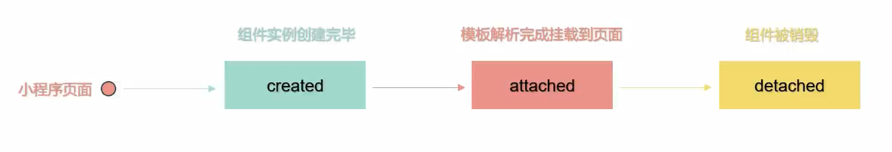
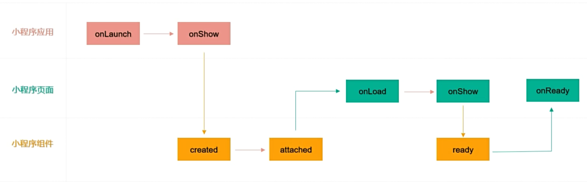
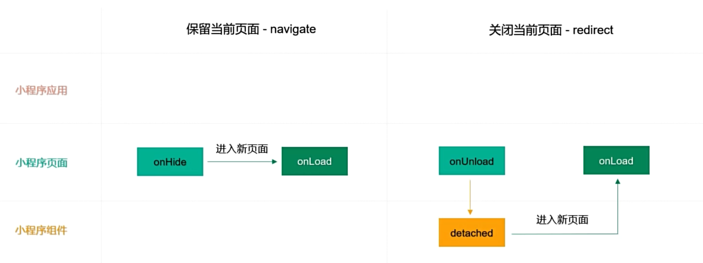
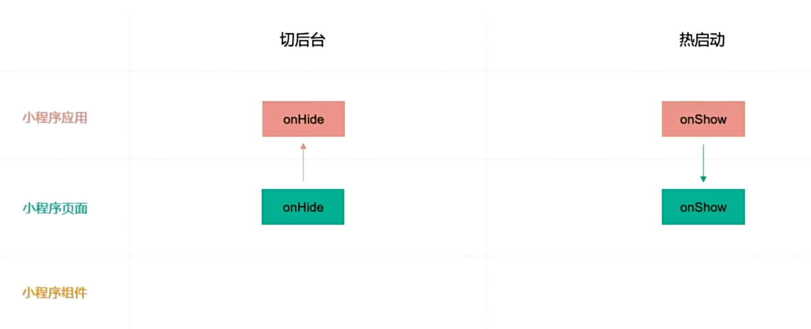

# 微信小程序

## 使用 sass

**project.config.json**

```json
{
  "setting": {
    "useCompilerPlugins": ["sass"]
  }
}
```

## scroll-view

**scroll-x**

```wxml
<scroll-view class="scroll-x" scroll-x>
  <view>1</view>
  <view>2</view>
  <view>3</view>
</scroll-view>
```

```scss
.scroll-x {
  white-space: nowrap;
  background-color: #bfa;

  view {
    display: inline-block;
    width: 300rpx;
    height: 100rpx;

    &:first-child {
      background-color: deepskyblue;
    }

    &:last-child {
      background-color: tomato;
    }
  }
}
```

**scroll-y**

```wxml
<scroll-view class="scroll-y" scroll-y>
  <view>1</view>
  <view>2</view>
  <view>3</view>
</scroll-view>
```

```scss
.scroll-y {
  height: 400rpx;
  margin-top: 20rpx;
  background-color: #bfa;

  view {
    height: 400rpx;

    &:first-child {
      background-color: deepskyblue;
    }

    &:last-child {
      background-color: tomato;
    }
  }
}
```

## 背景图片的使用

当编写小程序的样式文件时，我们可以使用 background-image 来设置元素的背景图片

注意事项：小程序的 background-image 不支持本地路径，需要使用网络图片，或者 base64 格式的图片，或者使用 image 组件

## 阻止事件冒泡

使用 bind 绑定的事件，会触发事件冒泡，如果想阻止事件冒泡，可以使用 catch 来绑定事件

```wxml
<view class="outer" bind:tap="clickOuterHandler">
  <view class="inner" catch:tap="clickInnerHandler">子元素</view>
</view>
```

```js
Page({
  clickOuterHandler() {
    console.log('父元素')
  },
  clickInnerHandler() {
    console.log('子元素')
  },
})
```

## 事件传参 data-\* 自定义数据

在组件上通过 data-\* 的方式定义需要传递的数据，其中 \* 是自定义的属性，例如：`<button bind:tap="clickBtnHandler" data-id="1" data-name="孙悟空" type="primary">点我一下</button>`，然后通过事件对象进行数据获取自定义数据

注意事项：

- e.target 是指触发事件的对象，e.currentTarget 是指绑定事件的对象
- 使用 data-\* 方法传递参数时，多个单词由连字符 - 连接，连字符写法会转换成小驼峰写法
- 使用 data-\* 方法传递参数时，大写字符会自动转换成小写字符

```wxml
<view class="outer" bind:tap="clickOuterHandler" data-outer-id="2" data-outer-name="猪八戒">
  <button bind:tap="clickBtnHandler" data-id="1" data-name="孙悟空" type="primary">点我一下</button>
</view>
```

```js
Page({
  clickBtnHandler(e) {
    console.log(e.target.dataset.id, e.target.dataset.name)
  },
  clickOuterHandler(e) {
    console.log(e.currentTarget.dataset.outerId, e.currentTarget.dataset.outerName)
  },
})
```

## 事件传参 mark 自定义数据

在组件上使用 mark:自定义属性的方式将数据传递给事件处理函数，例如：`<button bind:tap="clickBtnHandler" mark:id="1" mark:name="孙悟空" type="primary">点我一下</button>`，然后通过事件对象进行获取自定义数据

mark 和 data-\* 很相似，主要区别在于：

- mark 包含从事件触发的节点到根节点上所有的 mark 属性值
- currentTarget.dataset 或者 target.dataset 只包含事件绑定者或者事件触发者那一个节点的 data-\* 值

```wxml
<view class="outer" bind:tap="clickOuterHandler" mark:outerId="2" mark:outerName="猪八戒">
  <button bind:tap="clickBtnHandler" mark:id="1" mark:name="孙悟空" type="primary">点我一下</button>
</view>
```

```js
Page({
  clickBtnHandler(e) {
    console.log(e.mark.id, e.mark.name, e.mark.outerId, e.mark.outerName)
  },
  clickOuterHandler(e) {
    console.log(e.mark.outerId, e.mark.outerName)
  },
})
```

## 声明和数据绑定

小程序页面中使用的数据均需要在 Page() 方法的 data 对象中进行声明定义，在将数据声明好以后，在 wxml 使用 Mustache 语法(双大括号 `{{}}` )将变量包起来，从而将数据绑定

在 `{{}}` 内部可以做一些简单的运算，支持如下几种方式：

- 算数运算
- 三元运算
- 逻辑判断

注意事项：在 `{{}}` 语法中，只能写表达式，不能写语句，**也不能调用 js 相关的方法**

```wxml
<view>{{name}}</view>
<view id="{{id}}"></view>
<view>{{age+1}}</view>
<view>{{friend.name}}</view>
<checkbox checked="{{false}}" />
<view>{{age>=18?'成年人':'未成年人'}}</view>
```

```js
Page({
  data: {
    id: 1,
    name: '孙悟空',
    age: 18,
    friend: {
      name: 'Tom',
    },
  },
})
```

## setData() 修改数据

小程序中修改数据不推荐通过赋值的方式进行修改，通过赋值的方式修改数据无法改变页面的数据，而是需要通过调用 setData() 方法进行修改，setData() 方法接收对象作为参数，key 是需要修改的数据，value 是最新的值

setData() 方法有两个作用：

- 更新数据
- 驱动视图更新

```wxml
<view>{{num}}</view>
<button bind:tap="clickHandler" type="primary">点我一下</button>
```

```js
Page({
  data: {
    num: 1,
  },
  clickHandler() {
    this.setData({
      num: this.data.num + 1,
    })
  },
})
```

## setData 修改对象类型数据

```wxml
<button bind:tap="clickHandler" type="primary">点我一下</button>
<view>{{userInfo.name}}</view>
<view>{{userInfo.age}}</view>
<view>{{userInfo.gender}}</view>
```

```js
Page({
  data: {
    userInfo: {
      name: '孙悟空',
      age: 18,
      gender: '男',
    },
  },
  clickHandler() {
    // 新增属性
    // this.setData({
    //   'userInfo.name': '孙悟空',
    //   'userInfo.age': 18,
    //   'userInfo.gender': '男'
    // })
    // 修改属性
    // this.setData({
    //   'userInfo.name': '猪八戒',
    //   'userInfo.age': 28
    // })
    // 修改属性
    // const userInfo = {
    //   ...this.data.userInfo,
    //   name: '沙和尚',
    //   age: 38
    // }
    // this.setData({
    //   userInfo
    // })
    // 修改属性
    // const userInfo = Object.assign(
    //   this.data.userInfo,
    //   { name: '唐僧' },
    //   { age: 16 }
    // )
    // this.setData({
    //   userInfo
    // })
    // 删除属性
    // delete this.data.userInfo.gender
    // this.setData({
    //   userInfo: this.data.userInfo
    // })

    // 删除属性
    const { gender, ...args } = this.data.userInfo
    this.setData({
      userInfo: args,
    })
  },
})
```

## setData() 修改数组类型数据

```wxml
<button bind:tap="clickHandler" type="primary">点我一下</button>
<view wx:for="{{list}}" wx:key="index">{{item}}</view>
```

```js
Page({
  data: {
    list: [1, 2, 3],
  },
  clickHandler() {
    // 新增数组元素
    // this.data.list.push(4, 5)
    // this.setData({
    //   list: this.data.list
    // })
    // 新增数组元素
    // const newList = this.data.list.concat(4, 5)
    // this.setData({
    //   list: newList
    // })
    // 新增数组元素
    // const newList = [...this.data.list, 4, 5]
    // this.setData({
    //   list: newList
    // })
    // 修改数组元素
    // this.setData({
    //   'list[0]': 100,
    //   'list[1]': 200
    // })

    // 删除数组元素
    // this.data.list.splice(0, 1)
    // this.setData({
    //   list: this.data.list
    // })

    // 删除数组元素
    const newList = this.data.list.filter((item) => item !== 1)
    this.setData({
      list: newList,
    })
  },
})
```

## 简易双向数据绑定

在 wxml 中，普通属性的绑定是单向的，例如：`<input value="{{message}}" />`，如果希望用户输入数据的同时改变 data 中的数据，可以借助简易双向绑定机制，在对应属性之前添加 model:前缀即可，例如：`<input model:value="{{message}}" />`

注意事项：简易双向绑定的属性值有如下限制：

- 只能是一个单一字段的绑定，例如：错误用法：`<input model:value="值为{{message.name}}" />`
- 不能写 data 路径，也就是不支持数组和对象，例如：错误用法：`<input model:value="{{obj.name}}" />`

```wxml
<input type="text" bindinput="inputHandler" value="{{message}}" />
<input type="text" model:value="{{message}}" />
```

```js
Page({
  data: {
    message: '',
    obj: {
      name: '孙悟空',
    },
  },
  inputHandler(e) {
    this.setData({
      message: e.detail.value,
    })
  },
})
```

## 列表渲染-基本使用

列表渲染就是指通过循环遍历一个数组或对象，将其中的每个元素渲染到页面上，在组件上使用 wx:for 属性绑定一个数组或对象，既可使用每一项数据重复渲染当前组件，每一项的变量名默认为 item，下标变量名默认为 index

在使用 wx:for 进行变量的时候，建议加上 wx:key 属性，wx:key 的值以两种形式提供：

- 字符串：代表需要遍历的数组中 item 的某个属性，该属性的值需要是列表中唯一的字符串或数字，且不能动态改变
- 保留关键字 \*this 代表在 for 循环中的 item 本身，当 item 本身是一个唯一的字符串或者数字时可以使用

注意事项：

- 如果不加 wx:key，会报一个 warning，如果明确知道该列表是静态，即以后数据不会改变，或者不必关注其顺序，可以选择忽略
- 在给 wx:key 添加属性值时，不需要使用双大括号语法，直接使用遍历的数组中 item 的某个属性

```wxml
<view wx:for="{{numList}}" wx:key="index">{{index}} {{item}}</view>
<view wx:for="{{numList}}" wx:key="item">{{index}} {{item}}</view>
<view wx:for="{{numList}}" wx:key="*this">{{index}} {{item}}</view>
<view wx:for="{{studentList}}" wx:key="id">{{index}} {{item.name}}</view>
<view wx:for="{{obj}}" wx:key="index">{{index}} {{item}}</view>
```

```js
Page({
  data: {
    numList: [1, 2, 3],
    studentList: [
      { id: 1, name: '孙悟空' },
      { id: 2, name: '猪八戒' },
      { id: 3, name: '沙和尚' },
    ],
    obj: {
      name: 'Tom',
      age: 10,
    },
  },
})
```

## 列表渲染-进阶用法

如果需要对默认的变量名和下标进行修改，可以使用 wx:for-item 和 wx:for-index

- 使用 wx:for-item 可以指定数组当前元素的变量名
- 使用 wx:for-index 可以指定数组当前下标的变量名

将 wx:for 用在<block/>标签上，以渲染一个包含多个节点的结构块

- <block/>并不是一个组件，它仅仅是一个包装元素，不会在页面中做任何渲染，只接受控制属性
- <block/>标签在 wxml 中可以用于组织代码结构，支持列表渲染、条件渲染等

```wxml
<view wx:for="{{numList}}" wx:key="item">{{index}} {{item}}</view>
<view wx:for="{{studentList}}" wx:key="id" wx:for-item="studentItem" wx:for-index="idx">
  {{idx}} {{studentItem.name}}
</view>
<block wx:for="{{obj}}" wx:key="index">
  <view>{{index}} {{item}}</view>
</block>
```

```js
Page({
  data: {
    numList: [1, 2, 3],
    studentList: [
      { id: 1, name: '孙悟空' },
      { id: 2, name: '猪八戒' },
      { id: 3, name: '沙和尚' },
    ],
    obj: {
      name: 'Tom',
      age: 10,
    },
  },
})
```

## 条件渲染

条件渲染主要用来控制页面结构的展示和隐藏，在微信小程序中实现条件渲染有两种方式：

- 使用 wx:for、wx:elif、wx:else 属性组
- 使用 hidden 属性

wx:if 和 hidden 二者的区别：

- wx:if：当条件为 true 时将结构展示出来，否则结构不会进行展示，通过移除/新增节点的方式来实现
- hidden：当条件为 true 时会将结构隐藏，否则结构会展示出来，通过设置 display:none 来实现

```wxml
<view wx:if="{{age<18}}">未成年人</view>
<view wx:elif="{{age>=18&&age<60}}">成年人</view>
<view wx:else="{{age>=60}}">老年人</view>
<button bind:tap="addAgeHandler" type="primary">年龄{{age}}</button>

<view hidden="{{isHidden}}">Hello</view>
<button bind:tap="changeStateHandler" type="primary">切换</button>
```

```js
Page({
  data: {
    age: 1,
    isHidden: false,
  },
  addAgeHandler() {
    this.setData({
      age: this.data.age + 1,
    })
  },
  changeStateHandler() {
    this.setData({
      isHidden: !this.data.isHidden,
    })
  },
})
```

## 小程序运行机制

https://developers.weixin.qq.com/miniprogram/dev/framework/runtime/operating-mechanism.html#_1-1-%E5%B0%8F%E7%A8%8B%E5%BA%8F%E5%90%AF%E5%8A%A8

## 小程序更新机制

https://developers.weixin.qq.com/miniprogram/dev/framework/runtime/update-mechanism.html

**app.js**

```js
App({
  onLaunch() {
    const updateManager = wx.getUpdateManager()

    updateManager.onCheckForUpdate(function (res) {
      // 请求完新版本信息的回调
      console.log(res.hasUpdate)
    })

    updateManager.onUpdateReady(function () {
      wx.showModal({
        title: '更新提示',
        content: '新版本已经准备好，是否重启应用？',
        success(res) {
          if (res.confirm) {
            // 新的版本已经下载好，调用 applyUpdate 应用新版本并重启
            updateManager.applyUpdate()
          }
        },
      })
    })

    updateManager.onUpdateFailed(function () {
      // 新版本下载失败
    })
  },
})
```

## 小程序生命周期介绍

应用生命周期是指应用程序进程从创建到消亡的整个过程

小程序的生命周期指的是小程序从启动到销毁的整个过程

**一个小程序完整的生命周期由应用生命周期、页面生命周期和组件生命周期三部分来组成**

小程序生命周期伴随着一些函数，这些函数由小程序框架本身提供，被称为生命周期函数，生命周期函数会按照顺序依次自动触发调用，帮助程序员在特定的时机执行特定的操作，辅助程序员完成一些比较复杂的逻辑

## 应用生命周期

应用生命周期通常是指一个小程序从启动-->运行-->销毁的整个过程

应用生命周期伴随着一些函数，我们称为应用生命周期函数，应用生命周期函数需要在 app.js 文件的 App() 方法中进行定义，App() 方法必须在 app.js 中进行调用，主要用来注册小程序

应用生命周期函数由 onLaunch、onShow、onHide 三个函数组成


从小程序生命周期的角度来看，我们一般讲的启动专指冷启动，热启动一般被称为后台切前台

https://developers.weixin.qq.com/miniprogram/dev/reference/api/App.html#onLaunch-Object-object

**app.js**

```js
App({
  /**
   * 当小程序初始化完成时，会触发 onLaunch(全局只触发一次)
   */
  onLaunch: function () {
    console.log('onLaunch')
  },

  /**
   * 当小程序启动，或从后台进入前台显示，会触发 onShow
   */
  onShow: function (options) {
    console.log('onShow')
  },

  /**
   * 当小程序从前台进入后台，会触发 onHide
   */
  onHide: function () {
    console.log('onHide')
  },

  /**
   * 当小程序发生脚本错误，或者 api 调用失败时，会触发 onError 并带上错误信息
   */
  onError: function (msg) {},
})
```

## 页面生命周期

页面生命周期就是指小程序页面从加载-->运行-->销毁的整个过程

页面生命周期函数需要在 Page() 方法进行定义


https://developers.weixin.qq.com/miniprogram/dev/reference/api/Page.html

**my.js**

```js
Page({
  /**
   * 页面的初始数据
   */
  data: {},

  /**
   * 生命周期函数--监听页面加载
   */
  onLoad: function (options) {
    console.log('onLoad')
  },

  /**
   * 生命周期函数--监听页面初次渲染完成
   */
  onReady: function () {
    console.log('onReady')
  },

  /**
   * 生命周期函数--监听页面显示
   */
  onShow: function () {
    console.log('onShow')
  },

  /**
   * 生命周期函数--监听页面隐藏
   */
  onHide: function () {
    console.log('onHide')
  },

  /**
   * 生命周期函数--监听页面卸载
   */
  onUnload: function () {
    console.log('onUnload')
  },

  /**
   * 页面相关事件处理函数--监听用户下拉动作
   */
  onPullDownRefresh: function () {},

  /**
   * 页面上拉触底事件的处理函数
   */
  onReachBottom: function () {},

  /**
   * 用户点击右上角分享
   */
  onShareAppMessage: function () {},
})
```

## 生命周期两个细节

tabBar 页面之间相互切换，页面不会被销毁

点击左上角，返回上一个页面，会销毁当前页面

## 小程序 API 介绍

小程序分类

- 异步 API：通常都接受一个对象类型的参数，例如：`wx.request({})`
- 同步 API：约定以 Sync 结尾，例如：`wx.setStorageSync()`
- 事件监听 API：约定以 on 开头，例如：`wx.onAppHide()`

异步 API 支持 callback 和 Promise 两种调用方式：

- 当接口参数对象中不包含 success、fail、complete 时将默认返回 Promise
- 部分接口如 request、uploadFile 本身就有返回值，因此不支持 Promise 风格的调用方式，它们的 promisify 需要开发者自行封装

## 网络请求

```wxml
<button bind:tap="getData" type="primary">点我获取数据</button>
```

```js
Page({
  data: {
    list: [],
  },
  getData() {
    wx.request({
      url: 'https://gmall-prod.atguigu.cn/mall-api/index/findBanner',
      success: (res) => {
        if (res.data.code === 200) {
          this.setData({
            list: res.data.data,
          })
        }
      },
    })
  },
})
```

## 界面交互 loading 提示框

wx.showLoading()：显示 loading 提示框

wx.hideLoading()：关闭 loading 提示框

```js
Page({
  data: {
    list: [],
  },
  getData() {
    wx.showLoading({
      title: '数据加载中...',
      mask: true,
    })
    wx.request({
      url: 'https://gmall-prod.atguigu.cn/mall-api/index/findBanner',
      success: (res) => {
        if (res.data.code === 200) {
          this.setData({
            list: res.data.data,
          })
        }
      },
      complete: (res) => {
        wx.hideLoading()
      },
    })
  },
})
```

## 界面交互-模态对话框-消息提示框

```js
Page({
  async deleteHandler() {
    const res = await wx.showModal({
      title: '提示',
      content: '你确定要删除吗',
    })

    if (res.confirm) {
      wx.showToast({
        title: '删除成功',
        icon: 'success',
      })
    } else {
      wx.showToast({
        title: '取消删除',
        icon: 'none',
      })
    }
  },
})
```

## 本地存储

小程序本地存储

- 同步 API
  - 存储：wx.setStorageSync()
  - 获取：wx.getStorageSync()
  - 删除：wx.removeStorageSync()
  - 清空：wx.clearStorageSync()
- 异步 API
  - 存储：wx.setStorage()
  - 获取：wx.getStorage()
  - 删除：wx.removeStorage()
  - 清空：wx.clearStorage()

**注意事项：对象类型的数据，可以直接进行存储获取，无需使用 JSON.stringify() 和 JSON.parse() 进行转换**

**同步 API**

```js
Page({
  // 存储
  setStorage() {
    wx.setStorageSync('num', 1)
    wx.setStorageSync('obj', {
      name: '孙悟空',
      age: 18,
    })
  },
  // 获取
  getStorage() {
    const num = wx.getStorageSync('num')
    const obj = wx.getStorageSync('obj')
    console.log(num)
    console.log(obj)
  },
  // 删除
  removeStorage() {
    wx.removeStorageSync('obj')
  },
  // 清空
  clearStorage() {
    wx.clearStorageSync()
  },
})
```

**异步 API**

```js
Page({
  // 存储
  setStorage() {
    wx.setStorage({
      key: 'num',
      data: 1,
    })

    wx.setStorage({
      key: 'obj',
      data: {
        name: '猪八戒',
        age: 28,
      },
    })
  },
  // 获取
  async getStorage() {
    const num = await wx.getStorage({
      key: 'num',
    })

    const obj = await wx.getStorage({
      key: 'obj',
    })

    console.log(num.data)
    console.log(obj.data)
  },
  // 删除
  removeStorage() {
    wx.removeStorage({
      key: 'obj',
    })
  },
  // 清空
  clearStorage() {
    wx.clearStorage()
  },
})
```

## 路由与通信

小程序中实现页面的跳转，有两种方式：

- 声明式导航：navigate 组件
- 编程式导航：使用小程序提供的 API
  - wx.navigateTo()：保留当前页面，跳转到应用内的某个页面。但是不能跳到 tabBar 页面。使用 wx.navigateBack 可以返回到原页面。小程序中页面栈最多十层
  - wx.redirectTo()：关闭当前页面，跳转到应用内的某个页面。但是不允许跳转到 tabBar 页面
  - wx.switchTab()：跳转到 tabBar 页面，并关闭其他所有非 tabBar 页面，**路径后面不能传递参数**
  - wx.reLaunch()：关闭所有页面，打开到应用内的某个页面
  - wx.navigateBack()：关闭当前页面，返回上一页面或多级页面。可通过 getCurrentPages 获取当前的页面栈，决定需要返回几层

路径后可以带参数，参数与路径之间使用 ? 分隔，参数键与参数值使用 = 相连，多个参数用 & 分隔，例如 path?name=孙悟空&age=18

参数需要在跳转到的页面的 onLoad 钩子函数中通过形参进行接收

```js
Page({
  navigateTo() {
    wx.navigateTo({
      url: '/pages/list/list?name=孙悟空&age=18',
    })
  },
  redirectTo() {
    wx.redirectTo({
      url: '/pages/list/list?name=孙悟空&age=18',
    })
  },
  switchTab() {
    wx.switchTab({
      url: '/pages/cart/cart',
    })
  },
  reLaunch() {
    wx.reLaunch({
      url: '/pages/list/list?name=孙悟空&age=18',
    })
  },
  navigateBack() {
    wx.navigateBack({
      delta: 2,
    })
  },
})
```

## 页面处理函数-上拉加载

小程序中实现上拉加载的方式：

- 在 app.json 或者 page.json 中配置距离页面底部距离：onReachBottomDistance，默认为 50px
- 在页面.js 中定义 onReachBottom 事件监听用户上拉加载

**cart.json**

```json
{
  "usingComponents": {},
  "onReachBottomDistance": 100
}
```

**cart.wxml**

```wxml
<view wx:for="{{numList}}" wx:key="item">{{item}}</view>
```

**cart.js**

```js
Page({
  data: {
    numList: [1, 2, 3],
  },
  // 上拉触底加载
  onReachBottom() {
    wx.showLoading({
      title: '数据加载中...',
    })

    setTimeout(() => {
      const newList = this.data.numList.slice(-3).map((item) => item + 3)
      this.setData({
        numList: [...this.data.numList, ...newList],
      })

      wx.hideLoading()
    }, 1000)
  },
})
```

## 页面处理函数-下拉刷新

小程序中实现上拉加载更多的方式：

- 在 app.json 或者 page.json 中开启允许下拉，同时可以配置窗口、loading 样式等
- 在页面.js 中定义 onPullDownRefresh 事件监听用户下拉刷新

**cart.json**

```json
{
  "usingComponents": {},
  "onReachBottomDistance": 100,
  "enablePullDownRefresh": true,
  "backgroundColor": "#efefef",
  "backgroundTextStyle": "dark"
}
```

**cart.wxml**

```wxml
<view wx:for="{{numList}}" wx:key="item">{{item}}</view>
```

**cart.js**

```js
Page({
  data: {
    numList: [1, 2, 3],
  },
  // 上拉触底加载
  onReachBottom() {
    wx.showLoading({
      title: '数据加载中...',
    })

    setTimeout(() => {
      const newList = this.data.numList.slice(-3).map((item) => item + 3)
      this.setData({
        numList: [...this.data.numList, ...newList],
      })

      wx.hideLoading()
    }, 1000)
  },
  // 下拉刷新
  onPullDownRefresh() {
    this.setData({
      numList: [1, 2, 3],
    })

    wx.stopPullDownRefresh()
  },
})
```

## 使用 scroll-view 实现上拉加载更多和下拉刷新功能

```wxml
<scroll-view
  scroll-y
  lower-threshold="100"
  bindscrolltolower="scrolltolowerHandler"
  refresher-enabled
  refresher-default-style="black"
  refresher-background="#efefef"
  refresher-triggered="{{isTriggered}}"
  bindrefresherrefresh="refreshHandler"
>
  <view wx:for="{{numList}}" wx:key="*this">{{item}}</view>
</scroll-view>
```

```js
Page({
  data: {
    numList: [1, 2, 3],
    isTriggered: false,
  },
  // 下拉触底加载
  scrolltolowerHandler() {
    wx.showLoading({
      title: '数据加载中...',
    })

    setTimeout(() => {
      const newList = this.data.numList.slice(-3).map((item) => item + 3)
      this.setData({
        numList: [...this.data.numList, ...newList],
      })

      wx.hideLoading()
    }, 1000)
  },
  // 上拉刷新
  refreshHandler() {
    this.setData({
      numList: [1, 2, 3],
      isTriggered: false,
    })

    wx.showToast({
      title: '刷新成功',
      icon: 'success',
    })
  },
})
```

## 创建和注册组件

开发中常见的组件主要分为公共组件和页面组件两种，因此注册组件的方式也分为两种：

- 全局注册：在 app.json 文件中配置 usingComponents 进行注册，注册后可以在任意页面使用
- 局部注册：在页面的 json 文件中配置 usingComponents 进行注册，注册后只能在当前页面使用

在 usingComponents 中进行组件注册时，需要提供自定义组件的组件名和自定义组件文件路径

在将组件注册好以后，直接将自定义组件的组件名当成组件标签名使用即可

```json
{
  "usingComponents": {
    "my-component-one": "/components/my-component-one/my-component-one"
  }
}
```

## 组件的数据以及方法

组件数据和方法需要在组件.js 的 Component 方法中进行定义，Component 创建自定义组件

- data：定义组件的内部数据
- methods：在组件中事件处理程序需要写到 methods 中才可以

```wxml
<view>全局组件</view>
<checkbox checked="{{isChecked}}" bind:tap="updateIsChecked" />
```

```js
Component({
  /**
   * 组件的属性列表
   */
  properties: {},

  /**
   * 组件的初始数据
   */
  data: {
    isChecked: false,
  },

  /**
   * 组件的方法列表
   */
  methods: {
    updateIsChecked() {
      this.setData({
        isChecked: !this.data.isChecked,
      })
    },
  },
})
```

## 组件的属性

Properties 是指组件的对外属性，主要用来接收组件使用者传递给组件内部的数据，和 data 一同用于组件的模板渲染

注意事项：

- 设置属性类型需要使用 type 属性，属性类型是必填项，value 属性为默认值
- 属性类型可以为 String、Number、Boolean、Object、Array，也可以为 null 表示不限制类型

**category.wxml**

```wxml
<my-component-one content="我已阅读并同意用户协议、隐私协议" position="right">
</my-component-one>

<my-component-one content="匿名提交" position="left"></my-component-one>
```

**my-component-one.js**

```js
Component({
  /**
   * 组件的属性列表
   */
  properties: {
    content: String,
    position: {
      type: String,
      value: '',
    },
  },

  /**
   * 组件的初始数据
   */
  data: {
    isChecked: false,
  },

  /**
   * 组件的方法列表
   */
  methods: {
    updateIsChecked() {
      this.setData({
        isChecked: !this.data.isChecked,
      })

      console.log(this.properties.content, this.properties.position)
    },
  },
})
```

**my-component-one.wxml**

```wxml
<view class="{{position==='left'?'left':'right'}}">
  <checkbox checked="{{isChecked}}" bind:tap="updateIsChecked" />
  <view class="{{position==='left'?'container':''}}">
    <text>{{position==="left"?'您对商家/菜品满意吗？':''}}</text>
    <text>{{content}}</text>
  </view>
</view>
```

## 组件 wxml 的 slot 插槽

在使用基础组件时，可以在组件中间写子节点，从而将子节点的内容展示到页面中，自定义组件也可以接收子节点，只不过在组件模板中需要定义 `<slot/>` 节点，用于承载组件中间的子节点

默认情况下，一个组件的 wxml 中只能有一个 slot(默认插槽)，需要使用多插槽时，可以在 js 中声明启用

同时需要给 slot 添加 name 属性来区分不同的 slot(具名插槽)

然后给子节点内容添加 slot 属性，属性值是对应 slot 的 name 名称，从而将内容插入到对应的 slot 中

**cart.wxml**

```wxml
<custom-one>
  <view slot="header">头部内容</view>
  <view>主要内容</view>
  <view slot="footer">底部内容</view>
</custom-one>
```

**custom-one.wxml**

```wxml
<slot name="header"></slot>
<slot></slot>
<slot name="footer"></slot>
```

**custom-one.js**

```js
Component({
  options: {
    multipleSlots: true,
  },
})
```

## 组件样式以及注意事项

自定义组件拥有自己的 wxss 样式，组件 wxss 文件的样式，默认只对当前组件生效

编写组件样式时，需要注意以下几点：

- app.wxss 或页面的 wxss 中使用了标签名(view)选择器(或一些其他特殊选择器)来直接指定样式，这些选择器会影响到页面和全部组件，通常情况下这是不推荐的做法
- 组件和引用组件的页面不能使用 id 选择器、属性选择器和标签选择器，请改用 class 选择器
- 组件和引用组件的页面中使用后代选择器在一些极端情况下会有非预期的表现，如果遇到请避免使用
- 子元素选择器只能用于 view 组件与其子节点之间，用于其他组件可能导致非预期的情况
- 继承样式，如 font、color，会从组件外继承到组件内
- 除继承样式外，全局中的样式、组件所在的页面的样式对自定义组件无效(除非更改组件样式隔离选项)

## 组件样式隔离

默认情况下，自定义组件的样式只受自身 wxss 的影响，但是有时候我们需要组件使用者的样式的样式能够影响到组件，这时候就需要指定特殊的样式隔离选项 styleIsolation，选择它支持以下取值：

- isolate：表示启用样式隔离，在自定义组件内外，使用 class 指定的样式将不会相互影响(一般情况下的默认值)
- apply-shared：表示页面 wxss 样式将影响到自定义组件，但自定义组件 wxss 中指定的样式不会影响页面
- shared：表示页面 wxss 样式将影响到自定义组件，自定义组件 wxss 中指定的元素也会影响页面和其他设置了 apply-shared 或 shared 的自定义组件

```wxml
<view class="outer {{position==='left'?'left':'right'}}">
  <checkbox checked="{{isChecked}}" bind:tap="updateIsChecked" />
  <view class="{{position==='left'?'container':''}}">
    <text>{{position==="left"?'您对商家/菜品满意吗？':''}}</text>
    <text wx:if="{{content}}">{{content}}</text>
    <slot wx:else></slot>
  </view>
</view>
```

```scss
.outer {
  display: flex;
  align-items: center;

  .wx-checkbox-input {
    width: 30rpx;
    height: 30rpx;
    border-radius: 50%;
    border: 1px solid orange;
  }

  .wx-checkbox-input-checked {
    width: 30rpx;
    height: 30rpx;
    border-radius: 50%;
    border: 1px solid orange;

    &::before {
      color: red;
    }
  }

  &.right {
    flex-direction: row;
  }

  &.left {
    flex-direction: row-reverse;
  }

  .container {
    flex: auto;
    display: flex;
    justify-content: space-between;
    align-items: center;
  }
}
```

```js
Component({
  options: {
    styleIsolation: 'shared',
  },
})
```

## 数据监听器

数据监听器主要用于监听和响应任何属性(properties)和数据(data)的变化，当数据发生变化时就会触发对应回调函数，从而方便开发者进行业务逻辑的处理

在组件中如果需要进行数据监听，需要使用 observers 字段

**cart.wxml**

```wxml
<custom-four test="测试"></custom-four>
```

**custom-four.wxml**

```wxml
<view>num：{{num}}</view>
<view>count：{{count}}</view>
<view>{{obj.name}} {{obj.age}}</view>
<view>arr[1]：{{arr[1]}}</view>
<view>{{test}}</view>

<button type="primary" bind:tap="clickHandler">点我一下</button>
```

**custom-four.js**

```js
Component({
  /**
   * 组件的属性列表
   */
  properties: {
    test: {
      type: String,
      value: '',
    },
  },
  // 用来监听数据以及属性是否发生了变化
  observers: {
    // 监听单个数据
    // num: function (newNum) {
    //   console.log(newNum)
    // },
    // count: function (newCount) {
    //   console.log(newCount)
    // },
    // 监听多个数据
    // 'num,count': function (newNum, newCount) {
    //   console.log(newNum, newCount)
    // },
    // 监听单个属性
    // 'arr[1]': function (value) {
    //   console.log(value)
    // },
    // 监听多个属性
    // 'obj.name,obj.age': function (newName, newAge) {
    //   console.log(newName, newAge)
    // },
    // 使用通配符，监听对象中所有属性的变化
    // 'obj.**': function (newObj) {
    //   console.log(newObj)
    // },
    // 监听properties
    test: function (newTest) {
      console.log(newTest)
    },
  },

  /**
   * 组件的初始数据
   */
  data: {
    num: 10,
    count: 100,
    obj: {
      name: '孙悟空',
      age: 18,
    },
    arr: [1, 2, 3],
  },

  /**
   * 组件的方法列表
   */
  methods: {
    clickHandler() {
      this.setData({
        num: this.data.num + 1,
        count: this.data.count + 1,
        'arr[1]': this.data.arr[1] + 1,
        'obj.name': '猪八戒',
        'obj.age': this.data.obj.age + 1,
        test: '哈哈',
      })
    },
  },
})
```

## 组件通信-父往子传值

父组件如果需要向子组件传递数据，只需要两个步骤：

- 在父组件 wxml 中使用数据绑定的方式向子组件传递动态数据
- 子组件内部使用 properties 接收父组件传递的数据即可

**category.wxml**

```wxml
<my-component-one position="right" checked="{{checked}}">
  我已阅读并同意用户协议和隐私协议
</my-component-one>

<my-component-one position="left">
  匿名提交
</my-component-one>
```

**category.js**

```js
Page({
  data: {
    checked: false,
  },
})
```

**my-component-one.wxml**

```wxml
<view class="outer {{position==='left'?'left':'right'}}">
  <checkbox checked="{{isChecked}}" bind:tap="updateIsChecked" />
  <view class="{{position==='left'?'container':''}}">
    <text>{{position==="left"?'您对商家/菜品满意吗？':''}}</text>
    <text wx:if="{{content}}">{{content}}</text>
    <slot wx:else></slot>
  </view>
</view>
```

**my-component-one.js**

```js
Component({
  options: {
    styleIsolation: 'shared',
  },
  properties: {
    content: String,
    position: {
      type: String,
      value: '',
    },
    checked: {
      type: Boolean,
      value: false,
    },
  },
  observers: {
    checked: function (value) {
      this.setData({
        isChecked: value,
      })
    },
  },
  data: {
    isChecked: false,
  },
  methods: {
    updateIsChecked() {
      this.setData({
        isChecked: !this.data.isChecked,
      })
    },
  },
})
```

## 组件通信-子往父传值

子组件如果需要向父组件传递数据，可以通过小程序提供的事件系统实现，可以传递任意数据

- 自定义组件内部使用 triggerEvent 方法触发一个自定义事件，同时可以携带数据
- 自定义组件标签上通过 bind 方法监听发射的事件，同时绑定事件处理函数，在事件函数中通过事件对象获取传递的数据

**my.wxml**

```wxml
<custom-five num="{{num}}" bind:updatenum="updateNum"></custom-five>
```

**my.js**

```js
Page({
  data: {
    num: 1,
  },
  updateNum(e) {
    this.setData({
      num: e.detail,
    })
  },
})
```

**custom-five.wxml**

```wxml
<view>{{num}}</view>
<button type="primary" plain bind:tap="clickHandler">子组件修改父组件的值</button>
```

**custom-five.js**

```js
Component({
  properties: {
    num: {
      type: Number,
    },
  },
  methods: {
    clickHandler() {
      this.triggerEvent('updatenum', this.properties.num + 1)
    },
  },
})
```

## 组件通信-获取组件实例

父组件可以通过 this.selectComponent 方法获取子组件实例对象，这样就可以直接访问子组件的任意数据和方法

this.selectComponent 方法在调用时需要传入一个匹配选择器 selector

**category.wxml**

```wxml
<my-component-one
  class="child"
  position="right"
  isChecked="{{isChecked}}"
  bindchangechecked="changeChecked"
>
  我已阅读并同意用户协议和隐私协议
</my-component-one>

<button type="primary" plain bind:tap="clickHandler">获取子组件实例对象</button>
```

**category.js**

```js
Page({
  data: {
    isChecked: false,
  },
  changeChecked(e) {
    this.setData({
      isChecked: e.detail,
    })
  },
  clickHandler() {
    const res = this.selectComponent('.child')
    console.log(res.data.isChecked)
  },
})
```

**my-component-one.wxml**

```wxml
<view class="outer {{position==='left'?'left':'right'}}">
  <checkbox checked="{{isChecked}}" bind:tap="updateIsChecked" />
  <view class="{{position==='left'?'container':''}}">
    <text>{{position==="left"?'您对商家/菜品满意吗？':''}}</text>
    <text wx:if="{{content}}">{{content}}</text>
    <slot wx:else></slot>
  </view>
</view>
```

**my-component-one.js**

```js
Component({
  options: {
    styleIsolation: 'shared',
  },
  properties: {
    content: String,
    position: {
      type: String,
      value: '',
    },
    isChecked: {
      type: Boolean,
      value: false,
    },
  },
  methods: {
    updateIsChecked() {
      this.triggerEvent('changechecked', !this.properties.isChecked)
    },
  },
})
```

## 组件生命周期

组件的生命周期：指的是组件自身的一些钩子函数，这些函数在特定的时间节点被自动触发

组件的生命周期函数需要在 lifetimes 字段内进行声明

组件的声明周期函数有 5 个：created、attached、ready、moved、detached



**注意事项：created 钩子函数中不能调用 setData**

**my.wxml**

```wxml
<custom-six wx:if="{{num===1}}"></custom-six>

<button type="warn" plain bind:tap="clickHandler">销毁自定义组件</button>
```

**my.js**

```js
Page({
  data: {
    num: 1,
  },
  clickHandler() {
    this.setData({
      num: this.data.num + 1,
    })
  },
})
```

**custom-six.wxml**

```wxml
<view>{{name}}</view>
```

**custom-six.js**

```js
Component({
  data: {
    name: '孙悟空',
  },
  lifetimes: {
    created() {
      this.test = '测试'
      console.log('created')
    },
    attached() {
      this.setData({
        name: '猪八戒',
      })
      console.log('attached', this.test)
    },
    detached() {
      console.log('detached')
    },
  },
})
```

## 组件所在页面的生命周期

组件还有一些特殊的生命周期，这类生命周期和组件没有很强的关联

主要用于组件内部监听父组件的展示、隐藏状态，从而方便组件内部执行一些业务逻辑的处理

组件所在页面的生命周期有 4 个：show、hide、resize、routeDone、需要在 pageLifetimes 字段内进行声明

- show：组件所在的页面被展示时执行
- hide：组件所在的页面被隐藏时执行

```js
Component({
  data: {
    name: '孙悟空',
  },
  lifetimes: {
    created() {
      this.test = '测试'
      // console.log('created')
    },
    attached() {
      this.setData({
        name: '猪八戒',
      })
      // console.log('attached', this.test)
    },
    detached() {
      // console.log('detached')
    },
  },
  pageLifetimes: {
    show() {
      console.log('show')
    },
    hide() {
      console.log('hide')
    },
  },
})
```

## 小程序生命周期总结

一个小程序完整的生命周期由应用生命周期、页面生命周期和组件生命周期三部分来组成

**小程序冷启动，钩子函数执行的顺序**



**保留当前页面，进入下一个页面，钩子函数执行的顺序&销毁当前页面，进入下一个页面，钩子函数执行的顺序**



**小程序热启动，钩子函数执行的顺序**



## 使用 Component 构造页面

Component 方法用于创建自定义组件

小程序页面也可以视为自定义组件，因此页面也可以使用 Component 方法进行创建，从而实现复杂的页面逻辑开发

注意事项：

- 要求对应 json 文件中包含 usingComponents
- 页面使用 Component 构造器创建，需要定义与普通组件一样的字段与实例方法
- 页面 Page 中的一些生命周期方法(如 onLoad 等)，在 Component 中要写在 methods 属性中才能生效
- 组件的属性 Properties 可以用于接收页面的参数，在 onLoad()中可以通过 this.data 拿到对应的页面参数

**my.wxml**

```wxml
<navigator
  url="/pages/details/details?age=18&gender=男"
  open-type="navigate"
>
  跳转到details
</navigator>
```

**details.wxml**

```wxml
<view>details页面</view>
<view>{{name}}</view>

<button type="primary" plain bind:tap="updateName">点我一下</button>
```

**details.js**

```js
Component({
  properties: {
    age: Number,
    gender: String,
  },
  data: {
    name: '孙悟空',
  },
  methods: {
    updateName() {
      this.setData({
        name: '猪八戒',
      })
    },
    onLoad(option) {
      // console.log('details页面 onLoad')
      // console.log(option)
      console.log(this.properties.age, this.properties.gender)
    },
  },
})
```

## 组件复用机制 behaviors

小程序的 behaviors 方法是一种代码复用的方式，可以将一些通用的逻辑和方法提取出来，然后在多个组件中复用，从而减少代码冗余，提高代码的可维护性

如果需要 behavior 复用代码，需要使用 Behavior() 方法，每个 behavior 可以包含一组属性、数据、生命周期函数的方法，组件引用它时，它的属性、数据和方法会被合并到组件中，生命周期函数也会在对应时机被调用

组件和它引用的 behavior 中可以包含同名的字段，对这些字段的处理方法如下：

- 如果有同名的属性和方法，采用就近原则，组件会覆盖 behavior 中的同名属性和方法
- 如果有同名的数据字段且都是对象类型，会进行对象合并，其余情况会采用就近原则进行数据覆盖
- 生命周期函数和 observers 不会相互覆盖，会是在对应触发时机被逐个调用，也就是都会被执行

**my.wxml**

```wxml
<custom-eight></custom-eight>
```

**custom-eight.wxml**

```wxml
<view>自定义组件</view>
<view>{{label}}</view>
<view>{{name}}</view>
<view>{{obj.name}}</view>
<view>{{obj.age}}</view>

<button type="primary" plain bind:tap="updateName">点我一下</button>
```

**behavior.js**

```js
const behavior = Behavior({
  properties: {
    label: {
      type: String,
      value: '标签',
    },
  },
  data: {
    name: '孙悟空',
    obj: {
      name: '猪八戒',
    },
  },
  methods: {
    updateName() {
      this.setData({
        name: '沙和尚',
      })

      console.log('behavior中的方法')
    },
  },
  lifetimes: {
    attached() {
      console.log('behavior中的生命周期函数')
    },
  },
})

export default behavior
```

**custom-eight.js**

```js
import behavior from './behavio'

Component({
  behaviors: [behavior],
  properties: {
    label: {
      type: String,
      value: '哈哈',
    },
  },
  data: {
    name: '组件中的name',
    obj: {
      name: '组件中的obj name',
      age: 18,
    },
  },
  methods: {
    updateName() {
      console.log('组件内部的方法')
    },
  },
  lifetimes: {
    attached() {
      console.log('组件内部的生命周期函数')
    },
  },
})
```

## 外部样式类

默认情况下，组件和组件使用者之间如果存在相同的类名不会相互影响，组件使用者如果想修改组件的样式，就需要解除样式隔离，但是解除样式隔离以后，在极端情况下，会产生样式冲突、CSS 嵌套太深等问题，从而给我们的开发带来一定的麻烦

外部样式类：在使用组件时，组件使用者可以给组件传入 CSS 类名，通过传入的类名修改组件的样式

如果需要使用外部样式类修改组件的样式，在 Component 中需要用 externalClasses 定义若干个外部样式类

外部样式类的使用步骤：

- 在 Component 中用 externalClasses 定义若干个外部样式类
- 自定义组件标签通过属性绑定的方式提供一个样式类，属性是 externalClasses 定义的元素，属性值是传递的类名
- 将接受到的样式类用于自定义组件内部

注意事项：

- 在同一个节点上使用普通样式类和外部样式类时，两个类的优先级是未定义的，因此需要添加!important 以保证外部样式类的优先级
- 如果 styleIsolation 属性值是 shared，这时候 externalClasses 选项将会失效

**my.wxml**

```wxml
<custom-nine external-class="test test2"></custom-nine>
```

**my.scss**

```scss
.test {
  color: red !important;
}

.test2 {
  background-color: #bfa;
}
```

**custom-nine.wxml**

```wxml
<view class="external-class box">自定义组件</view>
```

**custom-nine.scss**

```scss
.box {
  color: deepskyblue;
}
```

**custom-nine.js**

```js
Component({
  externalClasses: ['external-class'],
})
```

## 使用 npm 包

目前小程序已经支持使用 npm 安装第三方包，因为 node_modules 目录中的包不会参与小程序项目的编译、上传和打包，因此在小程序项目中要使用的 npm 包，必须走一遍构建 npm 的过程

在构建成功以后，默认会在小程序项目根目录，也就是 node_modules 同级目录下生成 miniprogram_npm 目录，里面存放着构建完成以后的 npm 包，也就是小程序运行过程中真正使用的包

注意事项：

- 小程序运行在微信内部，因为运行环境的特殊性，这就导致并不是所有的包都能够在小程序使用
- 我们在小程序中提到的包指专为小程序定制的 npm 包，简称小程序 npm 包，在使用包之前需要先确定该包是否支持小程序
- 开发者如果需要发布小程序包，需要参考官方规范：https://developers.weixin.qq.com/miniprogram/dev/devtools/npm.html#%E5%8F%91%E5%B8%83-npm-%E5%8C%85

## 自定义构建 npm

在实际的开发中，随着项目的功能越来越多，项目越来越复杂，文件目录也变得很繁琐，为了方便进行项目的开发，开发人员通常会对目录结构进行调整优化，例如：将小程序源码放到 miniprogram 目录下

这时候需要开发者在 project.config.json 中指定 node_modules 的位置和目标 miniprogram_npm 的位置

具体配置如下：

- 配置 project.config.json 的 miniprogramRoot 指定小程序源码的目录
- 配置 project.config.json 的 setting.packNpmManually 为 true，开启自定义 node_modules 和 miniprogram_npm 位置的构建 npm 方式
- 配置 project.config.json 的 setting.packNpmRelationList 项，指定 packageJsonPath 和 miniprogramNpmDistDir 的位置

**project.config.json**

```json
{
  "miniprogramRoot": "./miniprogram",
  "setting": {
    "packNpmManually": true,
    "packNpmRelationList": [
      {
        "packageJsonPath": "./package.json",
        "miniprogramNpmDistDir": "./miniprogram"
      }
    ]
  }
}
```

## Vant Weapp 组件样式覆盖

Vant Weapp 基于微信小程序的机制，为开发者提供了三种修改组件样式的方法

- 解除样式隔离：在页面中使用 Vant Weapp 组件时，可直接在页面的样式文件中覆盖样式
- 使用外部样式类：需要注意的是普通样式类和外部样式类的优先级是未定义的，使用时需要添加!important 保证外部样式类的优先级
- 使用 CSS 变量：在页面或全局对多个组件的样式做批量修改以进行主题样式的定制

## 小程序分包加载

小程序的代码通常是由许多页面、组件以及资源等组成，随着小程序功能的增加，代码量也会逐渐增加，体积过大就会导致用户打开速度变慢，影响用户的使用体验

分包加载是一种小程序优化技术，将小程序不同功能的代码，分别打包成不同的子包，在构建时打包成不同的分包，使用在使用时按需进行加载，在构建小程序分包项目时，构建会输出一个或多个分包，每个使用分包小程序含有一个主包

- 主包：包含默认启动页面/tabBar 页面以及所有分包都需要用到的公共资源包
- 分包：根据开发者的配置进行划分出来的子包

分包后加载顺序：在小程序启动时，默认会下载主包并启动主包内页面，当用户进入分包内某个页面时，微信客户端会把对应分包下载下来，下载完成后再进行展示

目前小程序分包大小有以下限制：

- 整个小程序所有分包大小不超过 20M(开通虚拟支付后的小游戏不超过 30M)
- 单个分包/主包大小不能超过 2M

## 配置分包加载以及打包、引用原则

小程序如果需要进行分包加载，需要在 app.json 中，通过 subPackages 定义分包结构

每个分包结构含三个常用字段：

- root：分包的根目录，该目录下的所有文件都会被打包成一个独立的包
- name：分包的别名，用于在代码中引用该分包
- pages：指定当前分包中包含哪些页面

打包原则：

- tabBar 页面必须在主包内
- 最外层的 pages 字段，属于主包的包含页面
- 按 subPackages 配置路径进行打包，配置路径外的目录将被打包到主包中
- 分包之间不能相互嵌套，subPackage 的根目录不能是另外一个 subPackage 内的子目录

引用原则：

- 主包不可以引用分包的资源，但分包可以使用主包的公共资源
- 分包与主包之间资源无法相互引用，分包异步化时不受此条限制

**app.json**

```json
{
  "pages": ["pages/index/index", "pages/category/category", "pages/cart/cart", "pages/my/my"],
  "tabBar": {
    "selectedColor": "#f3514f",
    "color": "#666",
    "borderStyle": "black",
    "position": "bottom",
    "list": [
      {
        "text": "首页",
        "pagePath": "pages/index/index",
        "iconPath": "/assets/tabbar/index.png",
        "selectedIconPath": "/assets/tabbar/index-selected.png"
      },
      {
        "text": "分类",
        "pagePath": "pages/category/category",
        "iconPath": "/assets/tabbar/category.png",
        "selectedIconPath": "/assets/tabbar/category-selected.png"
      },
      {
        "text": "购物车",
        "pagePath": "pages/cart/cart",
        "iconPath": "/assets/tabbar/cart.png",
        "selectedIconPath": "/assets/tabbar/cart-selected.png"
      },
      {
        "text": "我的",
        "pagePath": "pages/my/my",
        "iconPath": "/assets/tabbar/my.png",
        "selectedIconPath": "/assets/tabbar/my-selected.png"
      }
    ]
  },
  "subPackages": [
    {
      "root": "modules/goodsModule",
      "name": "goodsModule",
      "pages": ["pages/list/list", "pages/details/details"]
    }
  ]
}
```

**my.wxml**

```wxml
<navigator url="/modules/goodsModule/pages/list/list">
  跳转到list
</navigator>
```

## 独立分包

独立分包：是指能够独立于主包和其他分包运行的包

从独立分包页面进行小程序时，不需要下载主包，当用户进入普通分包或主包内页面时，主包才会被下载

开发者可以将功能相对独立的页面配置到独立分包中，因此独立分包不依赖主包就可以运行，可以很大程度上提升分包页面的启动速度

给 subPackages 定义的分包结构添加 independent 字段，即可声明对应分包为独立分包

注意事项：

- 独立分包中不能依赖主包和其他分包中的资源
- 主包中的 app.wxss 对独立分包无效
- App 只能在主包内对应，独立分包中不能定义 App，会造成无法预期的行为

**app.json**

```json
{
  "subPackages": [
    {
      "root": "modules/goodsModule",
      "name": "goodsModule",
      "pages": ["pages/list/list", "pages/details/details"]
    },
    {
      "root": "modules/marketModule",
      "name": "marketModule",
      "pages": ["pages/market/market"],
      "independent": true
    }
  ]
}
```

## 分包预下载

分包预下载是指访问小程序某个页面时，预先下载其他分包中的代码和资源，当用户需要访问分包中的页面时，已经预先下载好代码和资源，因此可以直接使用，从而提高用户的使用体验

小程序的分包预下载需要在 app.json 中通过 preloadRule 字段设置预下载规则

preloadRule 是一个对象，对象的 key 表示访问哪个路径时进行预下载，value 是进入此页面的预下载配置，具有两个配置项：

- packages：进入页面后预下载分包的 root 或 name，`__APP__` 表示主包
- network：在指定网络下预下载，可选值为：all(不限网络)、wifi(仅 wifi 下预下载)

**app.json**

```json
{
  "subPackages": [
    {
      "root": "modules/goodsModule",
      "name": "goodsModule",
      "pages": ["pages/list/list", "pages/details/details"]
    },
    {
      "root": "modules/marketModule",
      "name": "marketModule",
      "pages": ["pages/market/market"],
      "independent": true
    }
  ],
  "preloadRule": {
    "pages/index/index": {
      "network": "all",
      "packages": ["modules/goodsModule"]
    },
    "modules/goodsModule/pages/list/list": {
      "network": "all",
      "packages": ["__APP__"]
    }
  }
}
```

## 获取微信头像

想使用微信提供的头像填写能力，需要两步：

- 将 button 组件 open-type 的值设置为 chooseAvatar
- 通过 bindchooseavatar 事件回调获取到头像信息的临时路径

**my.wxml**

```wxml
<view>
  <button class="btn" open-type="chooseAvatar" bindchooseavatar="chooseAvatar">
    <image class="img" src="{{avatarUrl}}" mode="" />
  </button>
</view>
```

**my.scss**

```scss
.btn {
  background-color: transparent;

  &::after {
    border: none;
  }

  .img {
    width: 200rpx;
    height: 200rpx;
    border-radius: 50%;
  }
}
```

**my.js**

```js
Page({
  data: {
    avatarUrl: '../../assets/img/01.jpg',
  },
  chooseAvatar(e) {
    this.setData({
      avatarUrl: e.detail.avatarUrl,
    })
  },
})
```

## 获取微信昵称

想使用微信提供的昵称填写能力，需要三步：

- 通过 form 组件中包裹住 input 以及 form-type 为 submit 的 button 组件
- 需要将 input 组件的 type 属性设置为 nickname，当用户输入框输入时，键盘上方会展示微信昵称
- 给 form 绑定 submit 事件，在事件处理函数中通过事件对象获取用户昵称

**my.wxml**

```wxml
<form bindsubmit="submitHandler">
  <input type="nickname" name="nickname" placeholder="请输入昵称" />
  <button class="nickname-btn" type="primary" plain form-type="submit">点击获取昵称</button>
</form>
```

**my.js**

```js
Page({
  // 获取微信昵称
  submitHandler(e) {
    console.log(e.detail.value.nickname)
  },
})
```

## 转发功能

想实现转发功能，有两种方式：

- 页面 js 文件必须声明 onShareAppMessage 事件监听函数，并自定义转发内容，只有定义了此事件处理函数，右上角菜单才会显示转发按钮
- 通过给 button 组件设置属性 open-type="share"，可以在用户点击按钮后触发 Page.onShareAppMessage 事件监听函数

**my.wxml**

```wxml
<button open-type="share" type="primary" plain>转发</button>
```

**my.js**

```js
Page({
  onShareAppMessage(obj) {
    console.log(obj)

    return {
      title: '这是一个非常棒的小程序',
      path: '/pages/my/my',
      imageUrl: '../../assets/img/01.jpg',
    }
  },
})
```

## 分享到朋友圈

小程序页面默认不能被分享到朋友圈，开发者需主动设置分享到朋友圈才可以，实现分享到朋友圈需要满足两个条件：

- 页面必须设置允许发送给朋友，页面 js 文件声明 onShareAppMessage 事件监听函数
- 页面必须设置允许分享到朋友圈，页面 js 文件声明 onShareTimeline 事件监听函数

**my.js**

```js
Page({
  // 转发功能
  onShareAppMessage(obj) {
    console.log(obj)

    return {
      title: '这是一个非常棒的小程序',
      path: '/pages/my/my',
      imageUrl: '../../assets/img/01.jpg',
    }
  },
  // 分享到朋友圈
  onShareTimeline() {
    return {
      title: '测试分享到朋友圈',
      query: 'name=Tom',
      imageUrl: '../../assets/img/03.jpg',
    }
  },
})
```

## 手机号验证组件

手机号验证组件，用于帮助开发者向用户发起手机号申请，必须经过用户同意后，才能获得由平台验证后的手机号，进而为用户提供相应服务，手机号验证组件分为两种：手机号快速验证组件以及手机号实时验证组件

手机号快速验证组件：平台会对号码进行验证，但不保证是实时验证，`<button open-type="getPhoneNumber" bindgetphonenumber="getPhoneNumber">获取手机号</button>`

手机号实时验证组件：在每次请求时，平台均会对用户选择的手机号进行实时验证，`<button open-type="getRealtimePhoneNumber" bindgetrealtimephonenumber="getRealtimePhoneNumber">获取手机号</button>"`

注意事项：

- 目前该接口针对非个人开发者，且完成了认证的小程序开发(不包含海外主体)
- 两种验证组件需要付费使用，每个小程序账号将有 1000 次体验额度

**my.wxml**

```wxml
<button type="primary" plain open-type="getPhoneNumber" bindgetphonenumber="getPhoneNumber">
  快速验证组件
</button>

<button type="warn" plain open-type="getRealtimePhoneNumber" bindgetrealtimephonenumber="getRealtimePhoneNumber">
  实时验证组件
</button>
```

**my.js**

```js
Page({
  // 快速验证组件
  getPhoneNumber(e) {
    console.log(e)
  },
  // 实时验证组件
  getRealtimePhoneNumber(e) {
    console.log(e)
  },
})
```

## 客服功能

小程序为开发者提供了客服能力，同时为客服人员提供移动端、网页端客服工作台便于及时处理消息，使用方式：

- 需要将 button 组件 open-type 属性设置为 contact，当用户点击后就会进入客服会话
- 在微信公众号后台，绑定后的客服账号，可以登录网页端客服或移动端小程序客服接收、发送客服消息

**my.wxml**

```wxml
<button type="primary" plain open-type="contact">客服</button>
```

## 框架接口 getApp()

在小程序中，可以通过 getApp() 方法获取到小程序全局唯一的 App 实例，因此在 App() 方法中添加全局共享的数据、方法，从而实现页面、组件的数据传值

注意事项：

- 不要在 App() 方法中使用 getApp()，使用 this 就可以拿到 app 实例
- 通过 getApp() 获取实例之后，不要私自调用生命周期函数

**app.js**

```js
App({
  globalData: {
    token: '',
  },
  setToken(token) {
    this.globalData.token = token
  },
})
```

**my.wxml**

```wxml
<button type="primary" plain bind:tap="login">登录</button>
```

**my.js**

```js
const app = getApp()

Page({
  login() {
    app.setToken('123456')
  },
})
```

**cart.js**

```js
const app = getApp()

Page({
  onShow() {
    console.log(app.globalData.token)
  },
})
```

## 页面间通信

如果一个页面通过 wx.navigateTo() 打开一个新页面，这两个页面间将建立一条数据通道

- 在 wx.navigateTo() 的 success 回调函数中通过 EventChannel 对象触发事件
- 被打开的页面可以通过 this.getOpenerEventChannel() 方法来获得一个 EventChannel 对象，进行监听、触发事件
- wx.navigateTo 方法中可以定义 events 配置项接收被打开页面发射的事件

**my.wxml**

```wxml
<button type="primary" plain bind:tap="clickHandler">跳转到list页面</button>
```

**my.js**

```js
Page({
  clickHandler() {
    wx.navigateTo({
      url: '/pages/list/list',
      events: {
        listdata: (res) => {
          console.log(res)
        },
      },
      success(res) {
        res.eventChannel.emit('myevent', {
          name: '孙悟空',
        })
      },
    })
  },
})
```

**list.js**

```js
Page({
  onLoad() {
    const eventChannel = this.getOpenerEventChannel()

    eventChannel.on('myevent', (res) => {
      console.log(res)
    })

    eventChannel.emit('listdata', {
      age: 18,
    })
  },
})
```

## 组件通信-事件总线

随着项目功能的增加，业务逻辑也会变得很复杂，一个页面可能是由多个组件进行构成，并且这些组件之间需要进行数据的传递，这时候如果使用之前学习的组件传值方式进行数据的传递，就会比较麻烦

事件总线是对发布-订阅模式的一种实现，是一种集中式事件处理机制，允许不同的组件之间进行彼此通信，常用于两个非父子关系组件和兄弟组件之间进行通信，我们可以借助第三方的发布订阅 JS 包，来实现事件总线的功能

**my.wxml**

```wxml
<custom-eleven></custom-eleven>
<custom-twelve></custom-twelve>
```

**custom-eleven.wxml**

```wxml
<view class="eleven">
  <view>自定义组件11</view>
  <button type="primary" bind:tap="clickHandler">传递数据给兄弟组件</button>
</view>
```

**custom-eleven.js**

```js
import PubSub from 'pubsub-js'

Component({
  data: {
    name: '孙悟空',
    age: 18,
  },
  methods: {
    clickHandler() {
      PubSub.publish('myevent', this.data)
    },
  },
})
```

**custom-twelve.wxml**

```wxml
<view class="twelve">
  <view>自定义组件12</view>
  <view>{{name}} {{age}}</view>
</view>
```

**custom-twelve.js**

```js
import PubSub from 'pubsub-js'

Component({
  data: {
    name: '',
    age: '',
  },
  lifetimes: {
    attached() {
      PubSub.subscribe('myevent', (msg, data) => {
        console.log(msg, data)
        this.setData({
          name: data.name,
          age: data.age,
        })
      })
    },
  },
})
```

## 自定义导航栏

小程序默认的导航栏与 APP 一样都位于顶部固定位置，但是默认导航栏可能会影响小程序的整体风格，且无法满足特定的设计需求，这时候，就需要进行自定义导航栏

在 app.json 或者 page.json 中，配置 navigationStyle 属性为 custom 即可自定义导航栏

在设置以后，就会移除默认的导航栏，只保留右上角的胶囊按钮

**cart.wxml**

```wxml
<swiper indicator-dots autoplay interval="3000" indicator-color="#fff" indicator-active-color="orange">
  <swiper-item>
    <image src="../../assets/img/01.jpg" mode="" />
  </swiper-item>
  <swiper-item>
    <image src="../../assets/img/02.jpg" mode="" />
  </swiper-item>
  <swiper-item>
    <image src="../../assets/img/03.jpg" mode="" />
  </swiper-item>
</swiper>
```

**cart.json**

```json
{
  "usingComponents": {},
  "navigationStyle": "custom"
}
```
