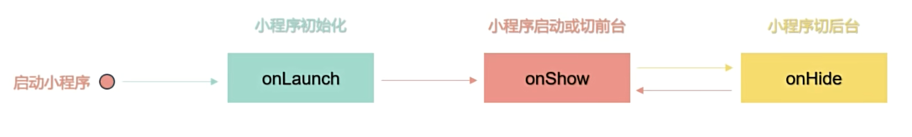
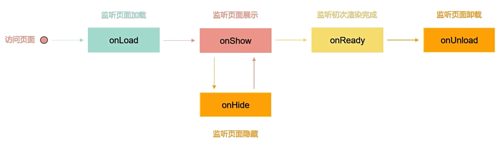

# 微信小程序

## 使用 sass

**project.config.json**

```json
{
  "setting": {
    "useCompilerPlugins": ["sass"]
  }
}
```

## scroll-view

**scroll-x**

```wxml
<scroll-view class="scroll-x" scroll-x>
  <view>1</view>
  <view>2</view>
  <view>3</view>
</scroll-view>
```

```scss
.scroll-x {
  white-space: nowrap;
  background-color: #bfa;

  view {
    display: inline-block;
    width: 300rpx;
    height: 100rpx;

    &:first-child {
      background-color: deepskyblue;
    }

    &:last-child {
      background-color: tomato;
    }
  }
}
```

**scroll-y**

```wxml
<scroll-view class="scroll-y" scroll-y>
  <view>1</view>
  <view>2</view>
  <view>3</view>
</scroll-view>
```

```scss
.scroll-y {
  height: 400rpx;
  margin-top: 20rpx;
  background-color: #bfa;

  view {
    height: 400rpx;

    &:first-child {
      background-color: deepskyblue;
    }

    &:last-child {
      background-color: tomato;
    }
  }
}
```

## 背景图片的使用

当编写小程序的样式文件时，我们可以使用 background-image 来设置元素的背景图片

注意事项：小程序的 background-image 不支持本地路径，需要使用网络图片，或者 base64 格式的图片，或者使用 image 组件

## 阻止事件冒泡

使用 bind 绑定的事件，会触发事件冒泡，如果想阻止事件冒泡，可以使用 catch 来绑定事件

```wxml
<view class="outer" bind:tap="clickOuterHandler">
  <view class="inner" catch:tap="clickInnerHandler">子元素</view>
</view>
```

```js
Page({
  clickOuterHandler() {
    console.log('父元素')
  },
  clickInnerHandler() {
    console.log('子元素')
  },
})
```

## 事件传参 data-\* 自定义数据

在组件上通过 data-\* 的方式定义需要传递的数据，其中 \* 是自定义的属性，例如：`<button bind:tap="clickBtnHandler" data-id="1" data-name="孙悟空" type="primary">点我一下</button>`，然后通过事件对象进行数据获取自定义数据

注意事项：

- e.target 是指触发事件的对象，e.currentTarget 是指绑定事件的对象
- 使用 data-\* 方法传递参数时，多个单词由连字符 - 连接，连字符写法会转换成小驼峰写法
- 使用 data-\* 方法传递参数时，大写字符会自动转换成小写字符

```wxml
<view class="outer" bind:tap="clickOuterHandler" data-outer-id="2" data-outer-name="猪八戒">
  <button bind:tap="clickBtnHandler" data-id="1" data-name="孙悟空" type="primary">点我一下</button>
</view>
```

```js
Page({
  clickBtnHandler(e) {
    console.log(e.target.dataset.id, e.target.dataset.name)
  },
  clickOuterHandler(e) {
    console.log(e.currentTarget.dataset.outerId, e.currentTarget.dataset.outerName)
  },
})
```

## 事件传参 mark 自定义数据

在组件上使用 mark:自定义属性的方式将数据传递给事件处理函数，例如：`<button bind:tap="clickBtnHandler" mark:id="1" mark:name="孙悟空" type="primary">点我一下</button>`，然后通过事件对象进行获取自定义数据

mark 和 data-\* 很相似，主要区别在于：

- mark 包含从事件触发的节点到根节点上所有的 mark 属性值
- currentTarget.dataset 或者 target.dataset 只包含事件绑定者或者事件触发者那一个节点的 data-\* 值

```wxml
<view class="outer" bind:tap="clickOuterHandler" mark:outerId="2" mark:outerName="猪八戒">
  <button bind:tap="clickBtnHandler" mark:id="1" mark:name="孙悟空" type="primary">点我一下</button>
</view>
```

```js
Page({
  clickBtnHandler(e) {
    console.log(e.mark.id, e.mark.name, e.mark.outerId, e.mark.outerName)
  },
  clickOuterHandler(e) {
    console.log(e.mark.outerId, e.mark.outerName)
  },
})
```

## 声明和数据绑定

小程序页面中使用的数据均需要在 Page() 方法的 data 对象中进行声明定义，在将数据声明好以后，在 wxml 使用 Mustache 语法(双大括号 `{{}}` )将变量包起来，从而将数据绑定

在 `{{}}` 内部可以做一些简单的运算，支持如下几种方式：

- 算数运算
- 三元运算
- 逻辑判断

注意事项：在 `{{}}` 语法中，只能写表达式，不能写语句，**也不能调用 js 相关的方法**

```wxml
<view>{{name}}</view>
<view id="{{id}}"></view>
<view>{{age+1}}</view>
<view>{{friend.name}}</view>
<checkbox checked="{{false}}" />
<view>{{age>=18?'成年人':'未成年人'}}</view>
```

```js
Page({
  data: {
    id: 1,
    name: '孙悟空',
    age: 18,
    friend: {
      name: 'Tom',
    },
  },
})
```

## setData() 修改数据

小程序中修改数据不推荐通过赋值的方式进行修改，通过赋值的方式修改数据无法改变页面的数据，而是需要通过调用 setData() 方法进行修改，setData() 方法接收对象作为参数，key 是需要修改的数据，value 是最新的值

setData() 方法有两个作用：

- 更新数据
- 驱动视图更新

```wxml
<view>{{num}}</view>
<button bind:tap="clickHandler" type="primary">点我一下</button>
```

```js
Page({
  data: {
    num: 1,
  },
  clickHandler() {
    this.setData({
      num: this.data.num + 1,
    })
  },
})
```

## setData 修改对象类型数据

```wxml
<button bind:tap="clickHandler" type="primary">点我一下</button>
<view>{{userInfo.name}}</view>
<view>{{userInfo.age}}</view>
<view>{{userInfo.gender}}</view>
```

```js
Page({
  data: {
    userInfo: {
      name: '孙悟空',
      age: 18,
      gender: '男',
    },
  },
  clickHandler() {
    // 新增属性
    // this.setData({
    //   'userInfo.name': '孙悟空',
    //   'userInfo.age': 18,
    //   'userInfo.gender': '男'
    // })
    // 修改属性
    // this.setData({
    //   'userInfo.name': '猪八戒',
    //   'userInfo.age': 28
    // })
    // 修改属性
    // const userInfo = {
    //   ...this.data.userInfo,
    //   name: '沙和尚',
    //   age: 38
    // }
    // this.setData({
    //   userInfo
    // })
    // 修改属性
    // const userInfo = Object.assign(
    //   this.data.userInfo,
    //   { name: '唐僧' },
    //   { age: 16 }
    // )
    // this.setData({
    //   userInfo
    // })
    // 删除属性
    // delete this.data.userInfo.gender
    // this.setData({
    //   userInfo: this.data.userInfo
    // })

    // 删除属性
    const { gender, ...args } = this.data.userInfo
    this.setData({
      userInfo: args,
    })
  },
})
```

## setData() 修改数组类型数据

```wxml
<button bind:tap="clickHandler" type="primary">点我一下</button>
<view wx:for="{{list}}" wx:key="index">{{item}}</view>
```

```js
Page({
  data: {
    list: [1, 2, 3],
  },
  clickHandler() {
    // 新增数组元素
    // this.data.list.push(4, 5)
    // this.setData({
    //   list: this.data.list
    // })
    // 新增数组元素
    // const newList = this.data.list.concat(4, 5)
    // this.setData({
    //   list: newList
    // })
    // 新增数组元素
    // const newList = [...this.data.list, 4, 5]
    // this.setData({
    //   list: newList
    // })
    // 修改数组元素
    // this.setData({
    //   'list[0]': 100,
    //   'list[1]': 200
    // })

    // 删除数组元素
    // this.data.list.splice(0, 1)
    // this.setData({
    //   list: this.data.list
    // })

    // 删除数组元素
    const newList = this.data.list.filter((item) => item !== 1)
    this.setData({
      list: newList,
    })
  },
})
```

## 简易双向数据绑定

在 wxml 中，普通属性的绑定是单向的，例如：`<input value="{{message}}" />`，如果希望用户输入数据的同时改变 data 中的数据，可以借助简易双向绑定机制，在对应属性之前添加 model:前缀即可，例如：`<input model:value="{{message}}" />`

注意事项：简易双向绑定的属性值有如下限制：

- 只能是一个单一字段的绑定，例如：错误用法：`<input model:value="值为{{message.name}}" />`
- 不能写 data 路径，也就是不支持数组和对象，例如：错误用法：`<input model:value="{{obj.name}}" />`

```wxml
<input type="text" bindinput="inputHandler" value="{{message}}" />
<input type="text" model:value="{{message}}" />
```

```js
Page({
  data: {
    message: '',
    obj: {
      name: '孙悟空',
    },
  },
  inputHandler(e) {
    this.setData({
      message: e.detail.value,
    })
  },
})
```

## 列表渲染-基本使用

列表渲染就是指通过循环遍历一个数组或对象，将其中的每个元素渲染到页面上，在组件上使用 wx:for 属性绑定一个数组或对象，既可使用每一项数据重复渲染当前组件，每一项的变量名默认为 item，下标变量名默认为 index

在使用 wx:for 进行变量的时候，建议加上 wx:key 属性，wx:key 的值以两种形式提供：

- 字符串：代表需要遍历的数组中 item 的某个属性，该属性的值需要是列表中唯一的字符串或数字，且不能动态改变
- 保留关键字 \*this 代表在 for 循环中的 item 本身，当 item 本身是一个唯一的字符串或者数字时可以使用

注意事项：

- 如果不加 wx:key，会报一个 warning，如果明确知道该列表是静态，即以后数据不会改变，或者不必关注其顺序，可以选择忽略
- 在给 wx:key 添加属性值时，不需要使用双大括号语法，直接使用遍历的数组中 item 的某个属性

```wxml
<view wx:for="{{numList}}" wx:key="index">{{index}} {{item}}</view>
<view wx:for="{{numList}}" wx:key="item">{{index}} {{item}}</view>
<view wx:for="{{numList}}" wx:key="*this">{{index}} {{item}}</view>
<view wx:for="{{studentList}}" wx:key="id">{{index}} {{item.name}}</view>
<view wx:for="{{obj}}" wx:key="index">{{index}} {{item}}</view>
```

```js
Page({
  data: {
    numList: [1, 2, 3],
    studentList: [
      { id: 1, name: '孙悟空' },
      { id: 2, name: '猪八戒' },
      { id: 3, name: '沙和尚' },
    ],
    obj: {
      name: 'Tom',
      age: 10,
    },
  },
})
```

## 列表渲染-进阶用法

如果需要对默认的变量名和下标进行修改，可以使用 wx:for-item 和 wx:for-index

- 使用 wx:for-item 可以指定数组当前元素的变量名
- 使用 wx:for-index 可以指定数组当前下标的变量名

将 wx:for 用在<block/>标签上，以渲染一个包含多个节点的结构块

- <block/>并不是一个组件，它仅仅是一个包装元素，不会在页面中做任何渲染，只接受控制属性
- <block/>标签在 wxml 中可以用于组织代码结构，支持列表渲染、条件渲染等

```wxml
<view wx:for="{{numList}}" wx:key="item">{{index}} {{item}}</view>
<view wx:for="{{studentList}}" wx:key="id" wx:for-item="studentItem" wx:for-index="idx">
  {{idx}} {{studentItem.name}}
</view>
<block wx:for="{{obj}}" wx:key="index">
  <view>{{index}} {{item}}</view>
</block>
```

```js
Page({
  data: {
    numList: [1, 2, 3],
    studentList: [
      { id: 1, name: '孙悟空' },
      { id: 2, name: '猪八戒' },
      { id: 3, name: '沙和尚' },
    ],
    obj: {
      name: 'Tom',
      age: 10,
    },
  },
})
```

## 条件渲染

条件渲染主要用来控制页面结构的展示和隐藏，在微信小程序中实现条件渲染有两种方式：

- 使用 wx:for、wx:elif、wx:else 属性组
- 使用 hidden 属性

wx:if 和 hidden 二者的区别：

- wx:if：当条件为 true 时将结构展示出来，否则结构不会进行展示，通过移除/新增节点的方式来实现
- hidden：当条件为 true 时会将结构隐藏，否则结构会展示出来，通过设置 display:none 来实现

```wxml
<view wx:if="{{age<18}}">未成年人</view>
<view wx:elif="{{age>=18&&age<60}}">成年人</view>
<view wx:else="{{age>=60}}">老年人</view>
<button bind:tap="addAgeHandler" type="primary">年龄{{age}}</button>

<view hidden="{{isHidden}}">Hello</view>
<button bind:tap="changeStateHandler" type="primary">切换</button>
```

```js
Page({
  data: {
    age: 1,
    isHidden: false,
  },
  addAgeHandler() {
    this.setData({
      age: this.data.age + 1,
    })
  },
  changeStateHandler() {
    this.setData({
      isHidden: !this.data.isHidden,
    })
  },
})
```

## 小程序运行机制

https://developers.weixin.qq.com/miniprogram/dev/framework/runtime/operating-mechanism.html#_1-1-%E5%B0%8F%E7%A8%8B%E5%BA%8F%E5%90%AF%E5%8A%A8

## 小程序更新机制

https://developers.weixin.qq.com/miniprogram/dev/framework/runtime/update-mechanism.html

**app.js**

```js
App({
  onLaunch() {
    const updateManager = wx.getUpdateManager()

    updateManager.onCheckForUpdate(function (res) {
      // 请求完新版本信息的回调
      console.log(res.hasUpdate)
    })

    updateManager.onUpdateReady(function () {
      wx.showModal({
        title: '更新提示',
        content: '新版本已经准备好，是否重启应用？',
        success(res) {
          if (res.confirm) {
            // 新的版本已经下载好，调用 applyUpdate 应用新版本并重启
            updateManager.applyUpdate()
          }
        },
      })
    })

    updateManager.onUpdateFailed(function () {
      // 新版本下载失败
    })
  },
})
```

## 小程序生命周期介绍

应用生命周期是指应用程序进程从创建到消亡的整个过程

小程序的生命周期指的是小程序从启动到销毁的整个过程

**一个小程序完整的生命周期由应用生命周期、页面生命周期和组件生命周期三部分来组成**

小程序生命周期伴随着一些函数，这些函数由小程序框架本身提供，被称为生命周期函数，生命周期函数会按照顺序依次自动触发调用，帮助程序员在特定的时机执行特定的操作，辅助程序员完成一些比较复杂的逻辑

## 应用生命周期

应用生命周期通常是指一个小程序从启动-->运行-->销毁的整个过程

应用生命周期伴随着一些函数，我们称为应用生命周期函数，应用生命周期函数需要在 app.js 文件的 App() 方法中进行定义，App() 方法必须在 app.js 中进行调用，主要用来注册小程序

应用生命周期函数由 onLaunch、onShow、onHide 三个函数组成



从小程序生命周期的角度来看，我们一般讲的启动专指冷启动，热启动一般被称为后台切前台

https://developers.weixin.qq.com/miniprogram/dev/reference/api/App.html#onLaunch-Object-object

**app.js**

```js
App({
  /**
   * 当小程序初始化完成时，会触发 onLaunch（全局只触发一次）
   */
  onLaunch: function () {
    console.log('onLaunch')
  },

  /**
   * 当小程序启动，或从后台进入前台显示，会触发 onShow
   */
  onShow: function (options) {
    console.log('onShow')
  },

  /**
   * 当小程序从前台进入后台，会触发 onHide
   */
  onHide: function () {
    console.log('onHide')
  },

  /**
   * 当小程序发生脚本错误，或者 api 调用失败时，会触发 onError 并带上错误信息
   */
  onError: function (msg) {},
})
```

## 页面生命周期

页面生命周期就是指小程序页面从加载-->运行-->销毁的整个过程

页面生命周期函数需要在 Page() 方法进行定义



https://developers.weixin.qq.com/miniprogram/dev/reference/api/Page.html

**my.js**

```js
Page({
  /**
   * 页面的初始数据
   */
  data: {},

  /**
   * 生命周期函数--监听页面加载
   */
  onLoad: function (options) {
    console.log('onLoad')
  },

  /**
   * 生命周期函数--监听页面初次渲染完成
   */
  onReady: function () {
    console.log('onReady')
  },

  /**
   * 生命周期函数--监听页面显示
   */
  onShow: function () {
    console.log('onShow')
  },

  /**
   * 生命周期函数--监听页面隐藏
   */
  onHide: function () {
    console.log('onHide')
  },

  /**
   * 生命周期函数--监听页面卸载
   */
  onUnload: function () {
    console.log('onUnload')
  },

  /**
   * 页面相关事件处理函数--监听用户下拉动作
   */
  onPullDownRefresh: function () {},

  /**
   * 页面上拉触底事件的处理函数
   */
  onReachBottom: function () {},

  /**
   * 用户点击右上角分享
   */
  onShareAppMessage: function () {},
})
```

## 生命周期两个细节

tabBar 页面之间相互切换，页面不会被销毁

点击左上角，返回上一个页面，会销毁当前页面

## 小程序 API 介绍

小程序分类

- 异步 API：通常都接受一个对象类型的参数，例如：`wx.request({})`
- 同步 API：约定以 Sync 结尾，例如：`wx.setStorageSync()`
- 事件监听 API：约定以 on 开头，例如：`wx.onAppHide()`

异步 API 支持 callback 和 Promise 两种调用方式：

- 当接口参数对象中不包含 success、fail、complete 时将默认返回 Promise
- 部分接口如 request、uploadFile 本身就有返回值，因此不支持 Promise 风格的调用方式，它们的 promisify 需要开发者自行封装

## 网络请求

```wxml
<button bind:tap="getData" type="primary">点我获取数据</button>
```

```js
Page({
  data: {
    list: [],
  },
  getData() {
    wx.request({
      url: 'https://gmall-prod.atguigu.cn/mall-api/index/findBanner',
      success: (res) => {
        if (res.data.code === 200) {
          this.setData({
            list: res.data.data,
          })
        }
      },
    })
  },
})
```

## 界面交互 loading 提示框

wx.showLoading()：显示 loading 提示框

wx.hideLoading()：关闭 loading 提示框

```js
Page({
  data: {
    list: [],
  },
  getData() {
    wx.showLoading({
      title: '数据加载中...',
      mask: true,
    })
    wx.request({
      url: 'https://gmall-prod.atguigu.cn/mall-api/index/findBanner',
      success: (res) => {
        if (res.data.code === 200) {
          this.setData({
            list: res.data.data,
          })
        }
      },
      complete: (res) => {
        wx.hideLoading()
      },
    })
  },
})
```

## 界面交互-模态对话框-消息提示框

```js
Page({
  async deleteHandler() {
    const res = await wx.showModal({
      title: '提示',
      content: '你确定要删除吗',
    })

    if (res.confirm) {
      wx.showToast({
        title: '删除成功',
        icon: 'success',
      })
    } else {
      wx.showToast({
        title: '取消删除',
        icon: 'none',
      })
    }
  },
})
```

## 本地存储

小程序本地存储

- 同步 API
  - 存储：wx.setStorageSync()
  - 获取：wx.getStorageSync()
  - 删除：wx.removeStorageSync()
  - 清空：wx.clearStorageSync()
- 异步 API
  - 存储：wx.setStorage()
  - 获取：wx.getStorage()
  - 删除：wx.removeStorage()
  - 清空：wx.clearStorage()

**注意事项：对象类型的数据，可以直接进行存储获取，无需使用 JSON.stringify() 和 JSON.parse() 进行转换**

**同步 API**

```js
Page({
  // 存储
  setStorage() {
    wx.setStorageSync('num', 1)
    wx.setStorageSync('obj', {
      name: '孙悟空',
      age: 18,
    })
  },
  // 获取
  getStorage() {
    const num = wx.getStorageSync('num')
    const obj = wx.getStorageSync('obj')
    console.log(num)
    console.log(obj)
  },
  // 删除
  removeStorage() {
    wx.removeStorageSync('obj')
  },
  // 清空
  clearStorage() {
    wx.clearStorageSync()
  },
})
```

**异步 API**

```js
Page({
  // 存储
  setStorage() {
    wx.setStorage({
      key: 'num',
      data: 1,
    })

    wx.setStorage({
      key: 'obj',
      data: {
        name: '猪八戒',
        age: 28,
      },
    })
  },
  // 获取
  async getStorage() {
    const num = await wx.getStorage({
      key: 'num',
    })

    const obj = await wx.getStorage({
      key: 'obj',
    })

    console.log(num.data)
    console.log(obj.data)
  },
  // 删除
  removeStorage() {
    wx.removeStorage({
      key: 'obj',
    })
  },
  // 清空
  clearStorage() {
    wx.clearStorage()
  },
})
```

## 路由与通信

小程序中实现页面的跳转，有两种方式：

- 声明式导航：navigate 组件
- 编程式导航：使用小程序提供的 API
  - wx.navigateTo()：保留当前页面，跳转到应用内的某个页面。但是不能跳到 tabBar 页面。使用 wx.navigateBack 可以返回到原页面。小程序中页面栈最多十层
  - wx.redirectTo()：关闭当前页面，跳转到应用内的某个页面。但是不允许跳转到 tabBar 页面
  - wx.switchTab()：跳转到 tabBar 页面，并关闭其他所有非 tabBar 页面，**路径后面不能传递参数**
  - wx.reLaunch()：关闭所有页面，打开到应用内的某个页面
  - wx.navigateBack()：关闭当前页面，返回上一页面或多级页面。可通过 getCurrentPages 获取当前的页面栈，决定需要返回几层

路径后可以带参数，参数与路径之间使用 ? 分隔，参数键与参数值使用 = 相连，多个参数用 & 分隔，例如 path?name=孙悟空&age=18

参数需要在跳转到的页面的 onLoad 钩子函数中通过形参进行接收

```js
Page({
  navigateTo() {
    wx.navigateTo({
      url: '/pages/list/list?name=孙悟空&age=18',
    })
  },
  redirectTo() {
    wx.redirectTo({
      url: '/pages/list/list?name=孙悟空&age=18',
    })
  },
  switchTab() {
    wx.switchTab({
      url: '/pages/cart/cart',
    })
  },
  reLaunch() {
    wx.reLaunch({
      url: '/pages/list/list?name=孙悟空&age=18',
    })
  },
  navigateBack() {
    wx.navigateBack({
      delta: 2,
    })
  },
})
```

## 页面处理函数-上拉加载

小程序中实现上拉加载的方式：

- 在 app.json 或者 page.json 中配置距离页面底部距离：onReachBottomDistance，默认为 50px
- 在页面.js 中定义 onReachBottom 事件监听用户上拉加载

**cart.json**

```json
{
  "usingComponents": {},
  "onReachBottomDistance": 100
}
```

**cart.wxml**

```wxml
<view wx:for="{{numList}}" wx:key="item">{{item}}</view>
```

**cart.js**

```js
Page({
  data: {
    numList: [1, 2, 3],
  },
  // 上拉触底加载
  onReachBottom() {
    wx.showLoading({
      title: '数据加载中...',
    })

    setTimeout(() => {
      const newList = this.data.numList.slice(-3).map((item) => item + 3)
      this.setData({
        numList: [...this.data.numList, ...newList],
      })

      wx.hideLoading()
    }, 1000)
  },
})
```
